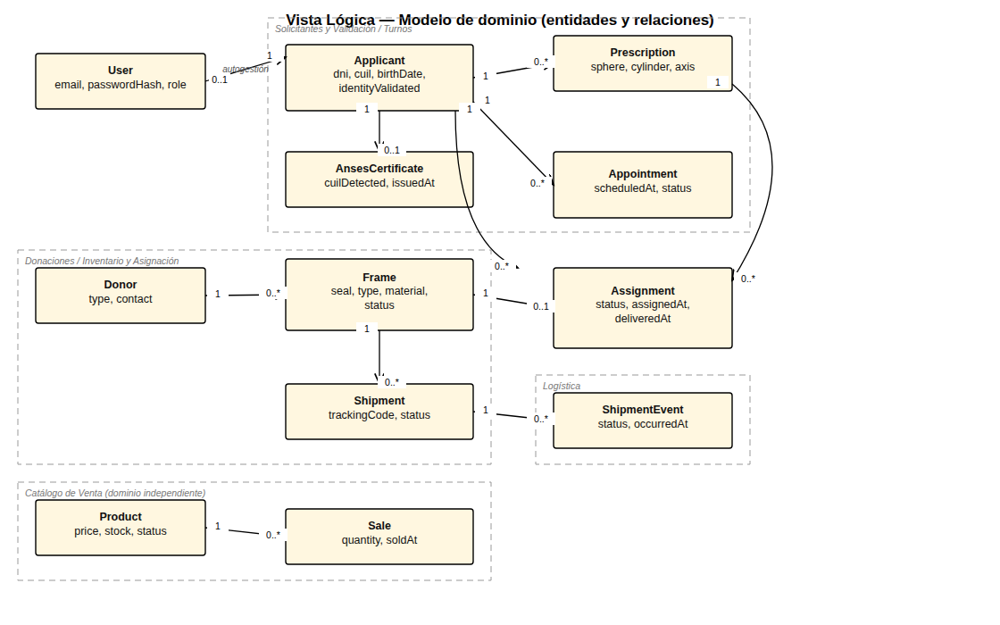
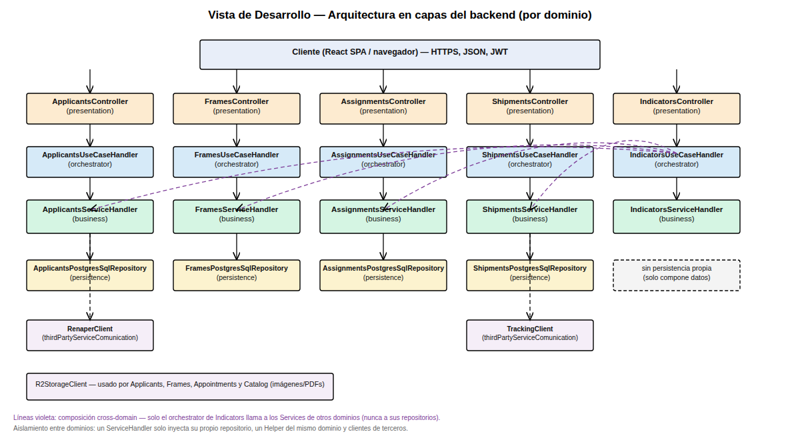
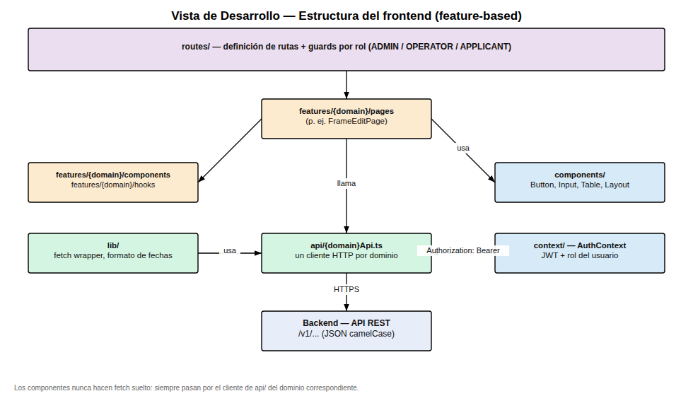
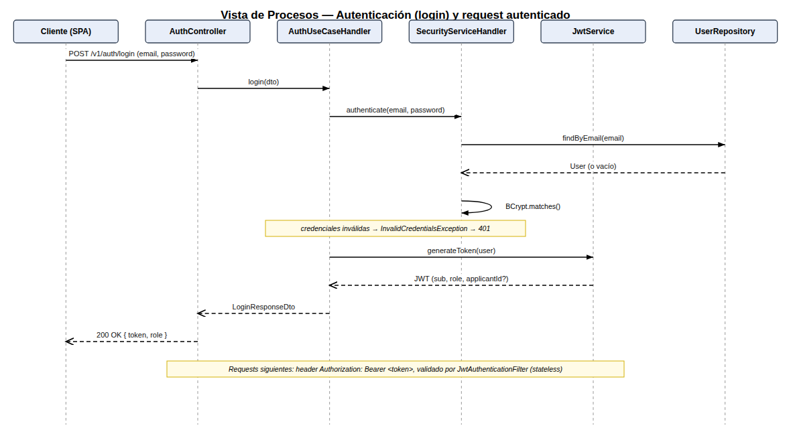
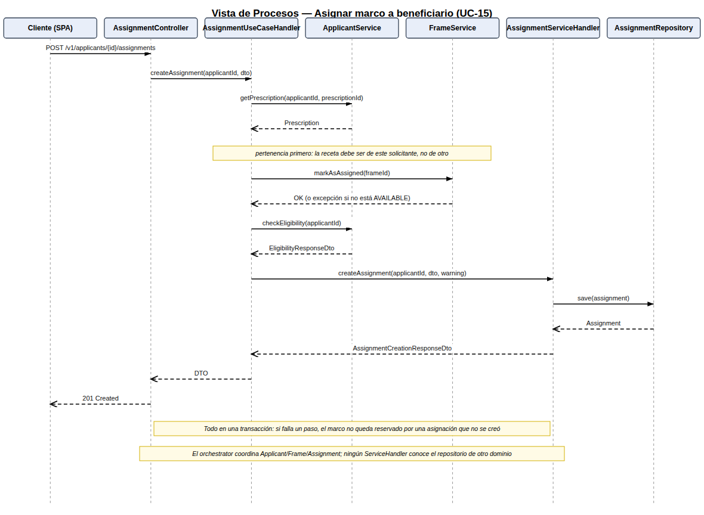
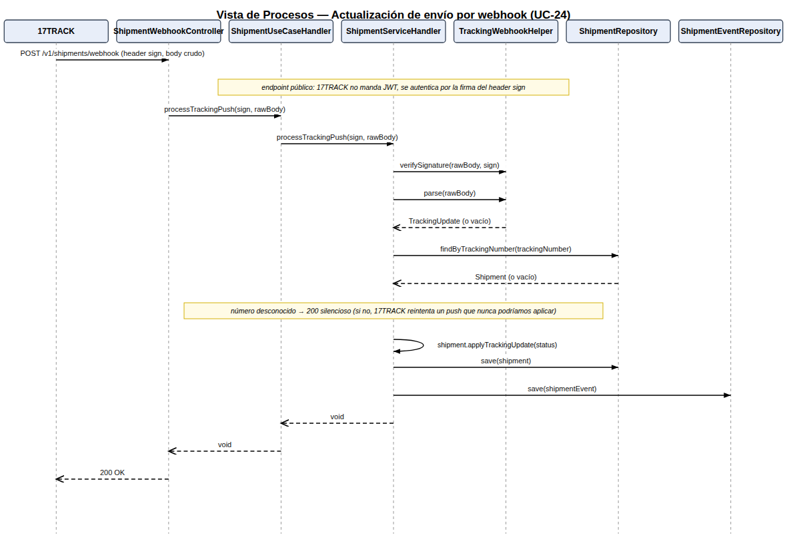
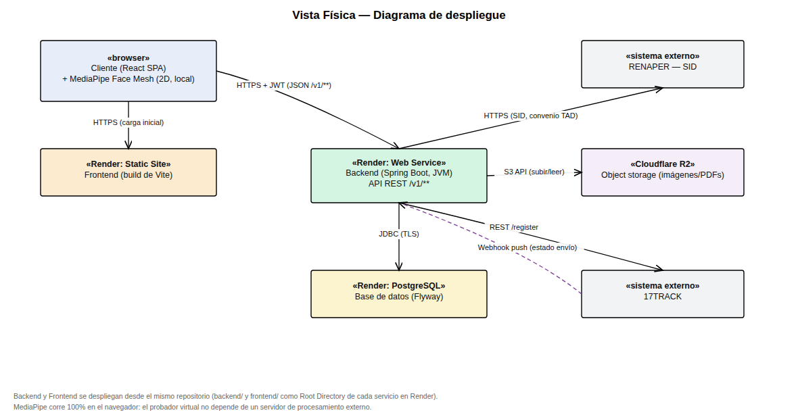

# Documento de Arquitectura de Software

## Sistema Banco de Anteojos — Fundación Hacer Futuro

> Organizado según el **modelo de vistas 4+1** (Kruchten): Vista Lógica, Vista de Desarrollo, Vista
> de Procesos, Vista Física y Vista de Escenarios (que conecta las cuatro anteriores con los casos
> de uso de `docs/casos-de-uso/CASOS_DE_USO.md`).

## 1. Introducción

### 1.1 Propósito y alcance

Este documento describe la arquitectura del sistema desde cinco perspectivas complementarias, cada
una dirigida a un interesado distinto:

| Vista | Responde a | Interesado principal |
|---|---|---|
| Lógica | ¿Qué entidades del dominio existen y cómo se relacionan? | Analistas, cátedra |
| Desarrollo | ¿Cómo está organizado el código en capas y módulos? | Equipo de desarrollo |
| Procesos | ¿Cómo fluye una operación en tiempo de ejecución? | Equipo de desarrollo, QA |
| Física | ¿Dónde se ejecuta cada pieza y cómo se conectan? | DevOps, cátedra |
| Escenarios | ¿Cómo se usan las cuatro vistas juntas para un caso de uso real? | Todos |

### 1.2 Restricciones arquitectónicas de partida

Estas decisiones ya están tomadas (`CLAUDE.md`, `backend/CLAUDE.md`) y no se reabren en este
documento:

- Backend en capas estrictas con aislamiento entre dominios (detallado en la Vista de Desarrollo).
- Persistencia gestionada 100% por migraciones Flyway (Hibernate en modo `none`).
- JWT stateless con roles `ADMIN`, `OPERATOR`, `APPLICANT`.
- Ningún binario en PostgreSQL: imágenes y PDFs van a Cloudflare R2, solo se persiste la URL.
- El probador virtual corre 100% en el navegador (MediaPipe + Canvas), sin servidor de
  procesamiento propio.
- Integraciones de terceros aisladas cada una en su propio cliente (`RenaperClient`,
  `TrackingClient`, `R2StorageClient`).

---

## 2. Vista Lógica

Modela las entidades del dominio y sus relaciones, agrupadas por los módulos funcionales del SRS.
Es independiente de cómo se implementan (esa es la Vista de Desarrollo) y de dónde se ejecutan
(Vista Física).



**Puntos clave:**

- `Applicant` es el centro del modelo: concentra su validación de identidad (vía `User` solo si se
  autogestiona), su `AnsesCertificate`, sus `Prescription` y sus `Appointment`.
- `Assignment` es la entidad de trazabilidad: une un `Applicant`, una `Prescription` y un `Frame`
  concretos, y por eso es también el punto donde conviven los estados de negocio más sensibles
  (`RF-15`, `RF-16`).
- `Frame` es 1 a 0..1 con `Assignment` porque un marco solo puede estar activamente asignado a un
  beneficiario a la vez (su ciclo de vida completo —`AVAILABLE → ASSIGNED → AT_OPTICIAN → READY →
  DELIVERED`/`DISCARDED`— vive en el propio `Frame`, no en la asignación).
- `Shipment`/`ShipmentEvent` modelan la logística entre sucursales como un sub-dominio propio,
  desacoplado de `Assignment`: un marco puede viajar por logística en cualquier punto de su ciclo de
  vida.
- **Catálogo (`Product`/`Sale`) es un dominio intencionalmente independiente**: no tiene relación de
  datos con `Donor`/`Frame` — son anteojos de sol para la venta, no marcos donados para beneficiarios.
  Mezclar ambos inventarios sería un acoplamiento accidental que el diseño evita a propósito.

---

## 3. Vista de Desarrollo

Describe cómo se organiza el código: la arquitectura en capas del backend por dominio, y la
estructura feature-based del frontend. Es la vista más ligada a `backend/CLAUDE.md` y
`frontend/CLAUDE.md`.

### 3.1 Backend — capas por dominio



Cada dominio (`applicants`, `donors`, `frames`, `assignments`, `appointments`, `shipments`,
`catalog`, `security`) repite la misma columna de 4 capas:

```
presentation/controllers/{domain}      → REST, sin lógica de negocio, delega al orchestrator
orchestrator/{domain}                  → coordina services, valida pertenencia PRIMERO
business/{domain}                      → lógica real (*ServiceHandler), un paquete por dominio
persistence/{domain}                   → repositorios JPA (*PostgresSqlRepository)
```

**`indicators` es la excepción que confirma la regla**: no tiene persistencia propia porque no
gestiona una entidad nueva, sino que agrega datos de otros dominios. Su orchestrator
(`IndicatorsUseCaseHandler`) inyecta directamente los `Service` (interfaces) de
`Frame`/`Assignment`/`Appointment`/`Shipment`, llama a sus métodos de conteo/agregación, y le pasa
los números ya resueltos a `IndicatorsService.build(...)` para el armado final del DTO. Esto es
exactamente la regla de aislamiento en acción: **la composición cross-domain vive solo en el
orchestrator**, nunca en un `*ServiceHandler`, que solo puede inyectar su propio repositorio, un
`*Helper` de su mismo dominio, o un cliente de terceros.

Los clientes de terceros (`thirdPartyServiceComunication/`) son un cuarto tipo de dependencia
permitida para un `*ServiceHandler`: `RenaperClient` (usado por `applicants` para RF-02),
`TrackingClient` (usado por `shipments` para RF-23) y `R2StorageClient` (compartido por
`applicants`, `frames`, `appointments` y `catalog` para subir imágenes/PDFs — el único caso de una
dependencia verdaderamente transversal, y por eso vive en terceros y no en un dominio de negocio).

### 3.2 Frontend — estructura feature-based



El frontend espeja los dominios del backend uno a uno en `features/{domain}/`. La regla de
aislamiento equivalente en el frontend es más simple: **los componentes nunca hacen `fetch`
suelto**, siempre pasan por el cliente de `api/{domain}Api.ts` correspondiente, que a su vez usa el
wrapper de `lib/` y el token de `context/AuthContext`. Las rutas (`routes/`) aplican los guards por
rol antes de renderizar cualquier página.

---

## 4. Vista de Procesos

Describe el comportamiento en tiempo de ejecución de tres escenarios representativos: autenticación
(sincrónico, iniciado por el cliente), un caso de uso transaccional multi-dominio (asignación de
marco) y un evento asincrónico iniciado por un sistema externo (webhook de 17TRACK).

### 4.1 Autenticación (login) y request autenticado



El backend es **stateless**: no hay sesión de servidor. Cada request posterior al login viaja con
`Authorization: Bearer <token>` y lo valida `JwtAuthenticationFilter` en cada request, no una sola
vez. Esto es lo que permite escalar el backend horizontalmente sin sticky sessions (relevante para
la Vista Física, sección 5).

### 4.2 Asignar marco a beneficiario (UC-15)



Este es el escenario que más domains cruza en una sola operación (`Applicant`, `Prescription`,
`Frame`, `Assignment`), y por eso ilustra mejor la regla de aislamiento: todas las llamadas
cross-domain (`ApplicantService.getPrescription`, `FrameService.markAsAssigned`,
`ApplicantService.checkEligibility`) las hace el **orchestrator**, nunca
`AssignmentServiceHandler` directamente. Toda la operación corre en una única transacción
(`@Transactional` a nivel orchestrator): si falla marcar el marco como asignado, no se crea la
asignación; si falla crear la asignación, la transacción revierte también la reserva del marco.

### 4.3 Actualización de envío por webhook (UC-24)



Caso distinto a los dos anteriores: el proceso lo **inicia un sistema externo**, no un usuario
autenticado. El endpoint es público (17TRACK no puede firmar un JWT) y se autentica verificando la
firma del header `sign` sobre el **cuerpo crudo** de la request — por eso el controller recibe
`String` y no un DTO deserializado: cualquier re-serialización cambiaría los bytes sobre los que se
calculó la firma. Un número de seguimiento desconocido responde 200 igual (silencioso), para que
17TRACK no reintente indefinidamente un push que el sistema nunca va a poder aplicar.

---

## 5. Vista Física (despliegue)



- **Backend y frontend se despliegan desde el mismo repositorio** en Render, cada uno apuntando a
  `backend/` o `frontend/` como Root Directory (RNF-06). Son servicios independientes: el frontend
  es un static site (build de Vite) y el backend un web service (JVM).
- El **backend es stateless** (sección 4.1), por lo que Render puede escalarlo horizontalmente sin
  coordinación adicional entre instancias.
- **PostgreSQL** es la única fuente de verdad transaccional; el acceso es siempre desde el backend,
  nunca directo desde el frontend.
- **Cloudflare R2** guarda todo binario (imágenes de marcos/catálogo, PDFs de recetas/ANSES/
  comprobantes); PostgreSQL solo tiene la URL (RNF-07).
- **RENAPER** se consume solo desde el backend, nunca desde el navegador (evita exponer credenciales
  del convenio de confronte de datos).
- **17TRACK** tiene un canal de ida (`REST /register`, iniciado por el backend al despachar un
  envío) y uno de vuelta (webhook push, iniciado por 17TRACK) — es la única integración bidireccional
  del sistema.
- **MediaPipe corre enteramente en el navegador**: no hay un nodo de despliegue propio para el
  probador virtual, es parte del bundle del frontend (RNF-04).

---

## 6. Vista de Escenarios (+1)

Conecta las cuatro vistas anteriores usando los casos de uso del Modelo de Casos de Uso como hilo
conductor. Los tres escenarios de la Vista de Procesos (secciones 4.1–4.3) ya cubren:

| Escenario | Vista Lógica involucrada | Vista de Desarrollo | Vista Física |
|---|---|---|---|
| UC-02 / login | `User`, `Applicant` | `security` (todas las capas) | Backend ↔ navegador |
| UC-15 Asignar marco | `Applicant`, `Prescription`, `Frame`, `Assignment` | `applicants`, `frames`, `assignments` (orchestrator cruza las tres) | Backend ↔ PostgreSQL |
| UC-24 Webhook 17TRACK | `Shipment`, `ShipmentEvent` | `shipments` (incluye `TrackingWebhookHelper` y `TrackingClient`) | 17TRACK → Backend → PostgreSQL |

Estos tres escenarios se eligieron porque cada uno ejercita una característica arquitectónica
distinta: autenticación stateless, transaccionalidad cross-domain coordinada solo desde el
orchestrator, y manejo de un evento asincrónico con autenticación no basada en JWT. El resto de los
casos de uso del sistema (`docs/casos-de-uso/CASOS_DE_USO.md`) siguen el mismo patrón de capas
descripto en la Vista de Desarrollo (sección 3.1), por lo que no requieren un diagrama de procesos
propio.
