# Casos de Uso Reales — Diseño de Interfaz Gráfica

## Sistema Banco de Anteojos — Fundación Hacer Futuro

> Concreta cada caso de uso esencial del `docs/casos-de-uso/CASOS_DE_USO.md` contra una pantalla real
> de `docs/mockups/MOCKUPS.md`. Cada caso de uso real reúne: los datos del caso (actores, propósito,
> resumen, tipo, referencias cruzadas, pre/postcondiciones), la captura de la pantalla con sus
> elementos interactivos marcados con una letra, y el diálogo actor↔sistema referenciando esas letras.
> Un caso de uso real puede agrupar varios casos de uso esenciales cuando comparten una sola pantalla
> (p. ej. UC-01 a UC-07 en el detalle del solicitante).

---

## RU-01 — Iniciar sesión

| Campo | Detalle |
|---|---|
| **Caso de uso** | RU-01 — Iniciar sesión |
| **Actores** | Operador, Administrador, Beneficiario |
| **Propósito** | Autenticar al usuario contra el sistema para habilitar el resto de las funciones según su rol. |
| **Resumen** | El usuario ingresa email y contraseña; el sistema los valida contra la base y, si son correctos, emite un JWT y redirige al panel correspondiente a su rol (Operador/Administrador o portal de autogestión del Beneficiario). |
| **Tipo** | Secundario y real |
| **Referencias cruzadas** | RNF-01 (Autenticación y autorización) |
| **Precondiciones** | El usuario tiene una cuenta creada (ADMIN/OPERATOR dado de alta por un administrador, o APPLICANT por autoregistro). |
| **Postcondiciones** | Sesión iniciada; el JWT queda almacenado en el cliente para las siguientes requests. |

**Pantalla:** Inicio de sesión (Figura 1)

**Diálogo**

| Acción de los actores | Respuesta del sistema |
|---|---|
| 1. El usuario completa el campo **Email** (A). | |
| 2. Completa el campo **Contraseña** (B). | |
| 3. Hace clic en **Ingresar** (C). | 4. El sistema valida las credenciales y redirige a la pantalla de inicio correspondiente a su rol. |
| 5. *(Opcional)* El beneficiario sin cuenta hace clic en el enlace "¿Sos beneficiario? Registrate para pedir tu turno" (D). | 6. El sistema muestra el formulario de autoregistro (RF-20). |

**Flujos alternativos**
- **3a. Credenciales inválidas:** el sistema muestra el mensaje de error devuelto por la API sin
  redirigir, sin indicar si falló el email o la contraseña.

---

## RU-02 — Gestionar solicitantes (listar y buscar)

| Campo | Detalle |
|---|---|
| **Caso de uso** | RU-02 — Gestionar solicitantes (listar y buscar) |
| **Actores** | Operador |
| **Propósito** | Ubicar un solicitante existente o iniciar el alta de uno nuevo. |
| **Resumen** | El operador visualiza el listado de solicitantes con su estado de identidad y de ANSES, lo filtra por DNI/nombre o estado, y navega al detalle de uno (RU-03) o al alta de uno nuevo. |
| **Tipo** | Primario y real |
| **Referencias cruzadas** | RF-08 (Consultar, editar y listar solicitantes) |
| **Precondiciones** | El operador inició sesión (RU-01). |
| **Postcondiciones** | El operador visualiza o navega al solicitante elegido. |

**Pantalla:** Solicitantes — Listado (Figura 3)

**Diálogo**

| Acción de los actores | Respuesta del sistema |
|---|---|
| 1. El operador entra a "Solicitantes" desde el menú lateral. | 2. El sistema muestra la tabla (D) con Nombre, DNI, estado de Identidad, estado de ANSES y fecha de última receta. |
| 3. El operador escribe en **Buscar por DNI o nombre…** (A) o elige un estado en el selector (B). | 4. El sistema filtra la tabla en vivo. |
| 5. El operador observa el estado de Identidad (E) y de ANSES (F) de un solicitante en la fila. | |
| 6. Hace clic en **Ver** (G) sobre una fila. | 7. El sistema navega al detalle del solicitante (RU-03). |
| 8. *(Alternativa)* Hace clic en **+ Nuevo solicitante** (C). | 9. El sistema abre el formulario de datos personales de RU-03, vacío. |

**Flujos alternativos**
- **4a. Sin resultados:** la tabla muestra un estado vacío con el texto de búsqueda aplicado.

---

## RU-03 — Alta, edición y validación del solicitante

| Campo | Detalle |
|---|---|
| **Caso de uso** | RU-03 — Alta, edición y validación del solicitante |
| **Actores** | Operador; RENAPER (SID) como sistema externo |
| **Propósito** | Registrar y mantener los datos de elegibilidad de un beneficiario: identidad, certificación negativa de ANSES y receta médica. |
| **Resumen** | El operador carga o edita los datos personales del solicitante, dispara la validación de identidad contra RENAPER (o la registra manualmente si el servicio no responde), carga el PDF de certificación negativa de ANSES para su verificación automática de CUIL y vigencia, y registra la receta médica que luego se usa para el match con marcos. |
| **Tipo** | Primario y real |
| **Referencias cruzadas** | RF-01 (Registrar solicitante), RF-02 (Validación de identidad vía RENAPER), RF-03 (Carga de PDF de Certificación Negativa de ANSES), RF-04 (Verificación de CUIL por código de barras), RF-05 (Verificación de vigencia del certificado ANSES), RF-06 (Validación presencial alternativa), RF-07 (Registrar receta médica), RF-08 (editar); RNF-02 (Protección de datos personales) |
| **Precondiciones** | Solicitante nuevo (desde RU-02, "+ Nuevo solicitante") o existente (desde RU-02, "Ver"). |
| **Postcondiciones** | El solicitante queda con sus datos, estado de validación y receta actualizados, disponible para el match de asignación (RU-06). |

**Pantalla:** Solicitantes — Detalle (Figura 4)

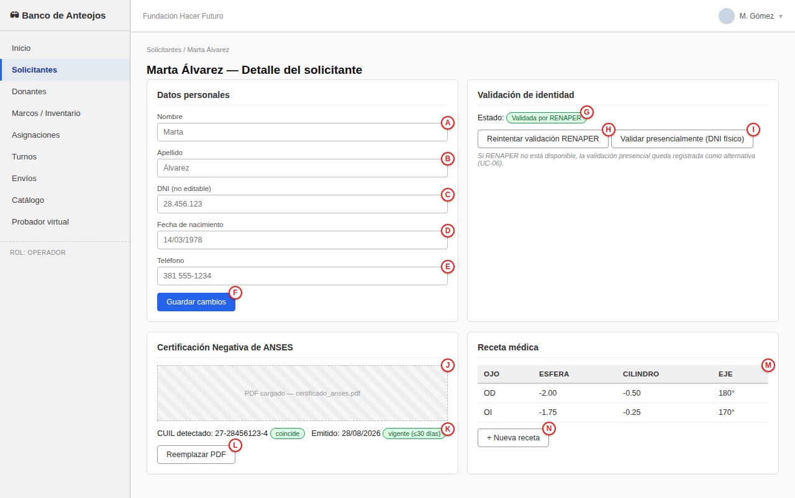

**Diálogo**

| Acción de los actores | Respuesta del sistema |
|---|---|
| 1. El operador completa **Nombre** (A), **Apellido** (B), **DNI** (C), **Fecha de nacimiento** (D) y **Teléfono** (E) en la tarjeta "Datos personales". | |
| 2. Hace clic en **Guardar cambios** (F). | 3. El sistema guarda el solicitante y deshabilita el campo **DNI** para ediciones futuras (es la identidad contra la que se valida RENAPER). |
| 4. En la tarjeta "Validación de identidad", el operador hace clic en **Reintentar validación RENAPER** (H). | 5. El sistema consulta el SID de RENAPER y actualiza el badge de estado (G) a "Validada por RENAPER". |
| 6. *(Alternativa)* Si RENAPER no está disponible, el operador hace clic en **Validar presencialmente (DNI físico)** (I) y confirma que verificó el documento en persona. | 7. El sistema registra la validación manual; el badge (G) pasa a "Manual (presencial)". |
| 8. En la tarjeta "Certificación Negativa de ANSES", el operador hace clic en **Reemplazar PDF** (L) —o el botón equivalente de subida, si es la primera carga— y selecciona el archivo (J). | 9. El sistema decodifica el código de barras y muestra el **CUIL detectado** (K) con el badge "coincide"/"no coincide" y la fecha de emisión con el badge "vigente (≤30 días)"/"vencido". Ninguno de los dos bloquea el guardado: quedan a criterio del operador. |
| 10. En la tarjeta "Receta médica", el operador hace clic en **+ Nueva receta** (N) y carga los valores de **Esfera**, **Cilindro** y **Eje** para OD y OI. | 11. El sistema agrega la fila a la tabla de recetas (M). |

**Flujos alternativos**
- **2a. DNI duplicado:** el sistema rechaza el alta con un mensaje de error.
- **9a. PDF de ANSES no legible / código de barras no encontrado:** el sistema informa el error y no
  completa el CUIL ni la fecha detectados; el operador puede reintentar la carga.

---

## RU-04 — Registrar donante y recepción de marcos

| Campo | Detalle |
|---|---|
| **Caso de uso** | RU-04 — Registrar donante y recepción de marcos |
| **Actores** | Operador |
| **Propósito** | Dar de alta un donante e ingresar al inventario los marcos que dona. |
| **Resumen** | El operador ubica o crea un donante, abre una nueva recepción y carga cada marco recibido (precinto, tipo, material, medidas); al confirmar, el sistema crea los marcos en estado disponible. |
| **Tipo** | Primario y real |
| **Referencias cruzadas** | RF-09 (Registrar donante), RF-10 (Registrar recepción de marcos donados), RF-11 (Clasificar marcos por atributos), RF-12 (Consultar y listar donaciones y donantes) |
| **Precondiciones** | El operador inició sesión. |
| **Postcondiciones** | Los marcos quedan disponibles en el inventario (RU-05), vinculados al donante. |

**Pantallas:** Donantes — Listado (Figura 5) y Registrar recepción de marcos (Figura 6)

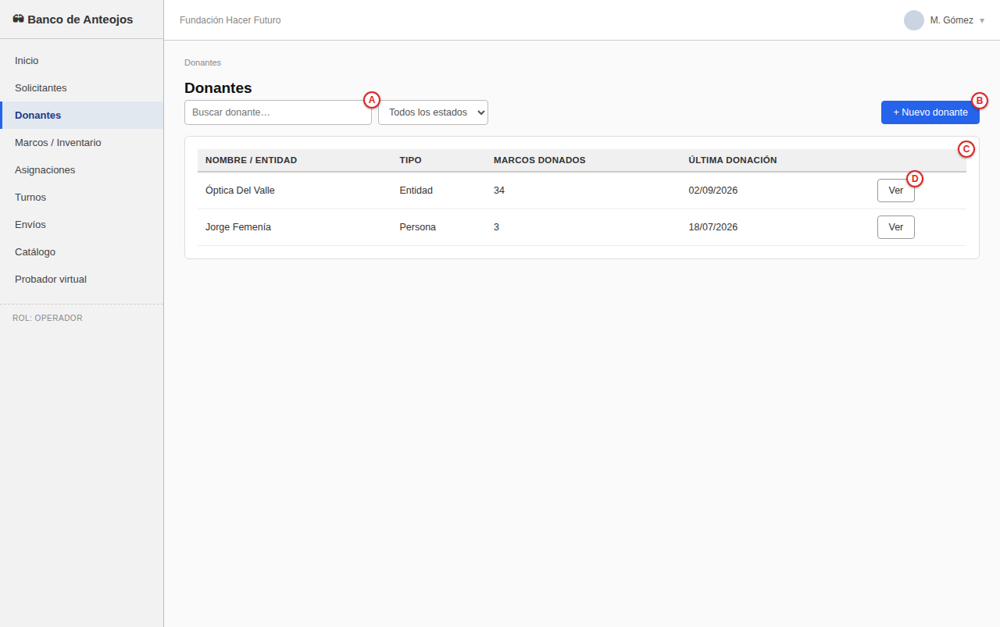
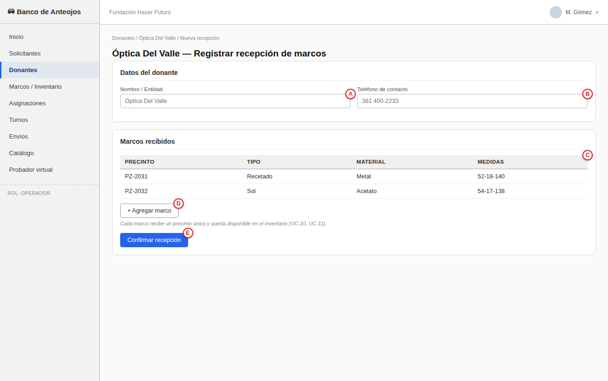

**Diálogo**

| Acción de los actores | Respuesta del sistema |
|---|---|
| 1. El operador busca con **Buscar donante…** (A) en el listado. | 2. El sistema filtra la tabla de donantes (C) en vivo. |
| 3. *(Alternativa)* Hace clic en **+ Nuevo donante** (B) y carga **Nombre / Entidad** y **Teléfono de contacto**. | |
| 4. Hace clic en **Ver** (D) sobre un donante y abre "Nueva recepción". | 5. El sistema muestra el formulario de recepción con **Nombre / Entidad** (A) y **Teléfono de contacto** (B) precargados. |
| 6. Por cada marco recibido, hace clic en **+ Agregar marco** (D) y completa **Precinto**, **Tipo**, **Material** y **Medidas** en la tabla (C) —el precinto es el identificador único que no se repite. | |
| 7. Hace clic en **Confirmar recepción** (E). | 8. El sistema crea cada marco en estado `AVAILABLE`. |

**Flujos alternativos**
- **7a. Precinto duplicado:** el sistema rechaza la fila con ese precinto y pide corregirlo antes de
  confirmar.

---

## RU-05 — Consultar inventario de marcos

| Campo | Detalle |
|---|---|
| **Caso de uso** | RU-05 — Consultar inventario de marcos |
| **Actores** | Operador |
| **Propósito** | Ubicar rápidamente un marco disponible o revisar el estado de cualquier marco del inventario. |
| **Resumen** | El operador consulta la lista completa de marcos con su estado (disponible, asignado, en óptica, descartado), la filtra por precinto o estado, y accede al detalle de un marco o carga uno nuevo a mano. |
| **Tipo** | Secundario y real |
| **Referencias cruzadas** | RF-13 (Inventario en tiempo real) |
| **Precondiciones** | Existen marcos cargados (RU-04) o a mano. |
| **Postcondiciones** | El operador ubica el marco que necesita para una asignación (RU-06). |

**Pantalla:** Inventario de marcos (Figura 7)

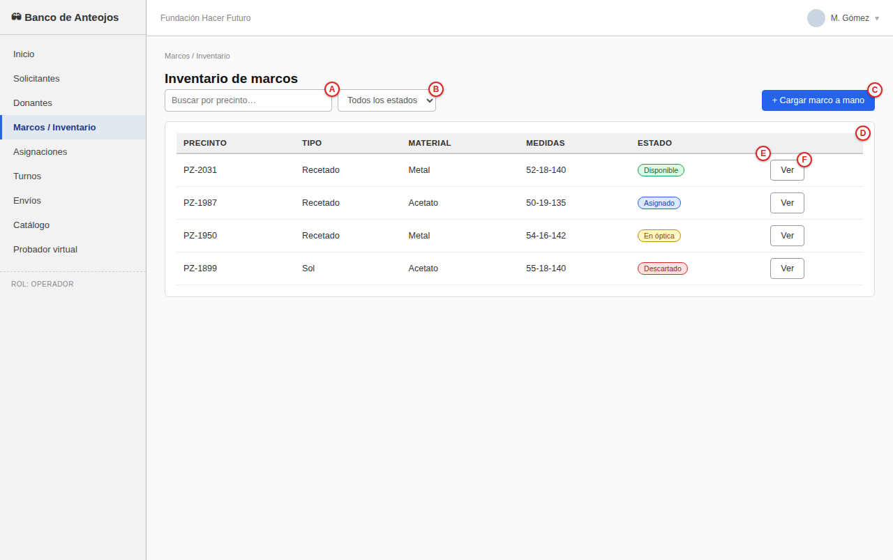

**Diálogo**

| Acción de los actores | Respuesta del sistema |
|---|---|
| 1. El operador entra a "Marcos / Inventario". | 2. El sistema lista los marcos (D) con Precinto, Tipo, Material, Medidas y Estado (E, badge: Disponible/Asignado/En óptica/Descartado). |
| 3. El operador filtra con **Buscar por precinto…** (A) o el selector de estado (B). | |
| 4. Hace clic en **Ver** (F) para el detalle de un marco. | |
| 5. *(Alternativa)* Hace clic en **+ Cargar marco a mano** (C) para dar de alta uno sin pasar por una recepción de donación. | |

---

## RU-06 — Asignar marco a beneficiario

| Campo | Detalle |
|---|---|
| **Caso de uso** | RU-06 — Asignar marco a beneficiario |
| **Actores** | Operador |
| **Propósito** | Elegir, de entre los marcos disponibles, el más compatible con la receta del beneficiario y reservarlo para él. |
| **Resumen** | El sistema ejecuta el algoritmo de match entre la receta del beneficiario y los marcos disponibles, ordenándolos por compatibilidad; el operador confirma la asignación sobre el marco elegido y el sistema lo descuenta del inventario disponible. |
| **Tipo** | Primario y real |
| **Referencias cruzadas** | RF-14 (Algoritmo de match receta↔marco), RF-15 (Asignar marco a beneficiario) |
| **Precondiciones** | El solicitante tiene identidad validada, ANSES cargado y receta registrada (RU-03). |
| **Postcondiciones** | Asignación creada, visible en la trazabilidad (RU-07); el marco queda `ASSIGNED`. |

**Pantalla:** Asignación — Match y asignar marco (Figura 8)

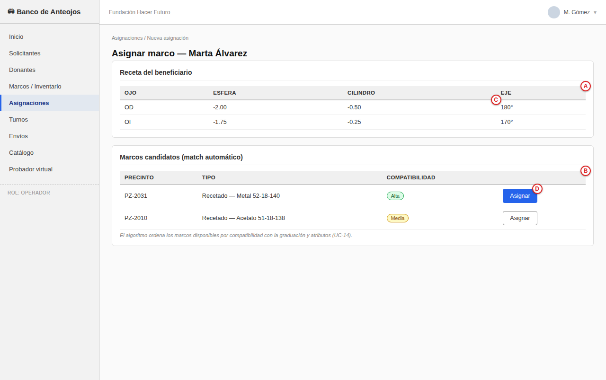

**Diálogo**

| Acción de los actores | Respuesta del sistema |
|---|---|
| 1. El operador abre "Asignaciones / Nueva asignación" para el beneficiario. | 2. El sistema muestra la receta del beneficiario (A) —Esfera, Cilindro y Eje por ojo— y ejecuta el match, listando los marcos candidatos (B) ordenados por compatibilidad (C, badge Alta/Media). |
| 3. El operador hace clic en **Asignar** (D) sobre el marco elegido. | 4. El sistema crea la asignación y descuenta el marco del inventario disponible (queda `ASSIGNED`). |

**Flujos alternativos**
- **2a. Sin marcos compatibles:** la lista aparece vacía; el operador puede volver más adelante cuando
  ingrese una donación compatible.
- **4a. El marco elegido dejó de estar disponible** (otro operador lo asignó primero): el sistema
  rechaza la asignación con un mensaje y refresca la lista.

---

## RU-07 — Consultar trazabilidad de la asignación

| Campo | Detalle |
|---|---|
| **Caso de uso** | RU-07 — Consultar trazabilidad de la asignación |
| **Actores** | Operador, Beneficiario |
| **Propósito** | Conocer en qué etapa del circuito se encuentra un par de anteojos ya asignado. |
| **Resumen** | El sistema muestra la línea de tiempo completa de la asignación —marco asignado, enviado a óptica, retornado con cristales, entregado— con fecha y responsable de cada hito, y el estado actual. |
| **Tipo** | Secundario y real |
| **Referencias cruzadas** | RF-16 (Trazabilidad end-to-end) |
| **Precondiciones** | Existe una asignación (RU-06). |
| **Postcondiciones** | Ninguna (consulta de solo lectura). |

**Pantalla:** Trazabilidad de la asignación (Figura 9)

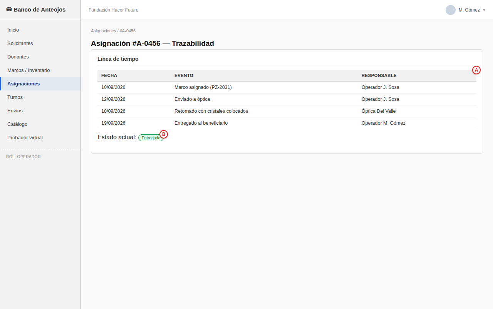

**Diálogo**

| Acción de los actores | Respuesta del sistema |
|---|---|
| 1. El usuario abre la asignación desde su detalle. | 2. El sistema muestra la línea de tiempo (A): asignado → enviado a óptica → retornado con cristales → entregado, cada uno con fecha y responsable, y el estado actual como badge (B, p. ej. "Entregado"). |

---

## RU-08 — Usar el probador virtual

| Campo | Detalle |
|---|---|
| **Caso de uso** | RU-08 — Usar el probador virtual |
| **Actores** | Beneficiario, Operador |
| **Propósito** | Previsualizar cómo le quedarían distintos marcos al beneficiario antes de asignarle uno. |
| **Resumen** | El usuario toma o sube una foto estática; MediaPipe Face Mesh detecta el rostro y el sistema superpone en 2D el marco elegido de la grilla de disponibles, permitiendo ajustar manualmente rotación y altura. |
| **Tipo** | Secundario y real |
| **Referencias cruzadas** | RF-17 (Detección de rostro), RF-18 (Superposición 2D del marco), RF-19 (Selección de distintos marcos); RNF-04 (Compatibilidad del probador virtual con gama baja) |
| **Precondiciones** | El navegador tiene acceso a cámara o a una foto ya tomada. |
| **Postcondiciones** | Ninguna (previsualización, no persiste datos). |

**Pantalla:** Probador virtual (Figura 10)

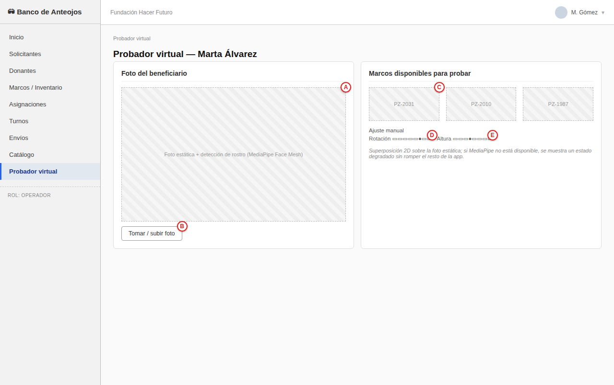

**Diálogo**

| Acción de los actores | Respuesta del sistema |
|---|---|
| 1. El usuario hace clic en **Tomar / subir foto** (B). | 2. El sistema carga la foto en el recuadro (A) y MediaPipe Face Mesh detecta el rostro. |
| 3. El usuario elige un marco de la grilla "Marcos disponibles para probar" (C). | 4. El sistema superpone el marco en 2D sobre la foto y habilita el ajuste manual de **Rotación** (D) y **Altura** (E). |
| 5. El usuario ajusta Rotación (D) y/o Altura (E) según lo necesite. | 6. El sistema actualiza la superposición en tiempo real. |

**Flujos alternativos**
- **2a. MediaPipe no disponible** (dispositivo o red): el sistema muestra un estado degradado
  ("probador virtual no disponible en este momento") sin romper el resto de la aplicación.
- **2b. No se detecta rostro en la foto:** el sistema pide subir otra foto.

---

## RU-09 — Gestionar turnos (agenda del staff)

| Campo | Detalle |
|---|---|
| **Caso de uso** | RU-09 — Gestionar turnos (agenda del staff) |
| **Actores** | Operador |
| **Propósito** | Registrar, reprogramar o cancelar turnos de entrega/retiro, y revisar los pagos pendientes de la autogestión. |
| **Resumen** | El operador consulta la agenda de turnos, busca por beneficiario, registra un turno nuevo o modifica uno existente (reprogramar/cancelar), y revisa el comprobante de un turno pendiente de pago generado por autogestión. |
| **Tipo** | Primario y real |
| **Referencias cruzadas** | RF-20 (Registrar turnos), RF-21 (Gestionar turnos: reprogramación y cancelación), RF-22 (Notificaciones automáticas de turnos) |
| **Precondiciones** | El solicitante existe. |
| **Postcondiciones** | El turno queda actualizado; los cambios de estado disparan la notificación correspondiente. |

**Pantalla:** Turnos — Agenda del staff (Figura 11)

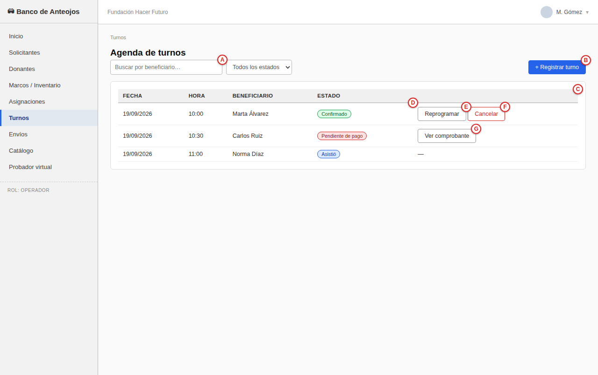

**Diálogo**

| Acción de los actores | Respuesta del sistema |
|---|---|
| 1. El operador busca con **Buscar por beneficiario…** (A). | 2. El sistema filtra la tabla de turnos (C) en vivo, mostrando fecha, hora, beneficiario y estado (D, badge). |
| 3. *(Alternativa)* Hace clic en **+ Registrar turno** (B) y carga fecha, hora y beneficiario. | |
| 4. Para un turno existente, hace clic en **Reprogramar** (E) y elige nueva fecha/hora. | 5. El sistema actualiza el turno, que permanece `SCHEDULED`. |
| 6. *(Alternativa)* Hace clic en **Cancelar** (F) y confirma el motivo. | 7. El sistema pasa el turno a `CANCELLED`. |
| 8. Si el turno está en estado "Pendiente de pago" (D, autogestión), el operador hace clic en **Ver comprobante** (G). | 9. El sistema muestra el comprobante subido para que el operador lo revise y, si corresponde, confirme el turno manualmente. |

---

## RU-10 — Autogestión del beneficiario: pedir turno y pagar el bono contribución

| Campo | Detalle |
|---|---|
| **Caso de uso** | RU-10 — Autogestión del beneficiario: pedir turno y pagar el bono contribución |
| **Actores** | Beneficiario |
| **Propósito** | Permitir que el beneficiario saque su turno sin asistir presencialmente y confirme el pago del bono contribución. |
| **Resumen** | El beneficiario elige una fecha disponible, transfiere el bono contribución a la cuenta de la fundación, sube el comprobante y el sistema confirma el turno; también puede ver su historial de turnos pasados. |
| **Tipo** | Primario y real |
| **Referencias cruzadas** | RF-20 (Registrar turnos), RF-21 (Gestionar turnos); RNF-01 (Autenticación y autorización, rol APPLICANT) |
| **Precondiciones** | El beneficiario tiene una cuenta (rol APPLICANT) y sesión iniciada. |
| **Postcondiciones** | Turno confirmado y visible en la agenda del staff (RU-09) para revisión posterior del comprobante por un operador. |

**Pantalla:** Autogestión — Mis turnos (Figura 12)

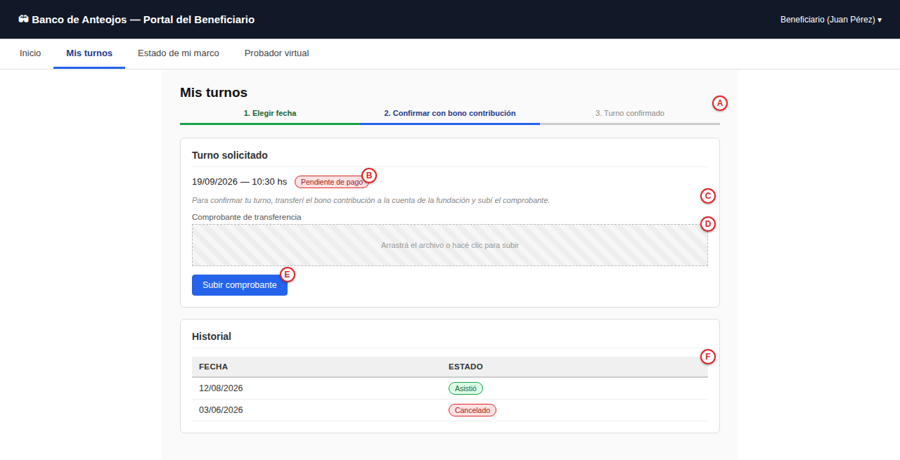

**Diálogo**

| Acción de los actores | Respuesta del sistema |
|---|---|
| 1. El beneficiario elige una fecha disponible (paso 1 del indicador de progreso, A: "Elegir fecha"). | 2. El sistema crea el turno en estado `PENDIENTE DE PAGO` (B) y avanza al paso 2 ("Confirmar con bono contribución"). |
| 3. El sistema muestra la indicación de transferencia (C) con los datos de la cuenta de la fundación. | |
| 4. El beneficiario hace clic en el recuadro de **Comprobante de transferencia** (D), sube el archivo y hace clic en **Subir comprobante** (E). | 5. El sistema pasa el turno a `SCHEDULED` (paso 3, "Turno confirmado") y dispara la notificación de confirmación. |
| 6. *(Opcional)* El beneficiario revisa su **Historial** (F) de turnos pasados (asistidos/cancelados). | |

**Flujos alternativos**
- **4a. El beneficiario no sube comprobante:** el turno permanece "Pendiente de pago" indefinidamente
  (no bloquea el resto de la app, pero no se confirma ni notifica).

---

## RU-11 — Gestionar envíos entre sucursales

| Campo | Detalle |
|---|---|
| **Caso de uso** | RU-11 — Gestionar envíos entre sucursales |
| **Actores** | Operador; 17TRACK como sistema externo |
| **Propósito** | Trazar el traslado de marcos/lotes entre sucursales de punta a punta. |
| **Resumen** | El operador registra un envío indicando origen, destino y marcos a trasladar, lo que dispara el registro en 17TRACK; el estado se actualiza automáticamente por webhook, y el operador puede revisar el historial de eventos de cada envío. |
| **Tipo** | Primario y real |
| **Referencias cruzadas** | RF-23 (Registrar envío en 17TRACK), RF-24 (Actualizaciones automáticas por webhook), RF-25 (Consultar estado y trazabilidad de envíos) |
| **Precondiciones** | Hay marcos/lotes que trasladar entre sucursales. |
| **Postcondiciones** | El envío queda trazado punta a punta entre sucursales. |

**Pantalla:** Logística — Envíos (Figura 13)

**Diálogo**

| Acción de los actores | Respuesta del sistema |
|---|---|
| 1. El operador hace clic en **+ Registrar envío** (B), elige origen/destino y los marcos a enviar. | 2. El sistema registra el envío en 17TRACK y lo agrega a la tabla (C) con su N° de seguimiento. |
| 3. El operador busca con **Buscar por N° de seguimiento…** (A). | 4. El sistema filtra la tabla en vivo. |
| 5. El operador observa el estado del envío (D, badge, actualizado automáticamente por el webhook de 17TRACK). | |
| 6. Hace clic en **Ver historial** (E). | 7. El sistema muestra el detalle de eventos de ese envío. |

---

## RU-12 — Consultar el panel de indicadores

| Campo | Detalle |
|---|---|
| **Caso de uso** | RU-12 — Consultar el panel de indicadores |
| **Actores** | Administrador, Operador |
| **Propósito** | Reportar el impacto social de la fundación con métricas agregadas. |
| **Resumen** | El sistema muestra los indicadores agregados (entregas realizadas, beneficiarios atendidos, marcos donados, % de turnos con asistencia) y un gráfico de entregas por mes; el usuario puede cambiar el período para recalcularlos. |
| **Tipo** | Secundario y real |
| **Referencias cruzadas** | RF-26 (Panel de indicadores de impacto social), RF-27 (Métricas agregadas por período) |
| **Precondiciones** | Hay datos históricos de asignaciones/turnos/envíos. |
| **Postcondiciones** | Ninguna (consulta de solo lectura). |

**Pantalla:** Panel de indicadores de impacto (Figura 14)

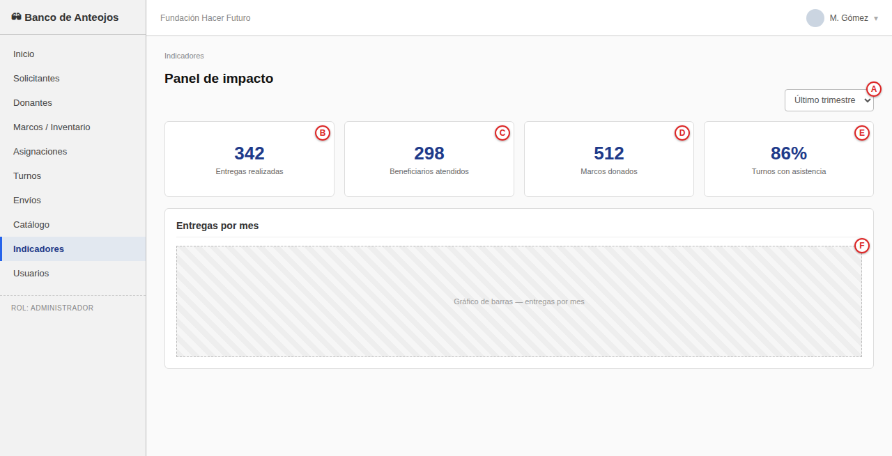

**Diálogo**

| Acción de los actores | Respuesta del sistema |
|---|---|
| 1. El usuario entra a "Indicadores". | 2. El sistema muestra los indicadores agregados: Entregas realizadas (B), Beneficiarios atendidos (C), Marcos donados (D) y % de Turnos con asistencia (E), junto con el gráfico de entregas por mes (F). |
| 3. El usuario cambia el selector de período (A, p. ej. "Último trimestre"). | 4. El sistema recalcula los indicadores y el gráfico para ese rango. |

---

## RU-13 — Consultar el catálogo público de anteojos de sol

| Campo | Detalle |
|---|---|
| **Caso de uso** | RU-13 — Consultar el catálogo público de anteojos de sol |
| **Actores** | Comprador |
| **Propósito** | Permitir que cualquier visitante vea los anteojos de sol disponibles para la venta, sin necesidad de cuenta. |
| **Resumen** | El sistema muestra los productos activos del catálogo con foto, nombre y precio; el visitante interesado se comunica con la fundación para coordinar la compra, que un operador registra desde la gestión de stock (RU-14). |
| **Tipo** | Secundario y real |
| **Referencias cruzadas** | RF-28 (Catálogo digital de anteojos de sol) |
| **Precondiciones** | Ninguna — acceso público. |
| **Postcondiciones** | Ninguna (consulta de solo lectura; la compra en sí se registra en RU-14). |

**Pantalla:** Catálogo público (Figura 15)

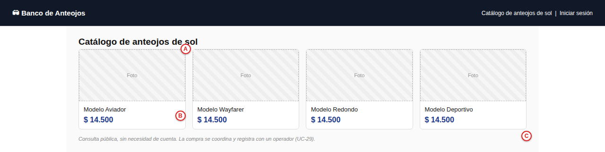

**Diálogo**

| Acción de los actores | Respuesta del sistema |
|---|---|
| 1. El visitante entra al catálogo desde el sitio de la fundación. | 2. El sistema muestra los productos activos (A) con foto, nombre y precio (B). |
| 3. El visitante interesado se comunica con la fundación para coordinar la compra (C: el catálogo público no procesa pagos online). | |

---

## RU-14 — Gestionar stock y registrar ventas del catálogo

| Campo | Detalle |
|---|---|
| **Caso de uso** | RU-14 — Gestionar stock y registrar ventas del catálogo |
| **Actores** | Administrador (gestión de catálogo), Operador (registro de venta) |
| **Propósito** | Mantener actualizado el catálogo de anteojos de sol y registrar las ventas descontando stock. |
| **Resumen** | El administrador da de alta o edita productos del catálogo (nombre, precio, stock); el operador registra la venta de un producto con stock disponible y el sistema descuenta el stock vendido. |
| **Tipo** | Primario y real |
| **Referencias cruzadas** | RF-29 (Registrar venta con descuento de stock), RF-30 (Gestionar stock del catálogo) |
| **Precondiciones** | Sesión de ADMIN u OPERATOR. |
| **Postcondiciones** | Stock y/o catálogo actualizados. |

**Pantalla:** Catálogo — Gestión de stock y ventas (Figura 16)

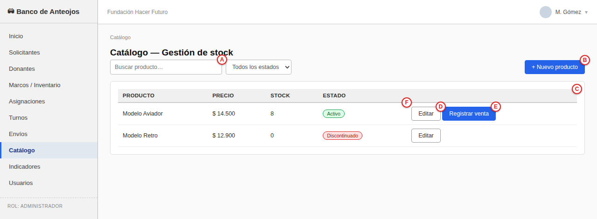

**Diálogo**

| Acción de los actores | Respuesta del sistema |
|---|---|
| 1. El administrador hace clic en **+ Nuevo producto** (B) o en **Editar** (D) sobre uno existente, y carga nombre, precio y stock. | 2. El sistema guarda el producto y lo muestra en la tabla (C) con su estado (F, badge Activo/Discontinuado). |
| 3. El operador busca con **Buscar producto…** (A). | |
| 4. Hace clic en **Registrar venta** (E) sobre un producto con stock disponible e indica la cantidad. | 5. El sistema descuenta el stock vendido. |

**Flujos alternativos**
- **5a. Stock insuficiente:** el sistema rechaza la venta con un mensaje y no descuenta stock.
- El administrador puede discontinuar un producto (baja lógica) desde **Editar** (D): pasa a estado
  "Discontinuado" (F) y deja de aparecer en el catálogo público, sin borrarse del historial de ventas.

---

## Notas de trazabilidad

- Cada RU referencia explícitamente su(s) RF/RNF del SRS (`docs/srs/SRS.md`) y su(s) UC del Modelo de
  Casos de Uso (`docs/casos-de-uso/CASOS_DE_USO.md`), y su mockup en `docs/mockups/`; cualquier cambio
  de campo o botón en el mockup debe reflejarse en la captura anotada y en el diálogo de este documento.
- Las letras que marcan cada captura identifican un control o dato concreto de la pantalla; se
  referencian igual en la columna "Acción de los actores" (lo que el usuario toca) y en "Respuesta del
  sistema" (lo que el sistema muestra o actualiza).
- Las validaciones "no bloqueantes, a criterio del operador" (vigencia ANSES, compatibilidad de
  match) son decisiones de diseño explícitas del SRS (RF-05, RF-14), no omisiones.
