# Casos de Uso Reales — Diseño de Interfaz Gráfica

## Sistema Banco de Anteojos — Fundación Hacer Futuro

> Concreta cada caso de uso del sistema contra una pantalla **real** del frontend implementado
> (`docs/mockups/`): reúne los datos del caso (actores, propósito, resumen, tipo, referencias
> cruzadas, pre/postcondiciones), la captura de la pantalla real con sus elementos interactivos
> marcados con una letra, y el diálogo actor↔sistema referenciando esas letras. Las capturas se
> generaron levantando el backend y el frontend de este repositorio contra datos de prueba reales,
> no son wireframes ni recreaciones — donde el comportamiento observado difiere de lo asumido en
> versiones anteriores de este documento, se documenta lo que el código realmente hace.

---

## RU-01 — Iniciar sesión

| Campo | Detalle |
|---|---|
| **Caso de uso** | RU-01 — Iniciar sesión |
| **Actores** | Operador, Administrador, Beneficiario |
| **Propósito** | Autenticar al usuario contra el sistema para habilitar el resto de las funciones según su rol. |
| **Resumen** | El usuario ingresa correo y contraseña; el sistema valida las credenciales, emite un JWT y redirige al portal correspondiente a su rol. |
| **Tipo** | Secundario y real |
| **Referencias cruzadas** | RNF-01 (Autenticación y autorización) |
| **Precondiciones** | El usuario tiene una cuenta creada (ADMIN/OPERATOR dado de alta por bootstrap o por un administrador, o APPLICANT por autoregistro). |
| **Postcondiciones** | Sesión iniciada; el JWT queda en `localStorage` para las siguientes requests. |

**Pantalla:** Inicio de sesión

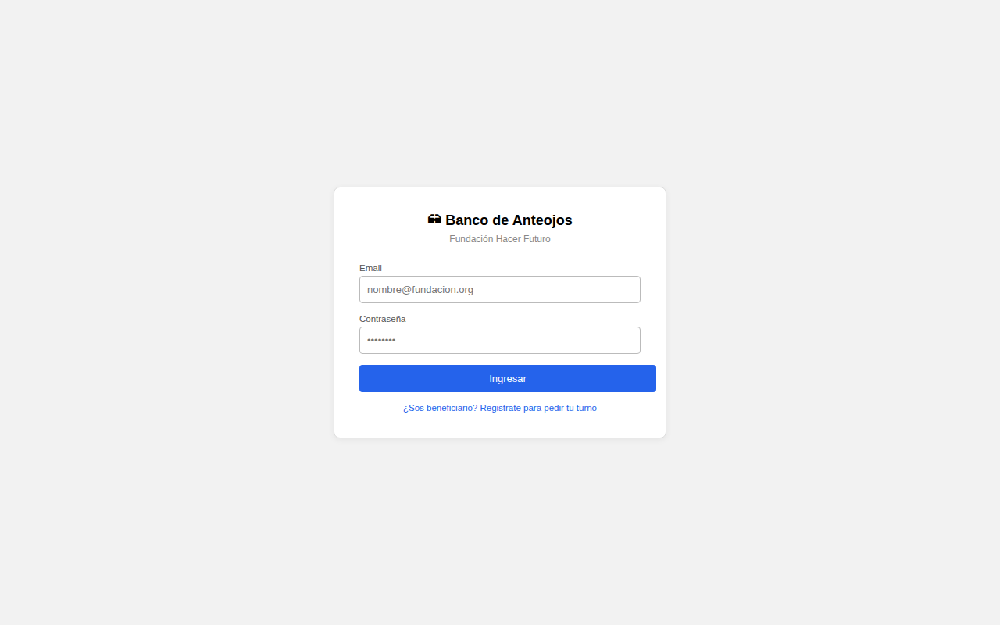

**Diálogo**

| Acción de los actores | Respuesta del sistema |
|---|---|
| 1. El usuario completa **Correo electrónico** (A). | |
| 2. Completa **Contraseña** (B). | |
| 3. Hace clic en **Iniciar sesión** (C). | 4. El sistema valida las credenciales y redirige a `/solicitante`, `/operador` o `/admin` según el rol del token. |
| 5. *(Opcional)* El beneficiario sin cuenta hace clic en **"Registrate acá"** (D). | 6. El sistema muestra el formulario de autoregistro (RU-02). |

**Flujos alternativos**
- **3a. Credenciales inválidas:** el sistema muestra el mensaje de error de la API sin redirigir.

---

## RU-02 — Registrarse como beneficiario (autogestión)

| Campo | Detalle |
|---|---|
| **Caso de uso** | RU-02 — Registrarse como beneficiario |
| **Actores** | Beneficiario |
| **Propósito** | Permitir que una persona sin cuenta se dé de alta como solicitante y obtenga acceso al portal de autogestión, sin pasar por un operador. |
| **Resumen** | El visitante completa sus datos personales y una contraseña; el sistema crea el `Applicant` (con `identityValidated = false`, igual que si lo cargara un operador) y el `User` de login en un solo paso, y devuelve sesión iniciada. |
| **Tipo** | Primario y real |
| **Referencias cruzadas** | RF-01 (Registrar solicitante); RNF-01 |
| **Precondiciones** | El DNI no pertenece ya a un solicitante registrado. |
| **Postcondiciones** | Solicitante y cuenta creados; sesión iniciada; redirige a `/solicitante`. |

**Pantalla:** Registro de solicitante

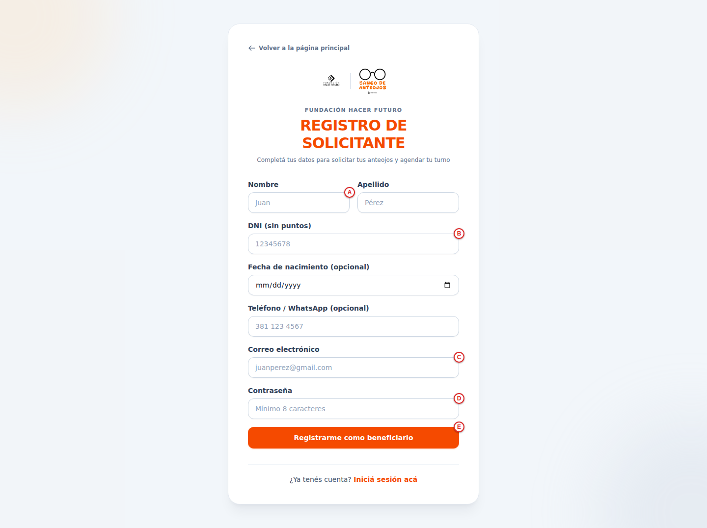

**Diálogo**

| Acción de los actores | Respuesta del sistema |
|---|---|
| 1. El visitante completa **Nombre**, Apellido, **DNI** (B), fecha de nacimiento y teléfono (opcionales). | |
| 2. Completa **Correo electrónico** (C) y **Contraseña** (D, mínimo 8 caracteres). | |
| 3. Hace clic en **"Registrarme como beneficiario"** (E). | 4. El sistema crea el solicitante y su cuenta, inicia sesión automáticamente y redirige a `/solicitante`. |

**Flujos alternativos**
- **4a. El DNI ya está registrado:** el sistema rechaza el alta con un mensaje de error.

---

## RU-03 — Gestionar solicitantes (listado)

| Campo | Detalle |
|---|---|
| **Caso de uso** | RU-03 — Gestionar solicitantes (listado) |
| **Actores** | Operador, Administrador |
| **Propósito** | Ubicar un solicitante existente o iniciar el alta de uno nuevo, y navegar a sus datos de elegibilidad. |
| **Resumen** | El operador visualiza el listado completo de solicitantes con su estado de identidad, y navega desde cada fila a Recetas, ANSES, Asignar marco, Turno o Editar. |
| **Tipo** | Primario y real |
| **Referencias cruzadas** | RF-08 (Consultar, editar y listar solicitantes) |
| **Precondiciones** | El operador inició sesión (RU-01). |
| **Postcondiciones** | El operador navega al solicitante y a la sección elegida. |

**Pantalla:** Solicitantes — Listado

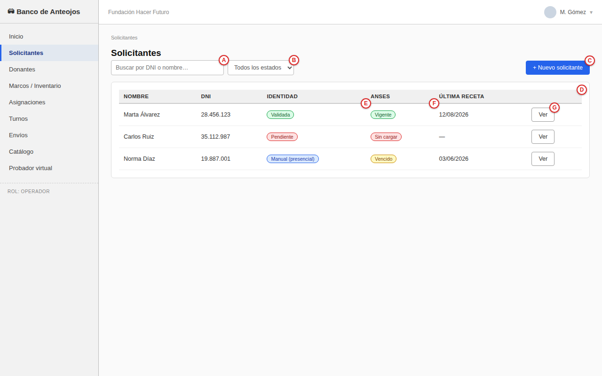

**Diálogo**

| Acción de los actores | Respuesta del sistema |
|---|---|
| 1. El operador entra a "Solicitantes" desde el menú. | 2. El sistema muestra la tabla completa: Apellido y nombre, DNI, Nacimiento, Contacto, Identidad (badge Validada/Pendiente, B). |
| 3. *(Alternativa)* Hace clic en **"Nuevo solicitante"** (A). | El sistema abre el formulario de alta (mismo formulario que RU-04, vacío y con DNI editable). |
| 4. Hace clic en **Recetas** (C), **ANSES** (D), **Asignar marco** (E) o **Turno** (F) sobre una fila. | El sistema navega a la sección elegida para ese solicitante (RU-05, RU-06, RU-09, RU-11). |
| 5. Hace clic en **Editar** (G). | El sistema navega a RU-04. |

**Flujos alternativos**
- El listado no tiene buscador ni filtro por estado en la implementación actual: siempre muestra
  todos los solicitantes.

---

## RU-04 — Editar datos personales del solicitante

| Campo | Detalle |
|---|---|
| **Caso de uso** | RU-04 — Editar datos personales del solicitante |
| **Actores** | Operador, Administrador |
| **Propósito** | Registrar o corregir los datos personales de un solicitante. |
| **Resumen** | El operador edita nombre, apellido, DNI (solo en el alta), fecha de nacimiento, teléfono y email de un solicitante. |
| **Tipo** | Primario y real |
| **Referencias cruzadas** | RF-01 (Registrar solicitante), RF-08 (editar) |
| **Precondiciones** | Solicitante nuevo (desde RU-03, "Nuevo solicitante") o existente (desde RU-03, "Editar"). |
| **Postcondiciones** | Datos personales actualizados. |

**Pantalla:** Solicitante — Editar datos personales

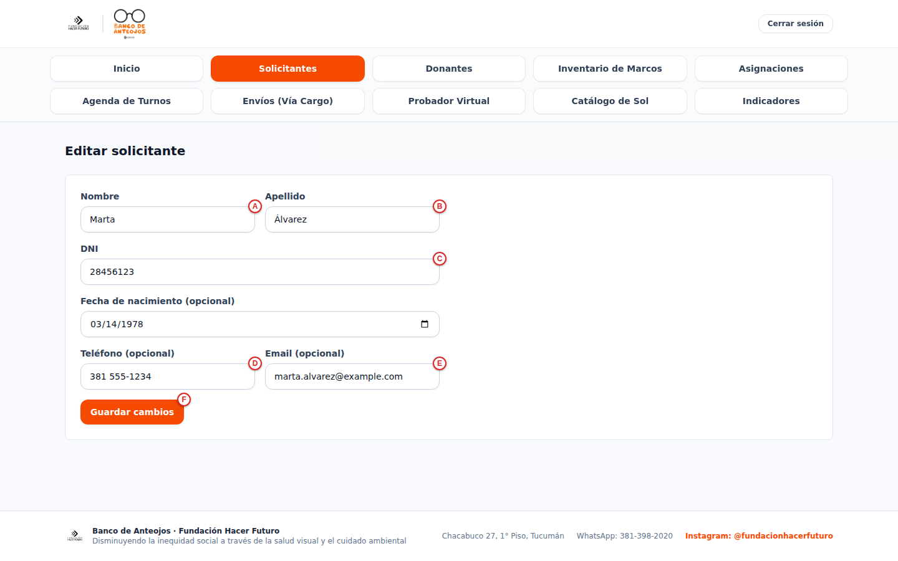

**Diálogo**

| Acción de los actores | Respuesta del sistema |
|---|---|
| 1. El operador completa/corrige **Nombre** (A), **Apellido** (B), **DNI** (C, solo editable en el alta), **Teléfono** (D) y **Email** (E). | |
| 2. Hace clic en **"Guardar cambios"** (F). | 3. El sistema guarda los datos y vuelve al listado (RU-03). |

**Flujos alternativos**
- **2a. DNI duplicado** (solo en el alta): el sistema rechaza el guardado con un mensaje de error.

> **Nota de fidelidad:** esta pantalla es la totalidad de "gestionar la ficha del solicitante" en el
> frontend actual — no existe ningún control de validación de identidad (RENAPER ni presencial). El
> campo `identityValidated` del modelo de datos permanece en `false` para todo solicitante: no hay
> endpoint ni botón que lo cambie. RF-02 y RF-06 están especificados en el SRS pero no implementados
> en el código actual.

---

## RU-05 — Gestionar recetas del solicitante

| Campo | Detalle |
|---|---|
| **Caso de uso** | RU-05 — Gestionar recetas del solicitante |
| **Actores** | Operador, Administrador |
| **Propósito** | Registrar la graduación oftalmológica del solicitante, usada luego para el match con marcos. |
| **Resumen** | El operador ve el historial de recetas cargadas y agrega una nueva con los valores de esfera/cilindro/eje por ojo, adjuntando opcionalmente el archivo de la receta del médico. |
| **Tipo** | Primario y real |
| **Referencias cruzadas** | RF-07 (Registrar receta médica) |
| **Precondiciones** | Solicitante existente (desde RU-03, "Recetas"). |
| **Postcondiciones** | Receta creada, disponible para el match de asignación (RU-09). |

**Pantalla:** Solicitante — Recetas

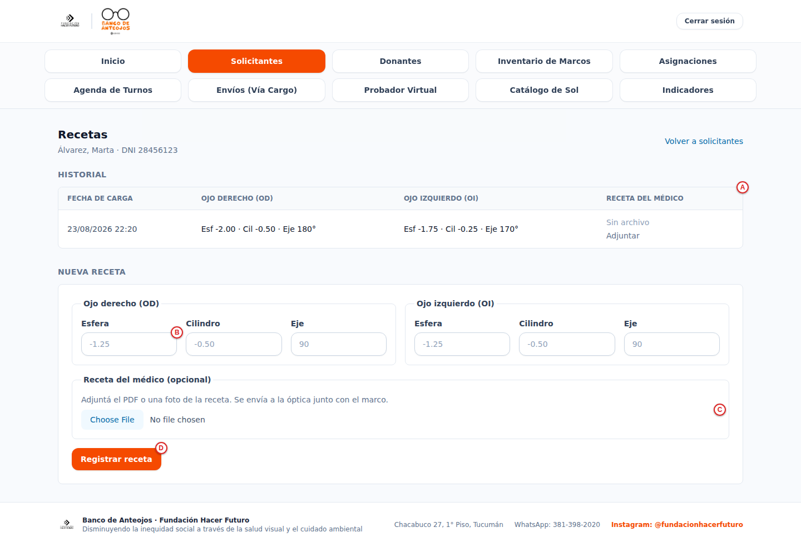

**Diálogo**

| Acción de los actores | Respuesta del sistema |
|---|---|
| 1. El operador consulta el **historial** (A): fecha de carga, Ojo derecho, Ojo izquierdo y archivo de la receta del médico. | |
| 2. En "Nueva receta", completa **Esfera** (B), Cilindro y Eje para OD y OI (todos opcionales). | |
| 3. *(Opcional)* Adjunta el archivo de la receta del médico (C). | |
| 4. Hace clic en **"Registrar receta"** (D). | 5. El sistema guarda la graduación primero; si hay archivo, lo sube aparte — si la subida falla, la receta queda igual creada y el operador puede reintentar el adjunto desde el historial. |

---

## RU-06 — Cargar certificación negativa de ANSES

| Campo | Detalle |
|---|---|
| **Caso de uso** | RU-06 — Cargar certificación negativa de ANSES |
| **Actores** | Operador, Administrador |
| **Propósito** | Registrar la certificación negativa de ANSES del solicitante y verificar automáticamente su validez. |
| **Resumen** | El operador sube el PDF de la certificación; el sistema decodifica el código de barras, extrae CUIL y fecha de emisión, y muestra si acredita elegibilidad o si hay una advertencia (CUIL no coincide o vencida) que el operador puede igualmente pasar por alto. |
| **Tipo** | Primario y real |
| **Referencias cruzadas** | RF-03 (Carga de PDF), RF-04 (Verificación de CUIL), RF-05 (Verificación de vigencia) |
| **Precondiciones** | Solicitante existente (desde RU-03, "ANSES"). |
| **Postcondiciones** | Certificación cargada y verificada; el solicitante queda (o no) marcado como elegible para el match (RU-09). |

**Pantalla:** Solicitante — Certificación ANSES

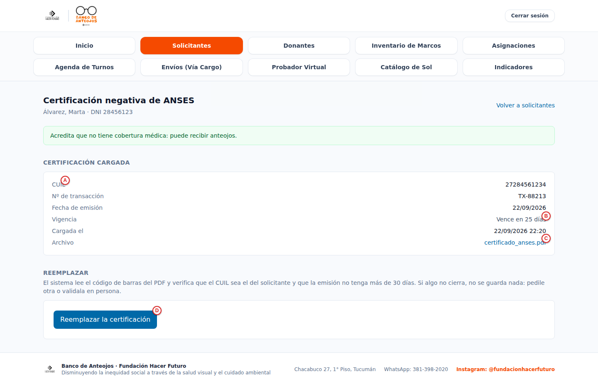

**Diálogo**

| Acción de los actores | Respuesta del sistema |
|---|---|
| 1. El operador hace clic en **"Subir la certificación"** (o "Reemplazar", D, si ya hay una cargada) y selecciona el PDF. | 2. El sistema lee el código de barras, guarda **CUIL** (A), N° de transacción, fecha de emisión y **vigencia** (B, "Vence en N días" / "Vencida hace N días"), y muestra el archivo (C, con nombre real, ej. `certificado_anses.pdf`). |
| | 3. El sistema muestra el resultado de elegibilidad: mensaje verde ("Acredita que no tiene cobertura médica") si está vigente, o un aviso ámbar si no, aclarando que la decisión final es del operador. |

**Flujos alternativos**
- **2a. El PDF no es legible o el código de barras no se reconoce:** el sistema no guarda nada y
  pide reintentar la carga.

**Pantalla alternativa (certificación vencida):**

---

## RU-07 — Registrar donante y marcos donados

| Campo | Detalle |
|---|---|
| **Caso de uso** | RU-07 — Registrar donante y marcos donados |
| **Actores** | Operador, Administrador |
| **Propósito** | Dar de alta un donante e ingresar al inventario los marcos que dona. |
| **Resumen** | El operador ubica o crea un donante y, desde su ficha, carga cada marco recibido con su precinto, tipo, material y medidas; el marco entra al inventario general. |
| **Tipo** | Primario y real |
| **Referencias cruzadas** | RF-09 (Registrar donante), RF-10 (Registrar recepción), RF-11 (Clasificar por atributos), RF-12 (Consultar donaciones) |
| **Precondiciones** | El operador inició sesión. |
| **Postcondiciones** | Los marcos quedan disponibles en el inventario (RU-08), vinculados al donante. |

**Pantallas:** Donantes — Listado, Donante — Marcos donados

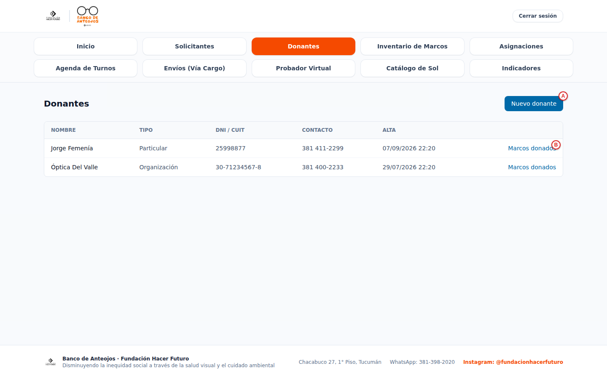
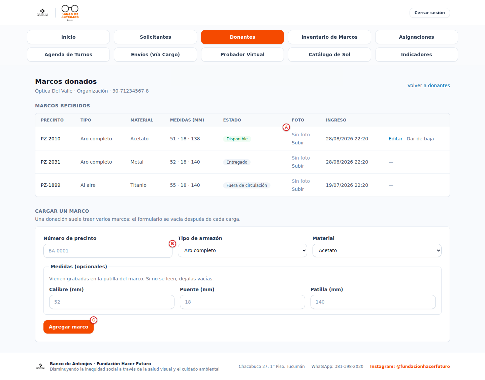

**Diálogo**

| Acción de los actores | Respuesta del sistema |
|---|---|
| 1. *(Alternativa)* El operador hace clic en **"Nuevo donante"** (A) y carga nombre, tipo, documento y contacto. | |
| 2. Hace clic en **"Marcos donados"** (B) sobre un donante. | El sistema muestra los marcos ya recibidos de ese donante, con su **Estado** (fila 1, C) y una miniatura o "Sin foto / Subir". |
| 3. El operador completa **Número de precinto** (D), tipo de armazón, material y medidas opcionales. | |
| 4. Hace clic en **"Agregar marco"** (E). | 5. El sistema crea el marco en estado `AVAILABLE` ("Disponible") y vacía el formulario para cargar el siguiente. |

**Flujos alternativos**
- **4a. Precinto duplicado:** el sistema rechaza la carga con un mensaje de error.

---

## RU-08 — Consultar inventario de marcos

| Campo | Detalle |
|---|---|
| **Caso de uso** | RU-08 — Consultar inventario de marcos |
| **Actores** | Operador, Administrador |
| **Propósito** | Ubicar rápidamente un marco o revisar el estado de cualquier marco del inventario. |
| **Resumen** | El operador consulta la lista completa de marcos de todos los donantes, filtra por estado, y desde ahí edita, da de baja o sube la foto de un marco disponible. |
| **Tipo** | Secundario y real |
| **Referencias cruzadas** | RF-13 (Inventario en tiempo real) |
| **Precondiciones** | Existen marcos cargados (RU-07). |
| **Postcondiciones** | El operador ubica el marco que necesita para una asignación (RU-09). |

**Pantalla:** Inventario de marcos

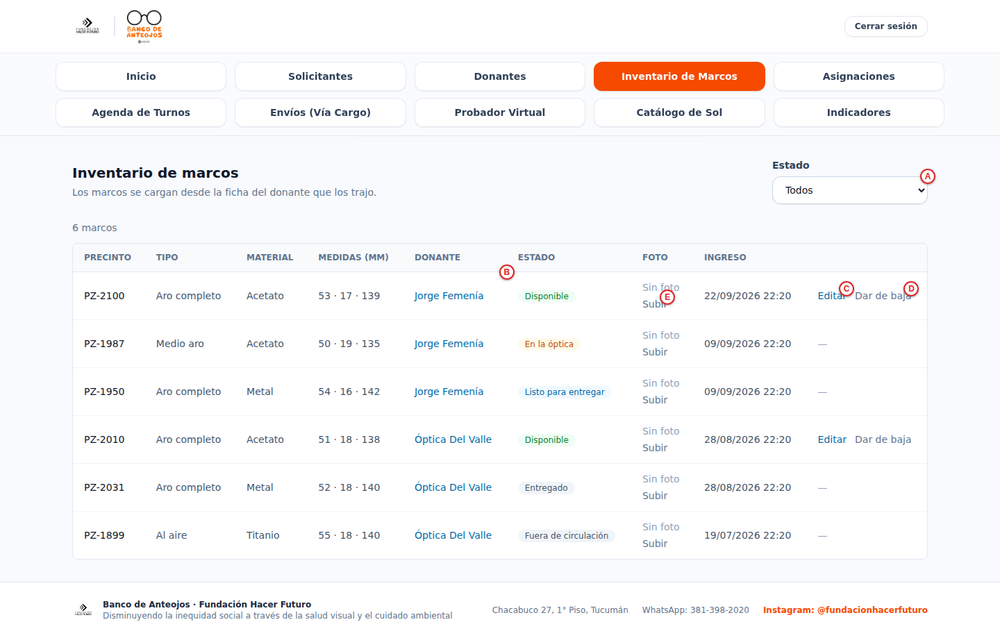

**Diálogo**

| Acción de los actores | Respuesta del sistema |
|---|---|
| 1. El operador filtra por **Estado** (A: Disponible / En la óptica / Listo para entregar / Entregado / Fuera de circulación). | 2. El sistema filtra la tabla, mostrando también el donante de cada marco (columna con link a RU-07). |
| 3. Sobre un marco **Disponible**, hace clic en **Editar** o **"Dar de baja"** (D). | El sistema permite corregir sus datos o descontinuarlo. Un marco ya asignado/entregado no ofrece estas acciones (columna "—"). |
| 4. Hace clic en **"Subir"** (E) bajo "Sin foto". | El sistema sube la imagen del marco (usada luego por el probador virtual, RU-16). |

---

## RU-09 — Asignar un marco a un beneficiario

| Campo | Detalle |
|---|---|
| **Caso de uso** | RU-09 — Asignar un marco a un beneficiario |
| **Actores** | Operador, Administrador |
| **Propósito** | Elegir un marco disponible y una receta del beneficiario, y comenzar el circuito de armado. |
| **Resumen** | El operador consulta la cola de asignaciones en curso y, desde la ficha del solicitante, elige una receta y un marco disponible para crear una nueva asignación. |
| **Tipo** | Primario y real |
| **Referencias cruzadas** | RF-14 (Match receta↔marco — selección manual en la UI actual), RF-15 (Asignar marco) |
| **Precondiciones** | El solicitante tiene al menos una receta cargada (RU-05) y hay marcos disponibles (RU-08). |
| **Postcondiciones** | Asignación creada, visible en la trazabilidad (RU-10); el marco queda `ASSIGNED`. |

**Pantallas:** Asignaciones — Cola, Asignar un marco

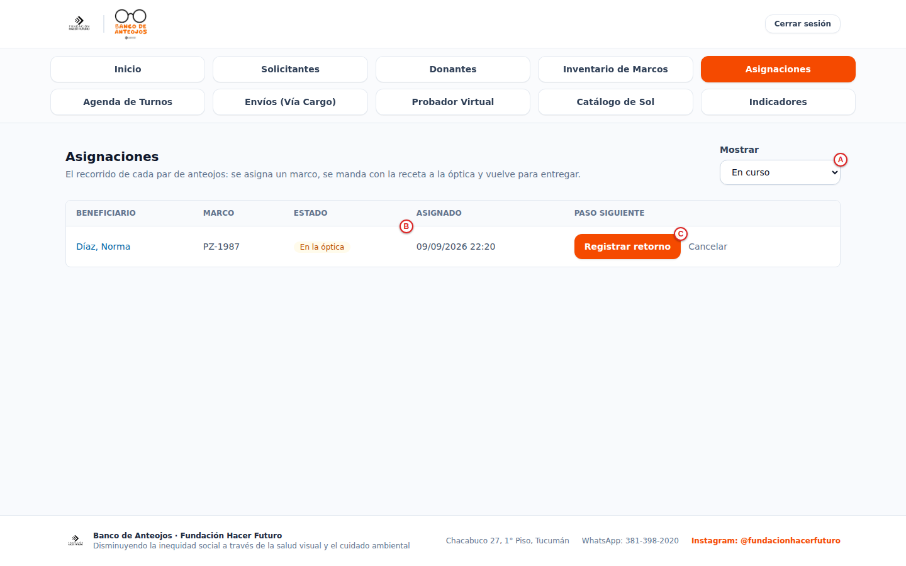

**Diálogo**

| Acción de los actores | Respuesta del sistema |
|---|---|
| 1. El operador filtra la cola con **Mostrar** (A: En curso / Todas). | 2. El sistema muestra beneficiario, marco, estado (B, badge) y el paso siguiente disponible para cada asignación en curso. |
| 3. Desde la ficha del solicitante (RU-03, "Asignar marco"), el operador elige una **Receta** (A) y un **Marco disponible** (B). | |
| 4. Hace clic en **"Asignar marco"** (C). | 5. El sistema crea la asignación (queda `ASSIGNED`) y descuenta el marco del inventario disponible. |

**Flujos alternativos**
- **Sin recetas o sin marcos disponibles:** el formulario no se muestra; en su lugar hay un enlace
  a "Cargá la receta primero" o "Cargá los marcos de una donación".

---

## RU-10 — Consultar trazabilidad de una asignación

| Campo | Detalle |
|---|---|
| **Caso de uso** | RU-10 — Consultar trazabilidad de una asignación |
| **Actores** | Operador, Administrador |
| **Propósito** | Conocer en qué etapa del circuito está un par de anteojos y avanzarlo al siguiente hito. |
| **Resumen** | El sistema muestra el recorrido completo de la asignación (asignado → enviado a la óptica → volvió con los cristales → entregado) junto con los datos del beneficiario, el marco y el donante, y permite registrar el siguiente hito o cancelarla. |
| **Tipo** | Primario y real |
| **Referencias cruzadas** | RF-16 (Trazabilidad end-to-end) |
| **Precondiciones** | Existe una asignación (RU-09). |
| **Postcondiciones** | El circuito avanza al siguiente hito, o la asignación se cancela. |

**Pantalla:** Asignación — Detalle y trazabilidad

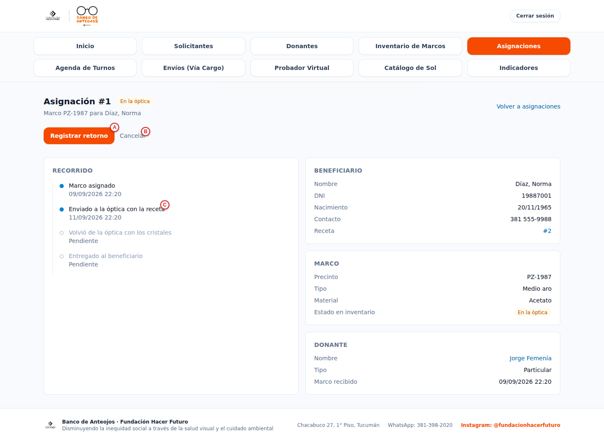

**Diálogo**

| Acción de los actores | Respuesta del sistema |
|---|---|
| 1. El operador abre una asignación desde la cola (RU-09). | 2. El sistema muestra el recorrido (C: "Enviado a la óptica con la receta" y los hitos pendientes en gris) junto con los datos de Beneficiario, Marco y Donante. |
| 3. Hace clic en el botón de acción del hito siguiente (A, p. ej. "Registrar retorno"). | 4. El sistema avanza la asignación al siguiente hito. |
| 5. *(Alternativa)* Hace clic en **Cancelar** (B). | El sistema cancela la asignación y libera el marco de vuelta a disponible. |

---

## RU-11 — Gestionar turnos (agenda del staff)

| Campo | Detalle |
|---|---|
| **Caso de uso** | RU-11 — Gestionar turnos (agenda del staff) |
| **Actores** | Operador, Administrador |
| **Propósito** | Registrar turnos, revisar y aprobar el comprobante del bono contribución de la autogestión, reprogramar o cancelar turnos, y registrar la asistencia del día. |
| **Resumen** | El operador consulta la agenda completa de turnos, filtrada por día o "Todos", y desde cada fila aprueba/cancela un turno pendiente de revisión, o registra asistencia/reprogramación/cancelación de un turno ya aceptado. |
| **Tipo** | Primario y real |
| **Referencias cruzadas** | RF-20 (Registrar turnos), RF-21 (Gestionar turnos: revisión, reprogramación y cancelación), RF-22 (Notificaciones automáticas) |
| **Precondiciones** | El solicitante existe. |
| **Postcondiciones** | El turno queda actualizado; los cambios de estado disparan la notificación correspondiente. |

**Pantalla:** Turnos — Agenda del staff

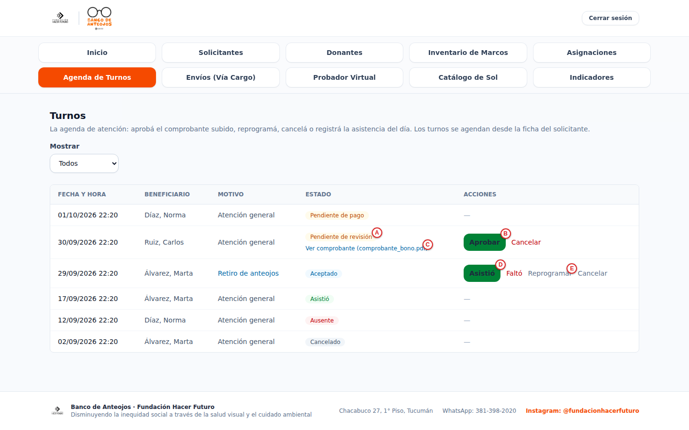

**Diálogo**

| Acción de los actores | Respuesta del sistema |
|---|---|
| 1. El operador cambia **Mostrar** a "Todos" (por defecto solo se ve el día de hoy). | 2. El sistema lista fecha y hora, beneficiario, motivo (Atención general o "Retiro de anteojos" con link a la asignación) y estado de cada turno. |
| 3. Para un turno **Pendiente de revisión** (A), el operador abre el comprobante con **"Ver comprobante"** (C) y lo revisa. | |
| 4. Hace clic en **"Aprobar"** (B). | El sistema pasa el turno a `SCHEDULED` ("Aceptado") y dispara la notificación de confirmación. |
| 5. *(Alternativa)* Hace clic en **Cancelar** junto al turno pendiente de revisión. | El sistema lo pasa a `CANCELLED` y notifica. |
| 6. Para un turno **Aceptado**, hace clic en **"Asistió"** (D) o **"Faltó"** el día del turno. | El sistema registra la asistencia (`COMPLETED`/`MISSED`), estado final para el panel de indicadores. |
| 7. *(Alternativa)* Hace clic en **"Reprogramar"** (E) y elige nueva fecha/hora. | El sistema actualiza el turno, que permanece `SCHEDULED`, y notifica el cambio. |

---

## RU-12 — Agendar un turno (staff)

| Campo | Detalle |
|---|---|
| **Caso de uso** | RU-12 — Agendar un turno (staff) |
| **Actores** | Operador, Administrador |
| **Propósito** | Registrar un turno presencialmente para un solicitante, ya `SCHEDULED` (sin el paso de pago de la autogestión). |
| **Resumen** | El operador elige fecha y hora, opcionalmente asociando el turno a una asignación en curso si es un retiro de anteojos. |
| **Tipo** | Primario y real |
| **Referencias cruzadas** | RF-20 (Registrar turnos) |
| **Precondiciones** | El solicitante existe (desde RU-03, "Turno"). |
| **Postcondiciones** | Turno creado en estado `SCHEDULED`; si el beneficiario tiene email, se le notifica. |

**Pantalla:** Agendar un turno (staff)

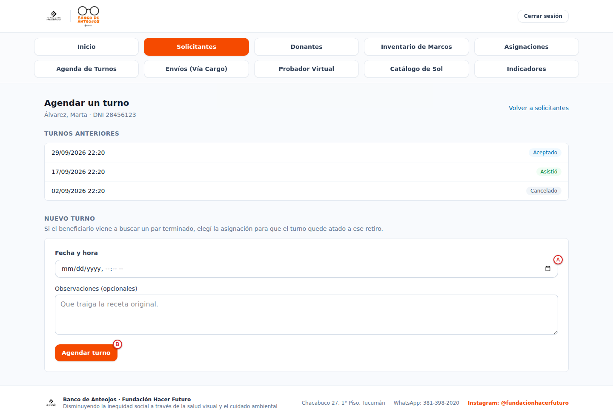

**Diálogo**

| Acción de los actores | Respuesta del sistema |
|---|---|
| 1. El operador consulta los **turnos anteriores** del solicitante (badges de estado real: Aceptado/Asistió/Cancelado). | |
| 2. Completa **Fecha y hora** (A) y, si corresponde, elige la asignación de retiro. | |
| 3. Hace clic en **"Agendar turno"** (B). | 4. El sistema crea el turno directamente `SCHEDULED` y confirma si se envió el email al beneficiario. |

---

## RU-13 — Autogestión: pedir turno y cargar el comprobante

| Campo | Detalle |
|---|---|
| **Caso de uso** | RU-13 — Autogestión: pedir turno y cargar el comprobante |
| **Actores** | Beneficiario |
| **Propósito** | Permitir que el beneficiario saque su turno sin asistir presencialmente y cargue el comprobante del bono contribución para que un operador lo revise. |
| **Resumen** | El beneficiario elige una fecha; el turno nace `PENDING_PAYMENT` y, en cuanto sube el comprobante, pasa a `PENDING_REVIEW` — recién queda `SCHEDULED` cuando un operador lo aprueba (RU-11). |
| **Tipo** | Primario y real |
| **Referencias cruzadas** | RF-20 (Registrar turnos), RF-21 (revisión); RNF-01 (rol APPLICANT) |
| **Precondiciones** | El beneficiario tiene una cuenta y sesión iniciada. |
| **Postcondiciones** | Turno pendiente de pago, de revisión, o aceptado (según el paso alcanzado), visible en la agenda del staff (RU-11). |

**Pantalla:** Autogestión — Mis turnos

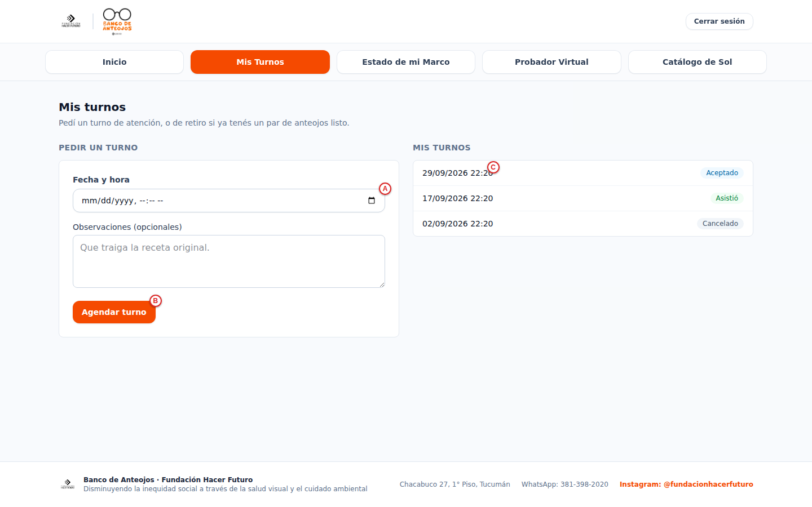

**Diálogo**

| Acción de los actores | Respuesta del sistema |
|---|---|
| 1. El beneficiario completa **Fecha y hora** (A) en "Pedir un turno". | |
| 2. Hace clic en **"Agendar turno"** (B). | 3. El sistema crea el turno en `PENDING_PAYMENT` y lo agrega a "Mis turnos" (C) con ese estado. |
| 4. El sistema muestra, bajo el turno pendiente de pago, los datos de la cuenta para transferir el bono contribución y el botón para subir el comprobante. | |
| 5. El beneficiario sube el comprobante. | 6. El sistema valida el archivo y pasa el turno a "Pendiente de revisión" — todavía no se notifica ni queda confirmado. |
| 7. *(Cuando un operador aprueba en RU-11)* | El turno pasa a "Aceptado" y el sistema notifica la confirmación. |

**Flujos alternativos**
- **5a. El beneficiario no sube comprobante:** el turno permanece "Pendiente de pago" indefinidamente.
- **6a. El archivo no es válido:** el sistema rechaza la carga y el beneficiario puede reintentarla.

---

## RU-14 — Autogestión: estado de mi marco

| Campo | Detalle |
|---|---|
| **Caso de uso** | RU-14 — Autogestión: estado de mi marco |
| **Actores** | Beneficiario |
| **Propósito** | Permitir que el beneficiario siga el recorrido de sus anteojos sin llamar a la fundación. |
| **Resumen** | El sistema muestra, de solo lectura, el mismo recorrido que ve el operador (RU-10) para cada asignación del beneficiario logueado. |
| **Tipo** | Secundario y real |
| **Referencias cruzadas** | RF-16 (Trazabilidad end-to-end) |
| **Precondiciones** | El beneficiario tiene sesión iniciada. |
| **Postcondiciones** | Ninguna (consulta de solo lectura; el circuito se mueve desde RU-10, no desde acá). |

**Pantalla:** Autogestión — Estado de mi marco

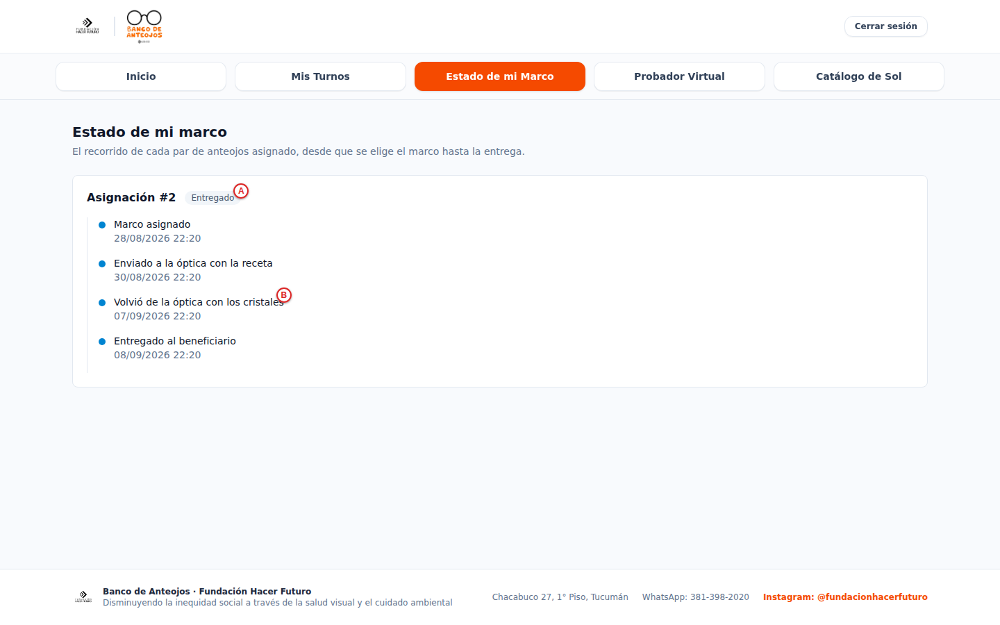

**Diálogo**

| Acción de los actores | Respuesta del sistema |
|---|---|
| 1. El beneficiario entra a "Estado de mi Marco". | 2. El sistema muestra cada asignación propia con su estado (A, p. ej. "Entregado") y el detalle del recorrido (B: Marco asignado → Enviado a la óptica con la receta → Volvió de la óptica con los cristales → Entregado al beneficiario), cada hito con su fecha. |

---

## RU-15 — Gestionar envíos entre sucursales

| Campo | Detalle |
|---|---|
| **Caso de uso** | RU-15 — Gestionar envíos entre sucursales |
| **Actores** | Operador, Administrador; 17TRACK como sistema externo |
| **Propósito** | Trazar el traslado de marcos entre sucursales de punta a punta. |
| **Resumen** | El operador arma un paquete con los marcos a trasladar (queda `PENDING`), lo despacha cargando el número de seguimiento de Vía Cargo (queda registrado en 17TRACK), y el estado se actualiza automáticamente por webhook a partir de ahí. |
| **Tipo** | Primario y real |
| **Referencias cruzadas** | RF-23 (Registrar envío en 17TRACK), RF-24 (Actualizaciones por webhook), RF-25 (Consultar estado y trazabilidad) |
| **Precondiciones** | Hay marcos que trasladar entre sucursales. |
| **Postcondiciones** | El envío queda trazado punta a punta entre sucursales. |

**Pantallas:** Envíos — Listado, Envío — Detalle

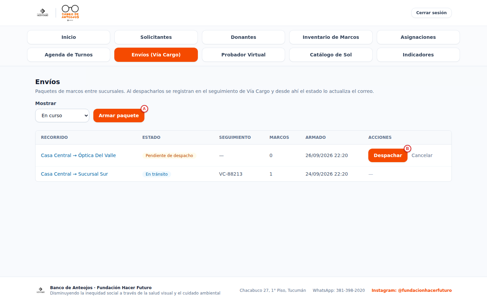
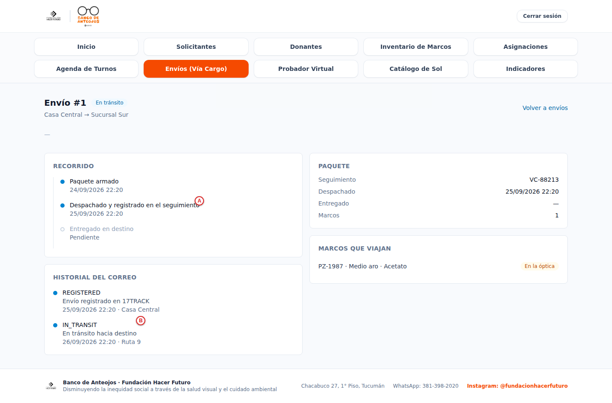

**Diálogo**

| Acción de los actores | Respuesta del sistema |
|---|---|
| 1. El operador hace clic en **"Armar paquete"** (A) y elige origen, destino y los marcos a enviar. | 2. El sistema crea el envío en `PENDING`, sin número de seguimiento todavía. |
| 3. Sobre un envío pendiente, hace clic en **"Despachar"** (B) y carga el número de Vía Cargo. | 4. El sistema lo registra en 17TRACK y pasa a `REGISTERED`/`IN_TRANSIT`. |
| 5. El operador abre el detalle de un envío y consulta el recorrido (A: "Despachado y registrado en el seguimiento") y el **historial del correo** (B: eventos crudos de 17TRACK, p. ej. `IN_TRANSIT`). | 6. El estado se actualiza automáticamente por el webhook de 17TRACK, sin acción del operador. |

---

## RU-16 — Usar el probador virtual

| Campo | Detalle |
|---|---|
| **Caso de uso** | RU-16 — Usar el probador virtual |
| **Actores** | Beneficiario, Operador |
| **Propósito** | Previsualizar cómo le quedarían al beneficiario los marcos disponibles con foto, antes de asignarle uno. |
| **Resumen** | El usuario toma o sube una foto; MediaPipe Face Mesh detecta el rostro (todo el procesamiento ocurre en el propio navegador, la foto nunca se sube a ningún servidor — RNF-02) y el sistema superpone en 2D el marco elegido, con ajuste manual de tamaño, altura y rotación. |
| **Tipo** | Secundario y real |
| **Referencias cruzadas** | RF-17 (Detección de rostro), RF-18 (Superposición 2D), RF-19 (Selección de marcos); RNF-04 (Compatibilidad con gama baja) |
| **Precondiciones** | Hay al menos un marco disponible con foto cargada (RU-08). |
| **Postcondiciones** | Ninguna (previsualización, no persiste datos). |

**Pantalla:** Probador virtual

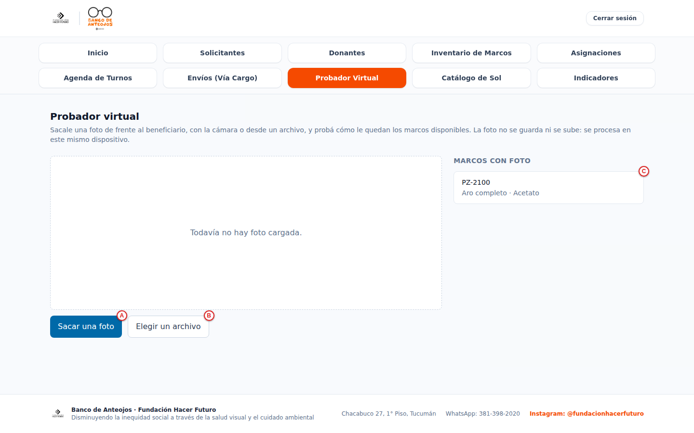

**Diálogo**

| Acción de los actores | Respuesta del sistema |
|---|---|
| 1. El usuario hace clic en "Sacar una foto" o "Elegir un archivo". | 2. El sistema detecta el rostro en el propio navegador. |
| 3. Elige un marco de "Marcos con foto" (solo aparecen los disponibles que ya tienen imagen cargada). | 4. El sistema superpone el marco en 2D sobre la foto y habilita el ajuste de Tamaño, Altura y Rotación. |

**Flujos alternativos**
- **2a. El detector de rostros no pudo cargar** (dispositivo o red): el sistema muestra "El probador
  no está disponible en este dispositivo" sin romper el resto de la aplicación — es exactamente el
  estado capturado arriba, observado en el entorno de prueba.
- **2b. No se detecta ningún rostro en la foto:** el sistema pide subir otra foto, de frente y con
  buena luz.

---

## RU-17 — Catálogo: consultar y vender (staff)

| Campo | Detalle |
|---|---|
| **Caso de uso** | RU-17 — Catálogo: consultar y vender (staff) |
| **Actores** | Operador, Administrador |
| **Propósito** | Registrar la venta de un producto del catálogo de sol con descuento de stock. |
| **Resumen** | El operador ve el catálogo (activos o todos) y, sobre un producto con stock, abre el formulario de venta en la misma fila. |
| **Tipo** | Primario y real |
| **Referencias cruzadas** | RF-29 (Registrar venta con descuento de stock) |
| **Precondiciones** | Hay al menos un producto activo con stock. |
| **Postcondiciones** | Venta registrada; stock descontado. |

**Pantalla:** Catálogo de venta (staff)

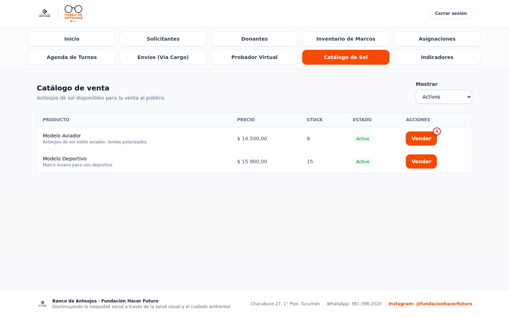

**Diálogo**

| Acción de los actores | Respuesta del sistema |
|---|---|
| 1. El operador filtra "Mostrar" (Activos/Todos) y ubica un producto con stock disponible. | |
| 2. Hace clic en **"Vender"** (A). | 3. El sistema despliega el formulario de venta en la misma fila (cantidad y comprador). |
| 4. El operador confirma la venta. | 5. El sistema descuenta el stock y registra la venta en el historial (RU-18). |

**Flujos alternativos**
- **5a. Stock insuficiente al momento de confirmar:** el sistema rechaza la venta con un mensaje y no
  descuenta stock.

---

## RU-18 — Catálogo: gestionar productos (admin)

| Campo | Detalle |
|---|---|
| **Caso de uso** | RU-18 — Catálogo: gestionar productos |
| **Actores** | Administrador |
| **Propósito** | Mantener actualizado el catálogo de anteojos de sol: alta, edición, foto y baja de productos. |
| **Resumen** | El administrador crea o edita un producto (nombre, descripción, precio, stock), le sube una foto, consulta su historial de ventas y puede darlo de baja de forma permanente. |
| **Tipo** | Primario y real |
| **Referencias cruzadas** | RF-30 (Gestionar stock del catálogo) |
| **Precondiciones** | Sesión de ADMIN — el Operador ve el catálogo pero no "Nuevo producto" ni "Editar". |
| **Postcondiciones** | Catálogo actualizado. |

**Pantalla:** Catálogo — Gestión (admin)

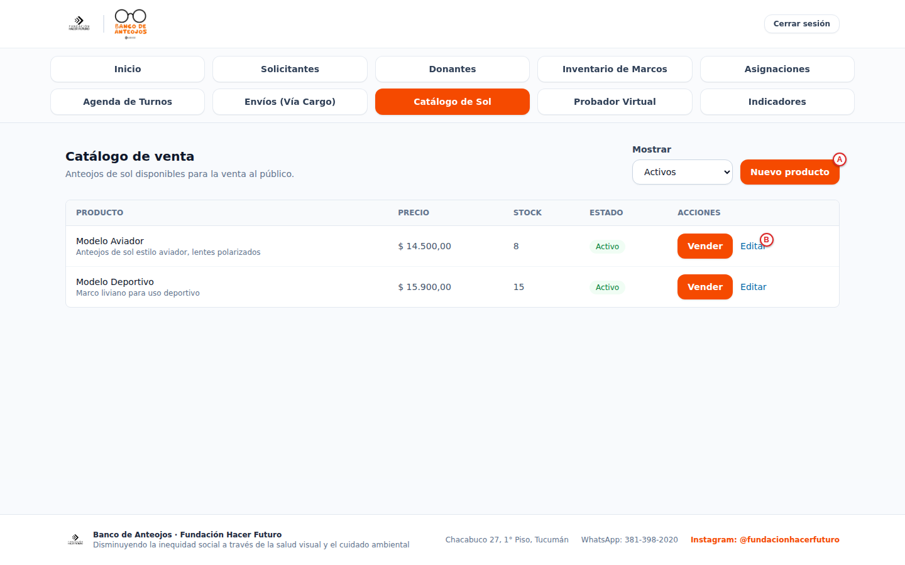

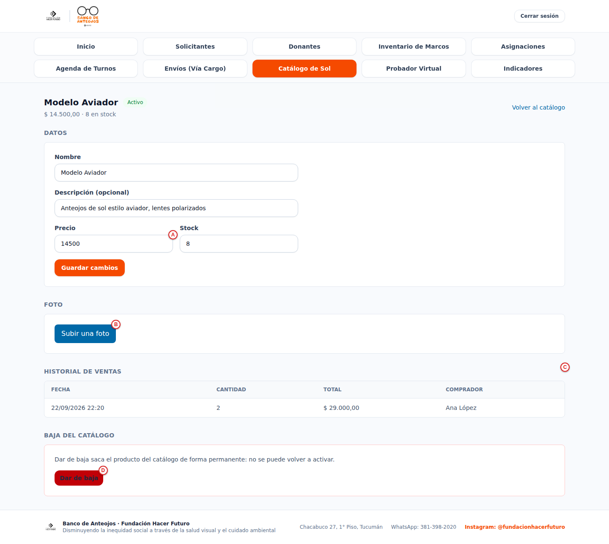

**Diálogo**

| Acción de los actores | Respuesta del sistema |
|---|---|
| 1. *(Alternativa)* El administrador hace clic en **"Nuevo producto"** (A) y carga nombre, descripción, precio y stock. | |
| 2. Hace clic en **Editar** (B) sobre un producto existente. | El sistema abre su ficha con **Precio**/Stock editables (A) y el historial de ventas (C) de ese producto. |
| 3. Corrige los datos y hace clic en **"Guardar cambios"**. | El sistema actualiza el producto. |
| 4. *(Opcional)* Hace clic en **"Subir una foto"** (B). | El sistema guarda la imagen, visible luego en el catálogo público y en el del beneficiario. |
| 5. *(Alternativa)* Hace clic en **"Dar de baja"** (D). | El sistema lo pasa a `DISCONTINUED` de forma **permanente** ("no se puede volver a activar", según el propio aviso de la pantalla) — no borra su historial de ventas ni desaparece del historial, solo deja de listarse como activo. |

---

## RU-19 — Catálogo: vista del beneficiario

| Campo | Detalle |
|---|---|
| **Caso de uso** | RU-19 — Catálogo: vista del beneficiario |
| **Actores** | Beneficiario |
| **Propósito** | Permitir que un beneficiario autenticado vea el catálogo de anteojos de sol desde su propio portal. |
| **Resumen** | El sistema muestra el mismo listado de productos activos que ve el staff, con precio y stock. |
| **Tipo** | Secundario y real |
| **Referencias cruzadas** | RF-28 (Catálogo digital de anteojos de sol) |
| **Precondiciones** | El beneficiario tiene sesión iniciada. |
| **Postcondiciones** | Ninguna (consulta). |

**Pantalla:** Autogestión — Catálogo de sol

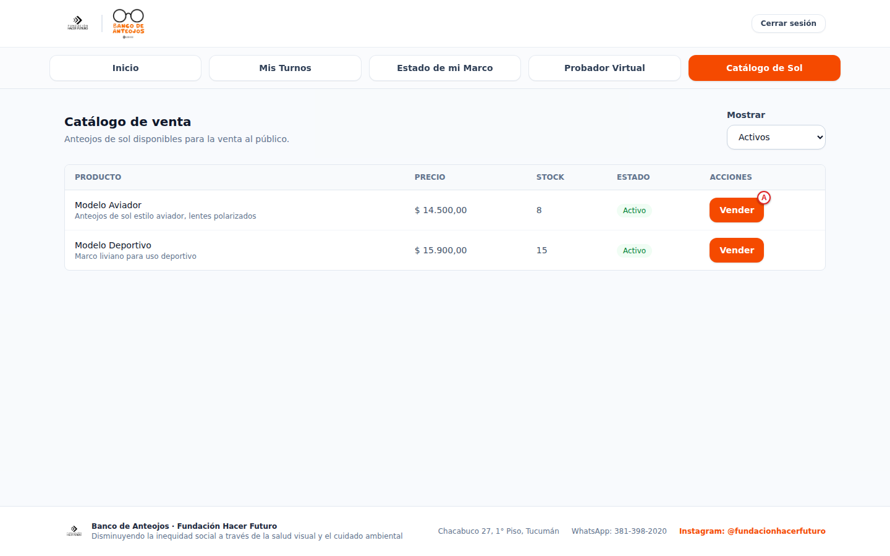

**Diálogo**

| Acción de los actores | Respuesta del sistema |
|---|---|
| 1. El beneficiario entra a "Catálogo de Sol" desde su portal. | 2. El sistema muestra los productos activos con precio y stock, igual que en la vista del staff. |

**Flujos alternativos**
- **Inconsistencia de permisos detectada:** el componente de listado es el mismo para todos los
  roles y no oculta el botón **"Vender"** (A) para un Beneficiario, aunque el backend rechaza con
  403 cualquier intento de venta que no venga de ADMIN u OPERATOR (`SecurityConfig` solo habilita
  `GET /v1/catalog/products` para APPLICANT). El botón queda visible pero inoperante para este rol.

---

## Notas de trazabilidad

- Cada RU referencia su(s) RF/RNF del SRS y su mockup real en `docs/mockups/`; cualquier cambio de
  campo, botón o ruta en el frontend debe reflejarse acá y en las capturas anotadas.
- Las letras que marcan cada captura identifican un control o dato concreto de la pantalla real
  (resuelto contra el DOM en vivo, no dibujado a mano), y se referencian igual en ambas columnas del
  diálogo.
- Dos brechas de implementación quedaron documentadas explícitamente porque afectan directamente el
  diseño de interfaz: la validación de identidad (RF-02/RF-06, sin UI ni endpoint) en RU-04, y la
  inconsistencia de permisos del botón "Vender" en RU-19.
- Las validaciones "no bloqueantes, a criterio del operador" (vigencia ANSES) son decisiones de
  diseño explícitas del SRS (RF-05), no omisiones.
