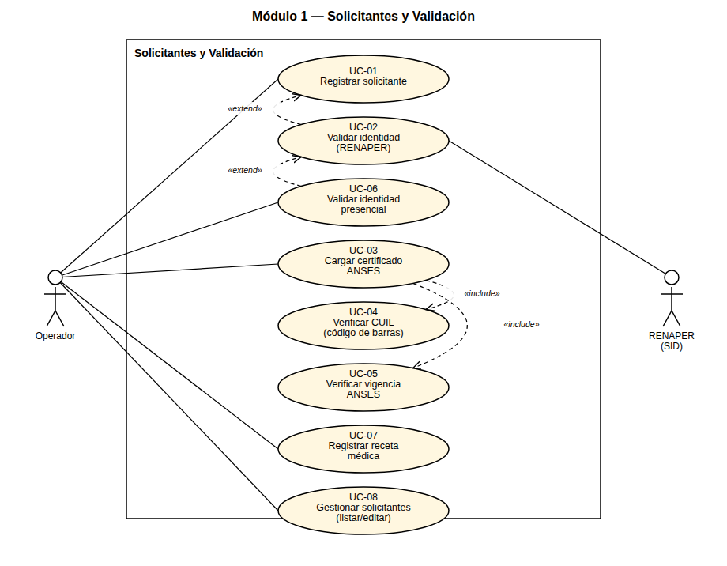
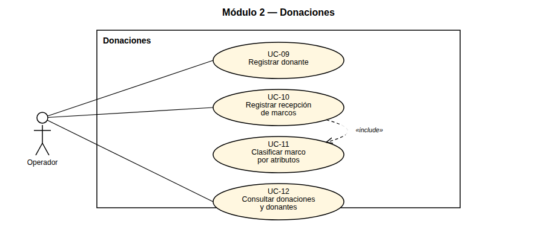
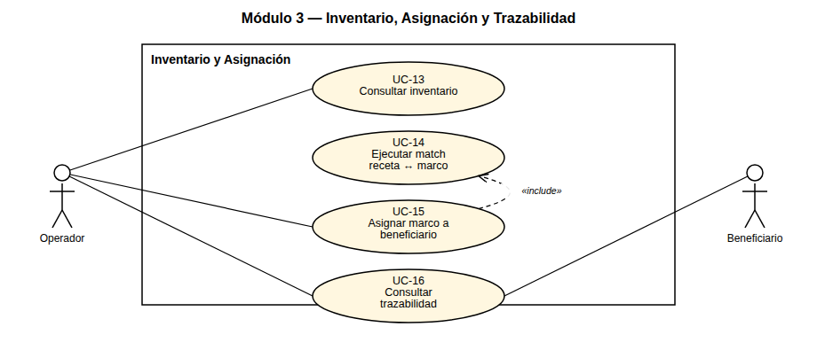
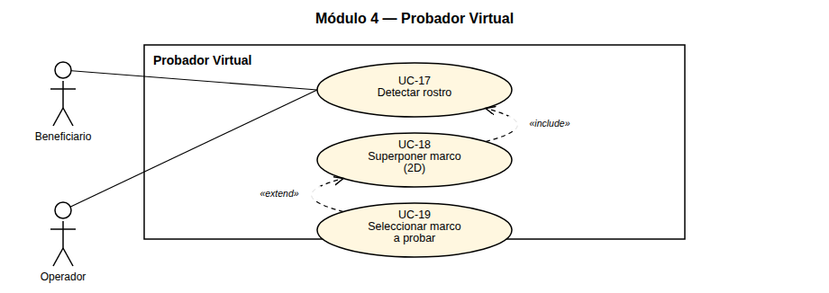
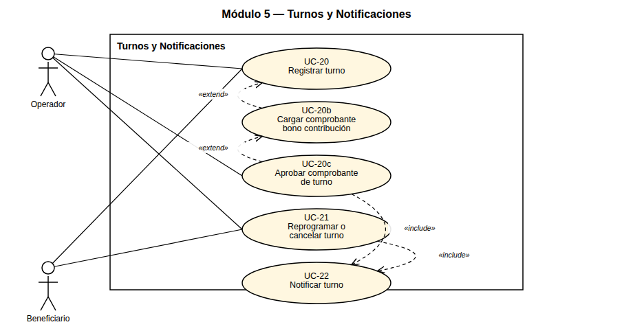
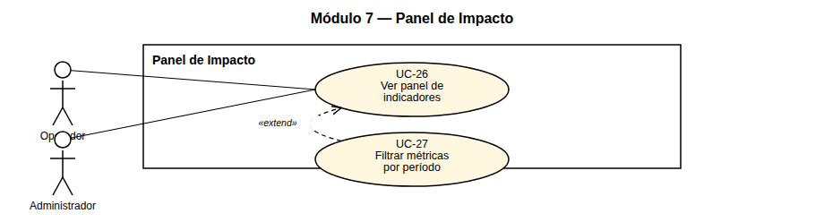

# Modelo de Casos de Uso

## Sistema Banco de Anteojos — Fundación Hacer Futuro

> Complementa el SRS (`docs/srs/SRS.md`) y el Diagrama de Casos de Uso
> (`docs/diagrama-casos-de-uso/`). Narra cada caso de uso **esencial** con su escenario de éxito
> paso a paso y sus escenarios alternativos referenciados por número de paso (formato Cockburn),
> independiente de la interfaz gráfica concreta — el diseño de interfaz de cada caso de uso se
> detalla en el entregable "Casos de Uso Reales", junto con los mockups.

---

## 1. Actores

| Actor | Tipo | Descripción |
|---|---|---|
| **Operador** | Primario, humano | Personal de la fundación: registra solicitantes, donaciones, asigna marcos, gestiona turnos y envíos. |
| **Administrador** | Primario, humano | Además de lo que hace el Operador, administra usuarios, configuración y el catálogo de venta. |
| **Beneficiario** | Primario, humano | Solicitante del banco de anteojos. En el portal de autogestión pide turno, sube el comprobante del bono contribución, consulta el estado de su marco y usa el probador virtual. |
| **Comprador** | Primario, humano | Público general que navega el catálogo de anteojos de sol (sin necesidad de cuenta). |
| **RENAPER (SID)** | Secundario, sistema externo | Valida la identidad del solicitante a partir del DNI. |
| **17TRACK** | Secundario, sistema externo | Registra y notifica (webhook) el estado de los envíos de Vía Cargo. |

## 2. Diagrama general de casos de uso

---

## 3. Módulo 1 — Solicitantes y Validación

### Caso de uso UC-01: Registrar solicitante
**Actor:** Operador
**Precondiciones:** —
**Postcondiciones:** Solicitante creado, identidad no validada.
**Escenario de éxito:**

1. El operador elige registrar un nuevo solicitante.
2. El sistema muestra el formulario de datos personales.
3. El operador ingresa nombre, apellido, DNI, fecha de nacimiento, teléfono y email.
4. El sistema valida el formato de los datos y la unicidad del DNI.
5. El sistema solicita confirmación.
6. El operador confirma el alta.
7. El sistema registra el solicitante con identidad no validada y muestra un mensaje de alta exitosa.

**Escenarios alternativos:**

*3a. El operador se equivoca al completar un campo.*
1. Se vuelve al paso 3.

*4a. El sistema detecta que el DNI ya está registrado.*
1. El sistema notifica que el DNI ya existe.
2. Se vuelve al paso 3.

*4b. El sistema detecta un formato de dato inválido.*
1. El sistema notifica el campo inválido.
2. Se vuelve al paso 3.

*6a. El operador no confirma.*
1. No se guardan los cambios.

### Caso de uso UC-02: Validar identidad (RENAPER)
**Actor:** Operador (+ RENAPER)
**Precondiciones:** Solicitante registrado (UC-01).
**Postcondiciones:** Identidad validada o rechazada.
**Escenario de éxito:**

1. El operador elige validar la identidad del solicitante.
2. El sistema consulta el SID de RENAPER con el DNI del solicitante.
3. RENAPER responde que los datos coinciden.
4. El sistema marca la identidad como validada y notifica el resultado exitoso.

**Escenarios alternativos:**

*3a. RENAPER responde que los datos no coinciden.*
1. El sistema notifica que la identidad no pudo validarse.
2. El operador revisa los datos cargados (vuelve a UC-01, paso 3) o inicia la validación presencial (UC-06).

*3b. El servicio de RENAPER no está disponible.*
1. El sistema notifica que el servicio no está disponible.
2. El operador inicia la validación presencial (UC-06).

### Caso de uso UC-06: Validar identidad presencial
**Actor:** Operador
**Precondiciones:** RENAPER no disponible (UC-02, alternativo 3b), o el operador opta por esta vía.
**Postcondiciones:** Identidad validada por vía alternativa, trazada como manual.
**Escenario de éxito:**

1. El operador elige la validación presencial.
2. El sistema le solicita confirmar que verificó el DNI físico del solicitante.
3. El operador coteja el documento físico contra los datos cargados en el sistema.
4. El operador confirma la verificación.
5. El sistema marca la identidad como validada por vía manual y registra al operador responsable.

**Escenarios alternativos:**

*4a. El operador no confirma (el documento no coincide o tiene dudas).*
1. El sistema no marca la identidad como validada.
2. El operador corrige los datos del solicitante (UC-08) o descarta el alta.

### Caso de uso UC-03: Cargar certificado ANSES
**Actor:** Operador
**Precondiciones:** Solicitante registrado.
**Postcondiciones:** Certificado ANSES registrado, pendiente de verificación.
**Escenario de éxito:**

1. El operador elige cargar el certificado de ANSES del solicitante.
2. El sistema solicita el archivo PDF.
3. El operador selecciona el archivo.
4. El sistema valida que el archivo sea un PDF válido y lo sube a almacenamiento externo (R2).
5. El sistema ejecuta la verificación de CUIL (UC-04) y de vigencia (UC-05) sobre el archivo.
6. El sistema registra el certificado y muestra los resultados de ambas verificaciones.

**Escenarios alternativos:**

*3a. El operador cancela la selección del archivo.*
1. Se vuelve al paso 2.

*4a. El archivo no es un PDF válido o está vacío.*
1. El sistema notifica el error.
2. Se vuelve al paso 2.

*6a. Ya existía un certificado cargado previamente para el solicitante.*
1. El sistema reemplaza el certificado anterior por el nuevo.

### Caso de uso UC-04: Verificar CUIL (código de barras)
**Actor:** Sistema (disparado por el Operador dentro de UC-03)
**Precondiciones:** Certificado ANSES cargado (UC-03, paso 4).
**Postcondiciones:** Coincidencia confirmada o rechazo con motivo (no bloqueante).
**Escenario de éxito:**

1. El sistema decodifica el código de barras del PDF.
2. El sistema extrae el CUIL y el número de transacción codificados.
3. El sistema compara el CUIL extraído contra el ya registrado para el solicitante (o lo registra, si es la primera verificación).
4. El sistema confirma la coincidencia y la muestra con una marca de "coincide".

**Escenarios alternativos:**

*1a. El sistema no encuentra un código de barras legible en el PDF.*
1. El sistema notifica el error y no completa el CUIL detectado.

*3a. El CUIL extraído no coincide con el ya registrado para el solicitante.*
1. El sistema muestra el resultado con una marca de "no coincide", sin bloquear la carga del certificado.
2. El operador decide si continúa o corrige el documento cargado (vuelve a UC-03, paso 2).

### Caso de uso UC-05: Verificar vigencia ANSES
**Actor:** Sistema (disparado por el Operador dentro de UC-03)
**Precondiciones:** Certificado ANSES cargado (UC-03, paso 4).
**Postcondiciones:** Estado de vigencia informado (no bloqueante).
**Escenario de éxito:**

1. El sistema extrae la fecha de emisión del texto del PDF.
2. El sistema calcula la antigüedad respecto de la fecha actual.
3. El sistema determina que la antigüedad es de 30 días o menos.
4. El sistema muestra el certificado con una marca de "vigente".

**Escenarios alternativos:**

*1a. El sistema no encuentra la fecha de emisión en el texto del PDF.*
1. El sistema notifica que no pudo determinar la vigencia.

*3a. La antigüedad supera los 30 días.*
1. El sistema muestra el certificado con una marca de "vencido", sin bloquear la carga; la validación final queda a criterio del operador.

### Caso de uso UC-07: Registrar receta médica
**Actor:** Operador
**Precondiciones:** Solicitante registrado.
**Postcondiciones:** Receta registrada, disponible para el match (UC-14).
**Escenario de éxito:**

1. El operador elige registrar una nueva receta para el solicitante.
2. El sistema muestra el formulario de graduación (esfera, cilindro y eje por ojo).
3. El operador ingresa los valores para ojo derecho e izquierdo.
4. El operador adjunta opcionalmente el archivo de la receta.
5. El sistema valida los rangos de los valores ingresados.
6. El sistema registra la receta y la agrega al historial del solicitante.

**Escenarios alternativos:**

*4a. El operador no adjunta archivo.*
1. Se continúa el flujo sin archivo (es opcional).

*5a. Alguno de los valores está fuera de rango (p. ej. eje fuera de 0°–180°).*
1. El sistema notifica el campo inválido.
2. Se vuelve al paso 3.

### Caso de uso UC-08: Gestionar solicitantes (listar/editar)
**Actor:** Operador
**Precondiciones:** —
**Postcondiciones:** Listado, detalle o edición confirmada.
**Escenario de éxito:**

1. El operador elige consultar los solicitantes.
2. El sistema muestra el listado de solicitantes.
3. El operador busca por DNI o nombre, o filtra por estado.
4. El sistema muestra los resultados filtrados.
5. El operador selecciona un solicitante para editar sus datos.
6. El sistema muestra el detalle con los campos editables (excepto DNI).
7. El operador modifica los datos y confirma.
8. El sistema valida y guarda los cambios, y muestra un mensaje de confirmación.

**Escenarios alternativos:**

*3a. La búsqueda no arroja resultados.*
1. El sistema muestra un listado vacío.

*7a. El operador intenta modificar el DNI.*
1. El sistema no permite editar ese campo (es de solo lectura).

*8a. Los datos ingresados no son válidos.*
1. El sistema notifica el campo inválido.
2. Se vuelve al paso 7.

---

## 4. Módulo 2 — Donaciones

### Caso de uso UC-09: Registrar donante
**Actor:** Operador
**Precondiciones:** —
**Postcondiciones:** Donante creado con ID único.
**Escenario de éxito:**

1. El operador elige registrar un nuevo donante.
2. El sistema solicita el tipo de donante (persona o entidad).
3. El operador selecciona el tipo e ingresa nombre o razón social y datos de contacto.
4. El sistema valida los datos.
5. El sistema registra el donante y muestra un mensaje de alta exitosa.

**Escenarios alternativos:**

*4a. Falta un dato obligatorio según el tipo elegido.*
1. El sistema notifica el campo faltante.
2. Se vuelve al paso 3.

### Caso de uso UC-10: Registrar recepción de marcos
**Actor:** Operador
**Precondiciones:** Donante registrado.
**Postcondiciones:** Marcos registrados en inventario, vinculados al donante.
**Escenario de éxito:**

1. El operador elige registrar una recepción de marcos para un donante.
2. El sistema solicita los datos de cada marco recibido.
3. El operador ingresa el precinto de un marco y lo clasifica por sus atributos (UC-11).

   Se repite el paso 3 hasta que el operador termine de cargar todos los marcos.
4. El operador confirma la recepción.
5. El sistema crea cada marco en estado disponible, los vincula al donante y muestra un mensaje de confirmación.

**Escenarios alternativos:**

*3a. El precinto ingresado ya existe en el sistema.*
1. El sistema notifica el precinto duplicado.
2. Se vuelve al paso 3.

*4a. El operador no confirma.*
1. No se guardan los marcos cargados.

### Caso de uso UC-11: Clasificar marco por atributos
**Actor:** Operador (dentro de UC-10)
**Precondiciones:** Marco en proceso de recepción (UC-10, paso 3).
**Postcondiciones:** Marco clasificado, disponible para el match.
**Escenario de éxito:**

1. El operador selecciona el tipo de marco (con aro completo, semi-aro, sin aro).
2. El operador selecciona el material (acetato, metal, titanio, plástico, otro).
3. El operador ingresa las medidas (ancho de lente, puente y patilla).
4. El sistema valida los datos y los incorpora al marco en carga.

**Escenarios alternativos:**

*4a. Falta un atributo obligatorio (tipo o material).*
1. El sistema notifica el campo faltante.
2. Se vuelve al paso 1.

### Caso de uso UC-12: Consultar donaciones y donantes
**Actor:** Operador
**Precondiciones:** —
**Postcondiciones:** —
**Escenario de éxito:**

1. El operador elige consultar donantes.
2. El sistema muestra el listado de donantes.
3. El operador busca un donante por nombre.
4. El sistema muestra los resultados.
5. El operador selecciona un donante para ver su detalle.
6. El sistema muestra los datos del donante y el historial de marcos donados.

**Escenarios alternativos:**

*3a. La búsqueda no arroja resultados.*
1. El sistema muestra un listado vacío.

---

## 5. Módulo 3 — Inventario, Asignación y Trazabilidad

### Caso de uso UC-13: Consultar inventario
**Actor:** Operador
**Precondiciones:** —
**Postcondiciones:** —
**Escenario de éxito:**

1. El operador elige consultar el inventario de marcos.
2. El sistema muestra el listado de marcos con su estado.
3. El operador filtra por precinto, tipo o estado.
4. El sistema actualiza el listado según el filtro.

**Escenarios alternativos:**

*3a. El filtro no arroja resultados.*
1. El sistema muestra un listado vacío.

### Caso de uso UC-14: Ejecutar match receta↔marco
**Actor:** Sistema (disparado por el Operador dentro de UC-15)
**Precondiciones:** Receta registrada (UC-07).
**Postcondiciones:** Lista de marcos candidatos.
**Escenario de éxito:**

1. El sistema toma la receta seleccionada del solicitante.
2. El sistema filtra los marcos en estado disponible compatibles con la graduación.
3. El sistema ordena los marcos candidatos por compatibilidad.
4. El sistema muestra la lista de marcos candidatos al operador.

**Escenarios alternativos:**

*2a. No hay marcos compatibles disponibles.*
1. El sistema muestra la lista vacía.
2. El operador espera a que ingrese una donación compatible.

### Caso de uso UC-15: Asignar marco a beneficiario
**Actor:** Operador
**Precondiciones:** Solicitante con identidad validada, ANSES cargado y receta registrada.
**Postcondiciones:** Asignación creada, marco removido del inventario disponible.
**Escenario de éxito:**

1. El operador elige asignar un marco al solicitante.
2. El sistema ejecuta el match receta↔marco (UC-14) y muestra los candidatos.
3. El operador selecciona un marco de la lista.
4. El sistema solicita confirmación.
5. El operador confirma.
6. El sistema crea la asignación, cambia el marco a estado asignado, descuenta el inventario disponible y muestra un mensaje de confirmación.

**Escenarios alternativos:**

*2a. No hay marcos candidatos.*
1. Ver UC-14, alternativo 2a.

*5a. El operador no confirma.*
1. No se realiza la asignación.

*6a. El marco elegido dejó de estar disponible (otro operador lo asignó primero).*
1. El sistema rechaza la asignación y notifica el motivo.
2. Se vuelve al paso 2 con la lista de candidatos actualizada.

### Caso de uso UC-16: Consultar trazabilidad
**Actor:** Operador, Beneficiario
**Precondiciones:** Asignación creada (UC-15).
**Postcondiciones:** —
**Escenario de éxito:**

1. El actor elige consultar la trazabilidad de una asignación.
2. El sistema muestra la línea de tiempo del circuito (asignado, enviado a la óptica, retornado, entregado) y el estado actual.

**Escenarios alternativos:**

*1a. El beneficiario intenta consultar una asignación que no es suya.*
1. El sistema rechaza la consulta (no encontrada).

---

## 6. Módulo 4 — Probador Virtual

### Caso de uso UC-17: Detectar rostro
**Actor:** Beneficiario, Operador
**Precondiciones:** Foto estática disponible (cámara o archivo).
**Postcondiciones:** Landmarks faciales calculados, o estado "no disponible" si falla.
**Escenario de éxito:**

1. El actor toma o sube una foto.
2. El sistema, en el navegador, procesa la foto con MediaPipe Face Mesh.
3. El sistema detecta el rostro y calcula los puntos de referencia faciales.

**Escenarios alternativos:**

*2a. MediaPipe no está disponible (dispositivo o red).*
1. El sistema muestra un estado degradado ("probador virtual no disponible") sin interrumpir el resto de la aplicación.

*3a. No se detecta un rostro en la foto.*
1. El sistema pide al actor subir otra foto.
2. Se vuelve al paso 1.

### Caso de uso UC-18: Superponer marco (2D)
**Actor:** Beneficiario, Operador
**Precondiciones:** Rostro detectado (UC-17).
**Postcondiciones:** Previsualización renderizada.
**Escenario de éxito:**

1. El sistema toma el marco actualmente seleccionado.
2. El sistema posiciona y escala el marco sobre los landmarks detectados.
3. El sistema renderiza la superposición en el canvas.
4. El actor ajusta manualmente la rotación o la altura si lo desea.
5. El sistema actualiza la previsualización con el ajuste.

**Escenarios alternativos:**

*4a. El actor no realiza ningún ajuste manual.*
1. Se conserva la posición calculada automáticamente.

### Caso de uso UC-19: Seleccionar marco a probar
**Actor:** Beneficiario, Operador
**Precondiciones:** Superposición activa (UC-18).
**Postcondiciones:** Previsualización recalculada para el nuevo marco.
**Escenario de éxito:**

1. El actor elige otro marco de la grilla de marcos disponibles.
2. El sistema recalcula la superposición (UC-18) para el marco elegido.

**Escenarios alternativos:** no aplica.

---

## 7. Módulo 5 — Turnos y Notificaciones

### Caso de uso UC-20: Registrar turno
**Actor:** Operador, Beneficiario
**Precondiciones:** Solicitante existente.
**Postcondiciones:** Turno creado.
**Escenario de éxito (registrado por el operador):**

1. El operador elige registrar un turno para el solicitante.
2. El sistema muestra la disponibilidad de fechas y horarios.
3. El operador selecciona fecha y hora.
4. El sistema registra el turno en estado confirmado y muestra un mensaje de confirmación.

**Escenarios alternativos:**

*2a. El turno lo solicita el propio beneficiario desde el portal de autogestión.*
1. El sistema muestra la disponibilidad de fechas.
2. El beneficiario selecciona fecha y hora.
3. El sistema registra el turno en estado "pendiente de pago" y continúa en UC-20b.

*3a. El horario elegido ya no está disponible.*
1. El sistema notifica que el horario fue tomado.
2. Se vuelve al paso 2 (o 2a.1) con la disponibilidad actualizada.

### Caso de uso UC-20b: Cargar comprobante de bono contribución
**Actor:** Beneficiario
**Precondiciones:** Turno en estado "pendiente de pago" (UC-20, alternativo 2a).
**Postcondiciones:** Turno pendiente de revisión (o continúa pendiente de pago).
**Escenario de éxito:**

1. El sistema muestra al beneficiario los datos de la cuenta para transferir el bono contribución.
2. El beneficiario realiza la transferencia por fuera del sistema.
3. El beneficiario sube el comprobante de la transferencia.
4. El sistema valida que el archivo sea un PDF, JPG o PNG válido y, si es PDF, que su contenido
   sea compatible con un comprobante de pago (detecta palabras clave como "comprobante", "recibo",
   "monto", "transacción").
5. El sistema cambia el turno a estado "pendiente de revisión" y continúa en UC-20c.

**Escenarios alternativos:**

*3a. El beneficiario no sube ningún comprobante.*
1. El turno permanece en estado "pendiente de pago" indefinidamente, sin confirmarse ni notificarse.

*4a. El archivo no es válido, o el PDF no parece un comprobante de pago.*
1. El sistema notifica el error.
2. Se vuelve al paso 3.

### Caso de uso UC-20c: Revisar y aprobar comprobante de turno
**Actor:** Operador
**Precondiciones:** Turno en estado "pendiente de revisión" (UC-20b).
**Postcondiciones:** Turno confirmado.
**Escenario de éxito:**

1. El operador abre el turno pendiente de revisión y consulta el comprobante cargado.
2. El operador verifica que el comprobante corresponde al bono contribución del turno.
3. El operador aprueba el turno.
4. El sistema cambia el turno a estado confirmado y dispara la notificación de confirmación (UC-22).

**Escenarios alternativos:**

*3a. El comprobante tiene un problema (no corresponde, monto incorrecto, ilegible, etc.).*
1. El operador cancela el turno en lugar de aprobarlo, con el motivo (UC-21, alternativo 1a).

### Caso de uso UC-21: Reprogramar o cancelar turno
**Actor:** Operador, Beneficiario
**Precondiciones:** Turno existente — confirmado (para reprogramar o cancelar) o pendiente de
revisión (solo para cancelar, si el comprobante tiene un problema); pertenencia validada.
**Postcondiciones:** Turno actualizado.
**Escenario de éxito (reprogramar):**

1. El actor elige reprogramar un turno confirmado.
2. El sistema muestra la disponibilidad de fechas.
3. El actor selecciona una nueva fecha y hora.
4. El sistema actualiza el turno conservando el estado confirmado y notifica el cambio (UC-22).

**Escenarios alternativos:**

*1a. El actor elige cancelar el turno en lugar de reprogramarlo.*
1. El sistema solicita el motivo de la cancelación.
2. El actor ingresa el motivo y confirma.
3. El sistema cambia el turno a estado cancelado y notifica (UC-22).

*1b. El actor intenta gestionar un turno que no le pertenece.*
1. El sistema rechaza la operación (no encontrado).

*3a. El nuevo horario elegido ya no está disponible.*
1. El sistema notifica que el horario fue tomado.
2. Se vuelve al paso 2.

### Caso de uso UC-22: Notificar turno
**Actor:** Sistema (disparado por UC-20c y UC-21)
**Precondiciones:** Evento de turno ocurrido (confirmación tras revisión, reprogramación o
cancelación).
**Postcondiciones:** Notificación entregada (best-effort).
**Escenario de éxito:**

1. El sistema arma el mensaje de notificación según el evento ocurrido.
2. El sistema envía la notificación al beneficiario.

**Escenarios alternativos:**

*2a. El envío de la notificación falla.*
1. El sistema registra el fallo sin interrumpir el flujo principal (el caso de uso que la disparó ya se completó).

---

## 8. Módulo 6 — Logística e Integración 17TRACK

### Caso de uso UC-23: Registrar envío (17TRACK)
**Actor:** Operador (+ 17TRACK)
**Precondiciones:** Marcos o lote a enviar entre sucursales.
**Postcondiciones:** Envío creado y en seguimiento.
**Escenario de éxito:**

1. El operador elige registrar un envío.
2. El sistema solicita sucursal de origen, destino y los marcos a incluir.
3. El operador completa los datos y confirma el despacho.
4. El sistema registra el envío en 17TRACK mediante el endpoint de registro.
5. El sistema guarda el número de seguimiento devuelto y marca el envío como despachado.

**Escenarios alternativos:**

*4a. El registro en 17TRACK falla.*
1. El sistema notifica el error y el envío queda pendiente para reintentar.

### Caso de uso UC-24: Recibir actualización (webhook)
**Actor:** 17TRACK
**Precondiciones:** Envío registrado (UC-23).
**Postcondiciones:** Estado del envío actualizado, evento trazado.
**Escenario de éxito:**

1. 17TRACK envía una actualización de estado por webhook.
2. El sistema verifica la firma del envío.
3. El sistema identifica el envío por su número de seguimiento.
4. El sistema actualiza el estado del envío y registra el evento con fecha, descripción y ubicación.

**Escenarios alternativos:**

*2a. La firma no es válida.*
1. El sistema rechaza la actualización.

*3a. El número de seguimiento no corresponde a ningún envío conocido.*
1. El sistema responde igualmente sin aplicar cambios (evita que 17TRACK reintente indefinidamente un push que nunca podría aplicar).

*4a. El estado informado no está mapeado en el sistema.*
1. El sistema registra igual el evento con el valor recibido, para no perder la trazabilidad, aunque no actualice el estado del envío.

### Caso de uso UC-25: Consultar estado y trazabilidad de envíos
**Actor:** Operador
**Precondiciones:** Envío registrado.
**Postcondiciones:** —
**Escenario de éxito:**

1. El operador elige consultar un envío.
2. El sistema muestra el estado actual y el historial de eventos del envío.

**Escenarios alternativos:** no aplica.

---

## 9. Módulo 7 — Panel de Impacto

### Caso de uso UC-26: Ver panel de indicadores
**Actor:** Operador, Administrador
**Precondiciones:** —
**Postcondiciones:** —
**Escenario de éxito:**

1. El actor accede al panel de indicadores.
2. El sistema calcula y muestra las entregas realizadas, los beneficiarios atendidos, los marcos donados y el porcentaje de asistencia a turnos, para el período por defecto.

**Escenarios alternativos:** no aplica (ver UC-27 para acotar por período).

### Caso de uso UC-27: Filtrar métricas por período
**Actor:** Operador, Administrador
**Precondiciones:** Panel visible (UC-26).
**Postcondiciones:** —
**Escenario de éxito:**

1. El actor selecciona un rango de fechas.
2. El sistema recalcula los indicadores para ese período y actualiza el panel.

**Escenarios alternativos:**

*1a. El actor ingresa una fecha "desde" posterior a la fecha "hasta".*
1. El sistema rechaza el rango y notifica el error.
2. Se vuelve al paso 1.

---

## 10. Módulo 8 — Catálogo de Venta

### Caso de uso UC-28: Consultar catálogo
**Actor:** Comprador, Operador
**Precondiciones:** —
**Postcondiciones:** —
**Escenario de éxito:**

1. El actor accede al catálogo de anteojos de sol.
2. El sistema muestra los productos activos con foto, nombre y precio.

**Escenarios alternativos:** no aplica.

### Caso de uso UC-29: Registrar venta
**Actor:** Operador
**Precondiciones:** Stock suficiente.
**Postcondiciones:** Venta registrada, stock actualizado.
**Escenario de éxito:**

1. El operador elige registrar una venta sobre un producto del catálogo (el comprador ya eligió cuál quiere, UC-28).
2. El sistema solicita la cantidad y el nombre del comprador (opcional).
3. El operador completa los datos y confirma.
4. El sistema descuenta el stock del producto, registra la venta con el precio vigente y muestra un mensaje de confirmación.

**Escenarios alternativos:**

*4a. El stock disponible es menor a la cantidad solicitada.*
1. El sistema rechaza la venta y notifica que no hay stock suficiente.
2. Se vuelve al paso 2.

### Caso de uso UC-30: Gestionar stock del catálogo
**Actor:** Administrador
**Precondiciones:** —
**Postcondiciones:** Catálogo actualizado.
**Escenario de éxito (alta o edición):**

1. El administrador elige crear o editar un producto.
2. El sistema muestra el formulario con nombre, descripción, precio, stock e imagen.
3. El administrador completa o modifica los datos y confirma.
4. El sistema guarda el producto y muestra un mensaje de confirmación.

**Escenarios alternativos:**

*1a. El administrador elige discontinuar un producto en lugar de editarlo.*
1. El sistema solicita confirmación.
2. El administrador confirma.
3. El sistema cambia el producto a estado discontinuado (no borra su historial de ventas) y deja de mostrarlo en el catálogo público.

*3a. Los datos ingresados no son válidos (p. ej. precio negativo).*
1. El sistema notifica el campo inválido.
2. Se vuelve al paso 3.

---

## 11. Notas de trazabilidad

- Correspondencia 1 a 1 con los RF del SRS, salvo UC-20/UC-20b que desagregan RF-20 para reflejar el
  flujo condicionado al bono contribución, y UC-20c que desagrega RF-21 para reflejar la revisión
  humana del comprobante antes de confirmar el turno (decisiones de diseño, no requisitos adicionales).
- UC-04, UC-05 y UC-14 se narran por separado por claridad, pero ocurren dentro de otro caso de uso
  (UC-03 y UC-15 respectivamente) — están marcados como "Sistema (disparado por ...)" en el actor.
- Estos casos de uso son **esenciales**: describen la intención del actor y la respuesta del sistema
  sin atarse a una pantalla concreta. El detalle de interacción con la UI (formularios, botones,
  mensajes) se especifica en el entregable "Casos de Uso Reales", que referencia los mismos IDs
  (UC-01, UC-02, …) y los mockups correspondientes.
