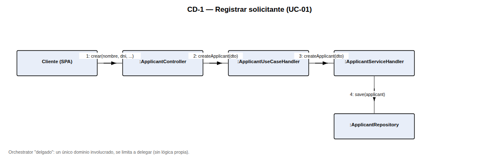
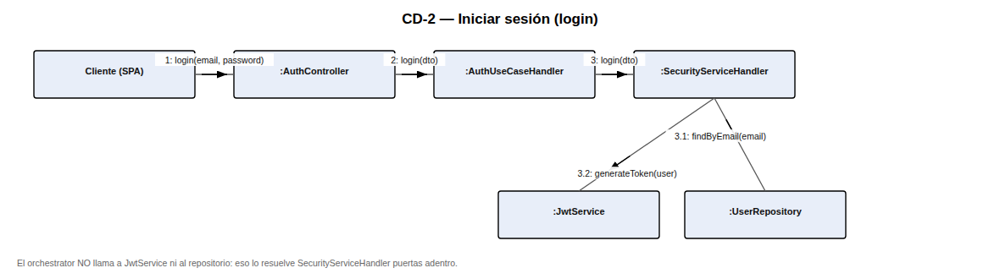
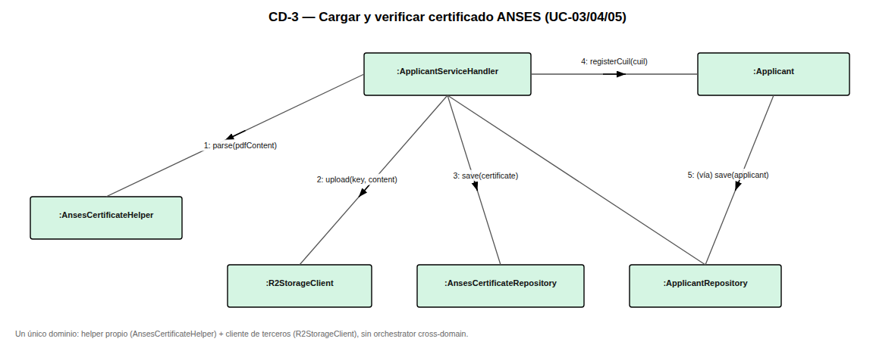
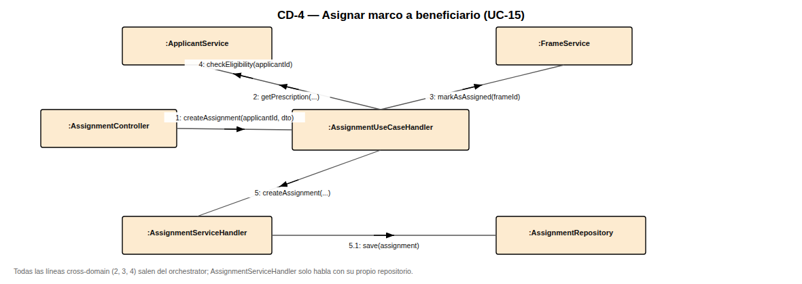
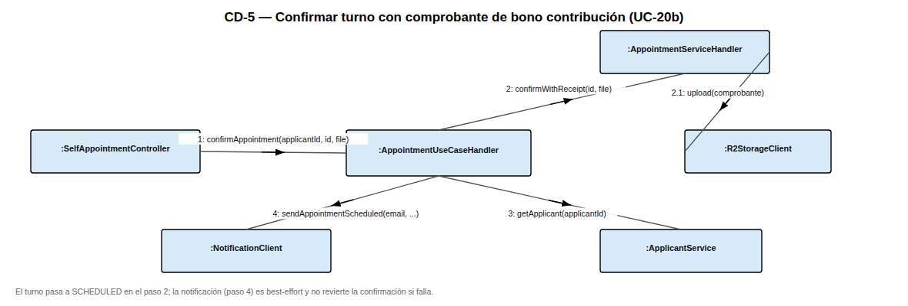
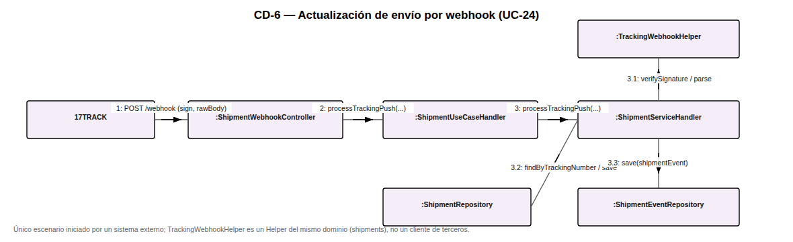
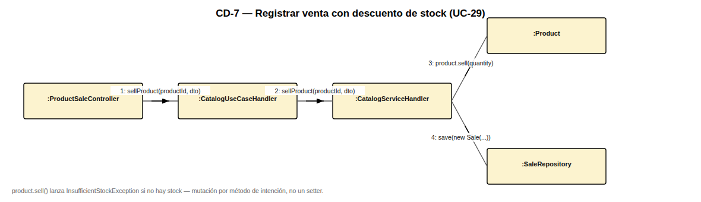

# Diagramas de Colaboración

## Sistema Banco de Anteojos — Fundación Hacer Futuro

> Notación UML de diagramas de colaboración/comunicación: objetos como cajas, enlaces (asociaciones)
> entre los que se comunican, y mensajes numerados sobre el enlace en el orden en que ocurren
> (`1`, `2`, `2.1`, `3`, …). Son la contracara de los diagramas de secuencia de la Vista de Procesos
> del Documento de Arquitectura (`docs/arquitectura/ARQUITECTURA.md`): mismas interacciones, foco en
> **quién habla con quién** en lugar de en la línea de tiempo. Se eligieron siete escenarios
> distintos a los de la Vista de Procesos (salvo la asignación de marco, que se repite por ser el
> caso más representativo) para no duplicar contenido y cubrir más patrones arquitectónicos.

Cada diagrama fue verificado contra el código real (orchestrators y `*ServiceHandler` del backend),
no inferido del diseño en abstracto.

---

## CD-1 — Registrar solicitante (UC-01)

Ejemplo de **orchestrator "delgado"**: un único dominio (`applicants`) está involucrado, así que
`ApplicantUseCaseHandler` no coordina nada — se limita a delegar en `ApplicantServiceHandler`. Este
patrón se repite en la mayoría de las altas simples del sistema (donantes, marcos a mano, productos
del catálogo).

## CD-2 — Iniciar sesión (login)

Corrige una simplificación excesiva que había quedado en la Vista de Procesos original: el
orchestrator (`AuthUseCaseHandler`) **no llama a `JwtService` ni al repositorio** — hace un único
passthrough a `SecurityServiceHandler.login(dto)`, que puertas adentro resuelve la búsqueda del
usuario, la verificación de la contraseña y la generación del JWT.

## CD-3 — Cargar y verificar certificado ANSES (UC-03/04/05)

Un único `ServiceHandler` (`applicants`) combinando sus tres colaboradores permitidos: un `Helper`
del mismo dominio (`AnsesCertificateHelper`, que decodifica el código de barras), un cliente de
terceros (`R2StorageClient`) y su propio repositorio. No hay orchestrator cross-domain porque no
hace falta: todo el caso de uso vive en `applicants`.

## CD-4 — Asignar marco a beneficiario (UC-15)

El escenario que más dominios cruza del sistema. Los tres mensajes cross-domain (`2`, `3`, `4`)
salen todos de `AssignmentUseCaseHandler`; `AssignmentServiceHandler` (mensaje `5`) solo conoce su
propio repositorio. Es la contraparte en colaboración del diagrama de secuencia de la sección 4.2
del Documento de Arquitectura.

## CD-5 — Confirmar turno con comprobante de bono contribución (UC-20b)

El orchestrator de `appointments` coordina tres colaboradores tras la carga del comprobante:
`AppointmentServiceHandler` (que sube el archivo a R2 y confirma el turno), `ApplicantService` (para
obtener el email) y `NotificationClient` (best-effort: un fallo ahí no revierte la confirmación ya
persistida).

## CD-6 — Actualización de envío por webhook (UC-24)

Único escenario del sistema **iniciado por un actor externo** (17TRACK) en vez de por un usuario
autenticado. `TrackingWebhookHelper` es un `Helper` del propio dominio `shipments` (verifica la
firma y parsea el payload), no un cliente de terceros — la llamada saliente a 17TRACK vive en
`TrackingClient`, que no participa de este flujo entrante.

## CD-7 — Registrar venta con descuento de stock (UC-29)

Otro caso de orchestrator delgado (dominio único: `catalog`). La mutación de stock es
`product.sell(quantity)`, un método de intención de negocio que lanza `InsufficientStockException`
si no alcanza el stock — nunca un `setStock(...)` directo, siguiendo la regla de "entidades sin
setters" del backend.

---

## Notas de trazabilidad

- CD-1, CD-3 y CD-7 ilustran el patrón de **orchestrator delgado / único dominio**.
- CD-4 y CD-5 ilustran **composición cross-domain**, siempre concentrada en el orchestrator.
- CD-2 y CD-6 ilustran los dos **puntos de entrada no convencionales** del sistema: login (primer
  contacto, sin pertenencia que validar) y el webhook (sin usuario autenticado en absoluto).
- La corrección aplicada en CD-2 también se propagó al diagrama de secuencia equivalente en
  `docs/arquitectura/ARQUITECTURA.md` (sección 4.1), para que ambos documentos queden consistentes.
