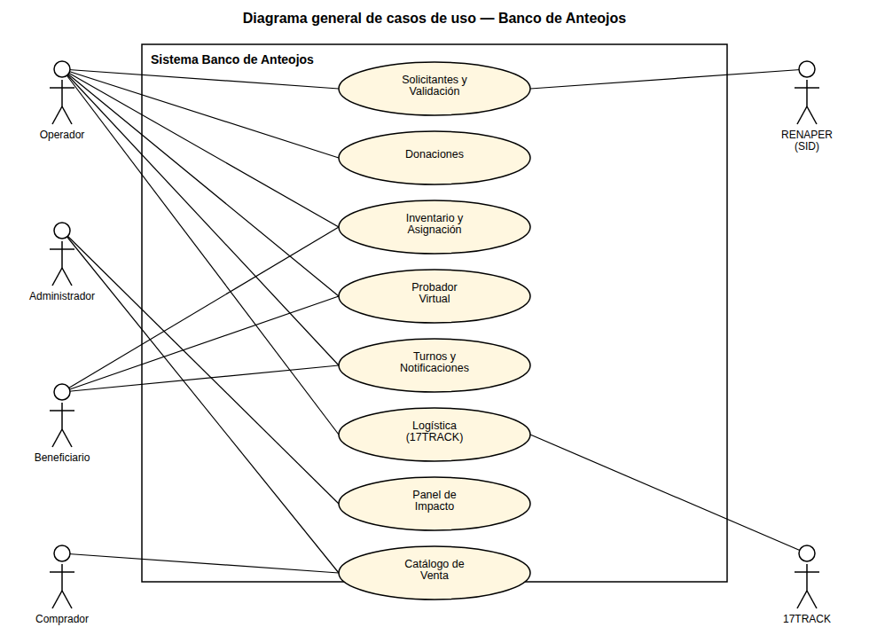
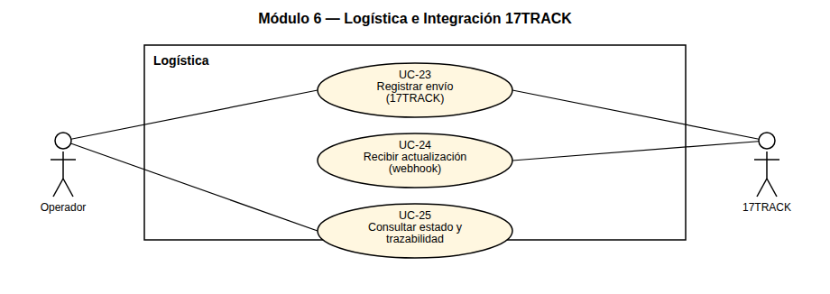
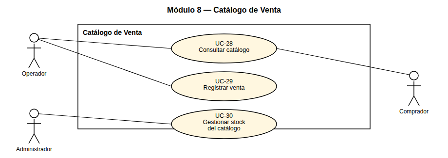

# Diagrama de Casos de Uso

## Sistema Banco de Anteojos — Fundación Hacer Futuro

> Entregable gráfico independiente: diagrama general de casos de uso más un diagrama por módulo.
> Las especificaciones textuales de cada caso de uso (actor, precondición, flujo, postcondición)
> están en `docs/casos-de-uso/CASOS_DE_USO.md`; este documento contiene solo los diagramas UML.

## Actores

| Actor | Tipo | Descripción |
|---|---|---|
| **Operador** | Primario, humano | Personal de la fundación: registra solicitantes, donaciones, asigna marcos, gestiona turnos y envíos. |
| **Administrador** | Primario, humano | Además de lo que hace el Operador, administra usuarios, configuración y el catálogo de venta. |
| **Beneficiario** | Primario, humano | Solicitante del banco de anteojos; en el portal de autogestión pide turno, sube el comprobante del bono contribución, consulta el estado de su marco y usa el probador virtual. |
| **Comprador** | Primario, humano | Público general que navega el catálogo de anteojos de sol (sin necesidad de cuenta). |
| **RENAPER (SID)** | Secundario, sistema externo | Valida la identidad del solicitante a partir del DNI. |
| **17TRACK** | Secundario, sistema externo | Registra y notifica (webhook) el estado de los envíos de Vía Cargo. |

## Diagrama general

## Módulo 1 — Solicitantes y Validación

## Módulo 2 — Donaciones

## Módulo 3 — Inventario, Asignación y Trazabilidad

## Módulo 4 — Probador Virtual

## Módulo 5 — Turnos y Notificaciones

## Módulo 6 — Logística e Integración 17TRACK

## Módulo 7 — Panel de Impacto

## Módulo 8 — Catálogo de Venta

---

Ver `docs/casos-de-uso/CASOS_DE_USO.md` para la especificación textual de cada caso de uso (ID,
actores, precondición, flujo básico, postcondición, RF relacionado).
