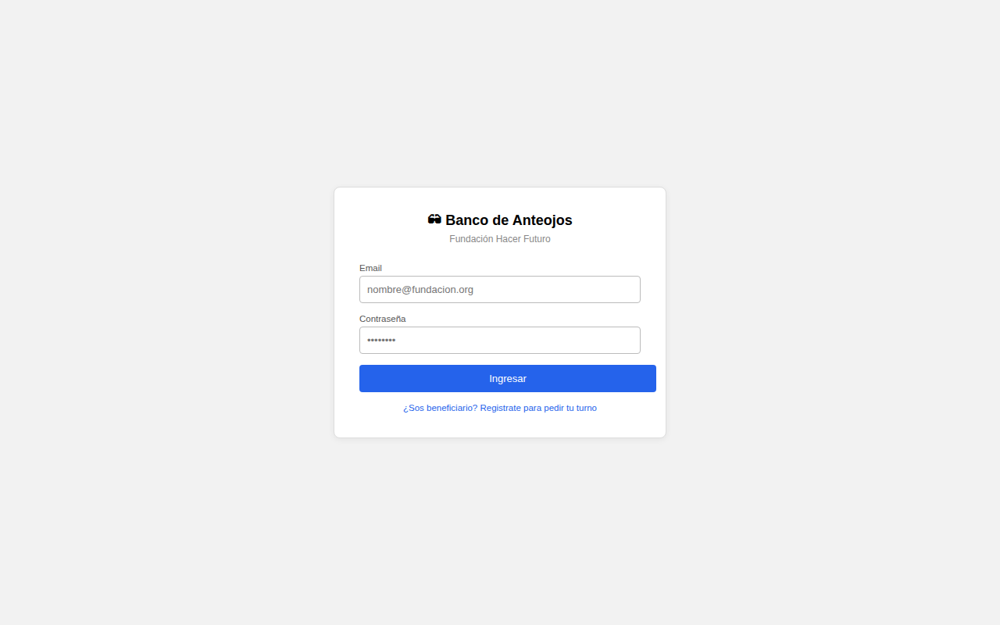
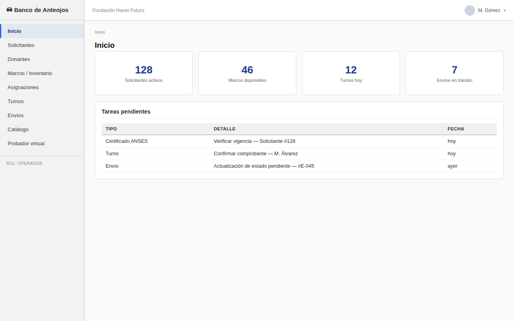
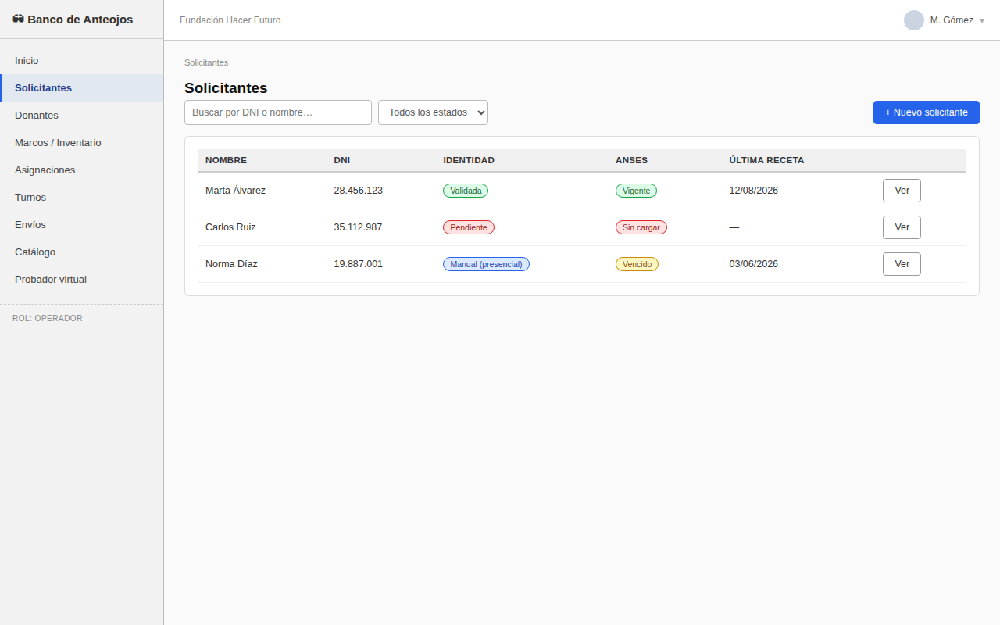
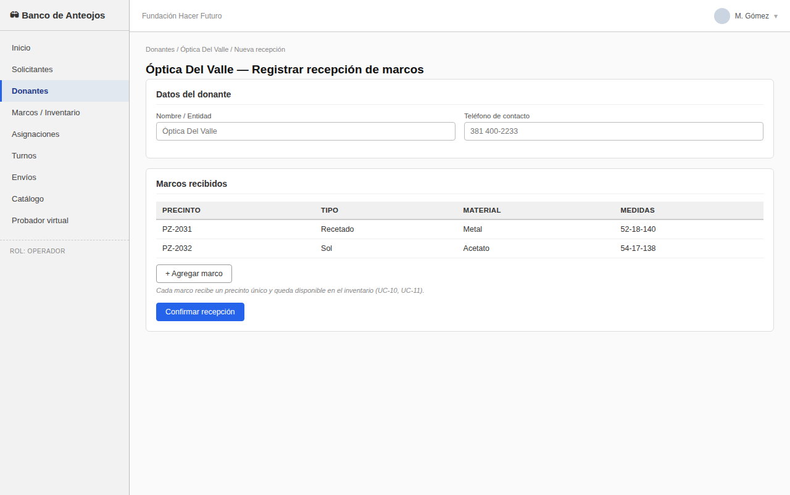
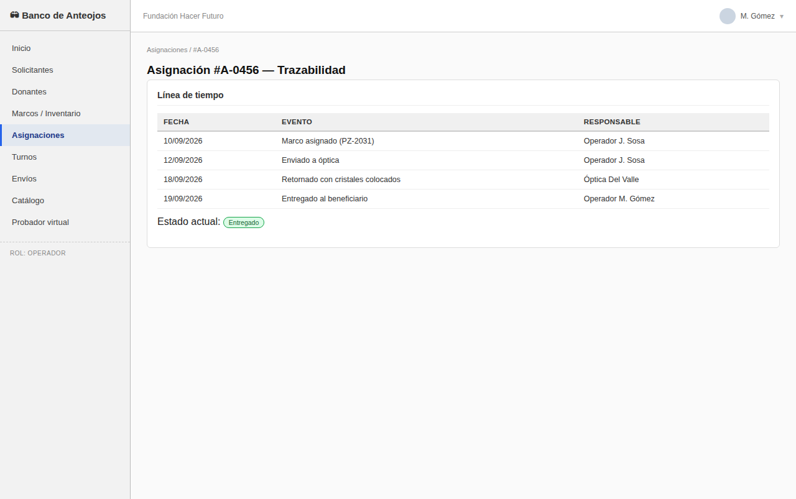
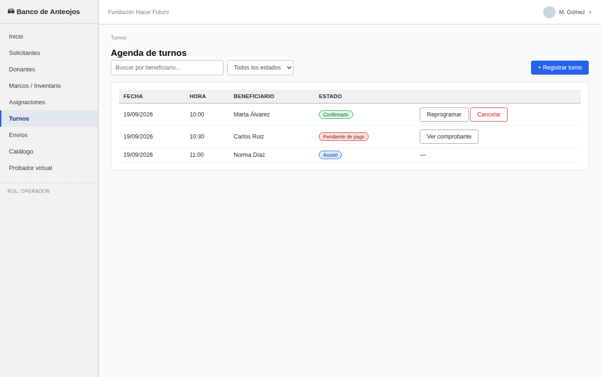
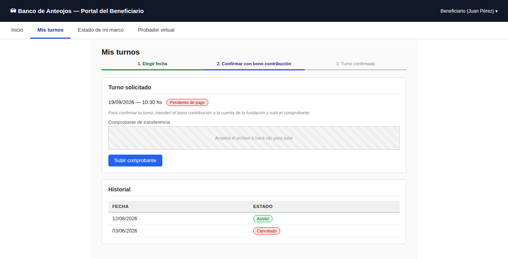
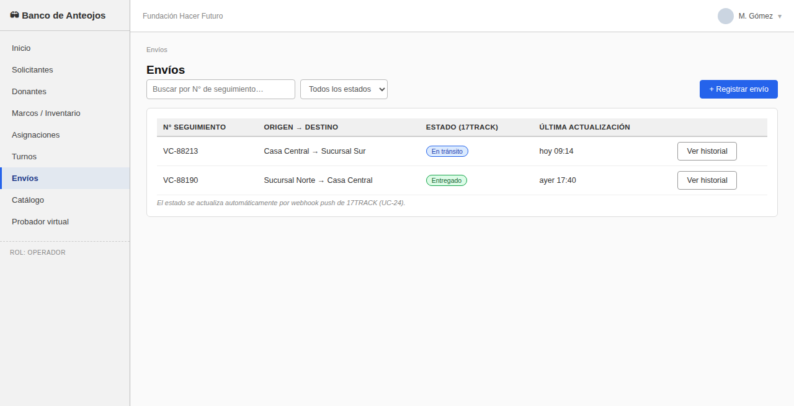
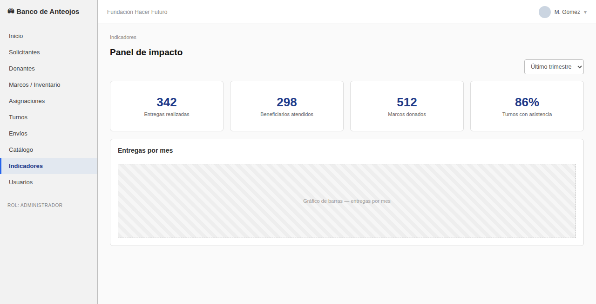
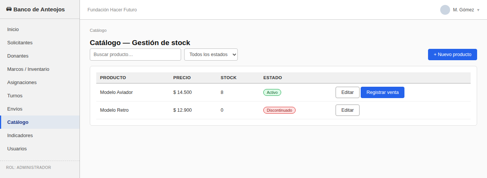

# Mockups

## Sistema Banco de Anteojos — Fundación Hacer Futuro

> Wireframes de fidelidad media: labels, navegación y textos de UI reales; los datos mostrados
> (nombres, DNI, montos) son ilustrativos. Complementan el Modelo de Casos de Uso
> (`docs/casos-de-uso/CASOS_DE_USO.md`); el detalle de interacción concreta con cada pantalla se
> desarrolla en el entregable "Casos de Uso Reales".

## Convenciones

- **Navegación lateral** (Operador/Administrador): refleja los módulos del backend uno a uno. El
  Administrador ve además "Indicadores" y "Usuarios".
- **Portal de autogestión** (Beneficiario): navegación superior simplificada, sin acceso a datos de
  otros beneficiarios.
- **Catálogo público**: sin barra lateral ni sesión iniciada; accesible para cualquier visitante.
- **Badges de estado**: verde = OK/vigente/completo, amarillo = atención/vencido/en curso, rojo =
  pendiente/bloqueante, azul = informativo.
- Las áreas con textura rayada representan imágenes o gráficos (fotos de marcos, gráficos del panel
  de impacto, previsualización del probador virtual).

## Pantallas

| # | Pantalla | Rol | Casos de uso |
|---|---|---|---|
| 1 | Inicio de sesión | Todos | RNF-01 |
| 2 | Inicio (panel del Operador) | Operador | — |
| 3 | Solicitantes — Listado | Operador | UC-08 |
| 4 | Solicitantes — Alta / Detalle y validación | Operador | UC-01, UC-02, UC-06, UC-03, UC-04, UC-05, UC-07 |
| 5 | Donantes — Listado | Operador | UC-12 |
| 6 | Donantes — Registrar recepción de marcos | Operador | UC-09, UC-10, UC-11 |
| 7 | Inventario de marcos | Operador | UC-13 |
| 8 | Asignación — Match y asignar marco | Operador | UC-14, UC-15 |
| 9 | Trazabilidad de la asignación | Operador | UC-16 |
| 10 | Probador virtual | Beneficiario / Operador | UC-17, UC-18, UC-19 |
| 11 | Turnos — Agenda del staff | Operador | UC-20, UC-21, UC-22 |
| 12 | Autogestión — Mis turnos | Beneficiario | UC-20, UC-20b, UC-21 |
| 13 | Logística — Envíos entre sucursales | Operador | UC-23, UC-24, UC-25 |
| 14 | Panel de indicadores de impacto | Administrador | UC-26, UC-27 |
| 15 | Catálogo público de anteojos de sol | Comprador | UC-28 |
| 16 | Catálogo — Gestión de stock y ventas | Administrador | UC-29, UC-30 |

---

### 1. Inicio de sesión

### 2. Inicio (panel del Operador)

### 3. Solicitantes — Listado

### 4. Solicitantes — Alta / Detalle y validación

### 5. Donantes — Listado

### 6. Donantes — Registrar recepción de marcos

### 7. Inventario de marcos

### 8. Asignación — Match y asignar marco

### 9. Trazabilidad de la asignación

### 10. Probador virtual

### 11. Turnos — Agenda del staff

### 12. Autogestión — Mis turnos

### 13. Logística — Envíos entre sucursales

### 14. Panel de indicadores de impacto

### 15. Catálogo público de anteojos de sol

### 16. Catálogo — Gestión de stock y ventas

