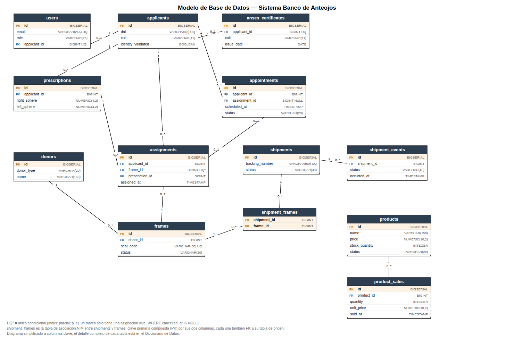

# Modelo de Base de Datos

## Sistema Banco de Anteojos — Fundación Hacer Futuro

> Modelo físico relacional (PostgreSQL), reconstruido a partir de las migraciones Flyway
> (`backend/src/main/resources/db/migration/V1` a `V14`), que son la única fuente de verdad del
> schema (Hibernate corre en modo `none`). A diferencia de la Vista Lógica del Documento de
> Arquitectura —que modela conceptos de dominio—, este documento describe las **tablas, columnas,
> tipos y restricciones reales** tal como existen en la base.

## 1. Convenciones del schema

- `snake_case`; tablas en plural, columnas en singular.
- Toda PK se llama `id` (`BIGSERIAL`); toda FK `<entidad>_id`.
- Timestamps de instante en `_at` (`TIMESTAMP WITHOUT TIME ZONE`); fechas puras en `_date` (`DATE`).
- Booleanos con prefijo `is_`/tal cual (`identity_validated`), `NOT NULL` + `DEFAULT` coherente.
- Estados como `VARCHAR(n)` con `CHECK` explícito — excepto `shipment_events.status`, que guarda el
  valor crudo del carrier sin restricción (un estado nuevo de 17TRACK no puede romper el webhook).
- **Ningún binario se persiste en la base**: PDFs e imágenes van a Cloudflare R2; las tablas
  guardan la *key* del objeto (no una URL, que quedaría muerta si el bucket sirve con presigned
  URLs que vencen).
- Las migraciones son **append-only**: un cambio de schema siempre es una migración nueva, nunca se
  edita una ya aplicada.

## 2. Diagrama

Las 13 tablas del esquema en un único diagrama.

> El diagrama muestra columnas clave (PK/FK/UNIQUE + atributos distintivos) para que se lea de un
> vistazo. El detalle completo de cada tabla está en el diccionario de datos (sección 4).

## 3. Diccionario de datos

### `users` — V1, alterada en V13

| Columna | Tipo | Restricciones | Notas |
|---|---|---|---|
| `id` | BIGSERIAL | PK | |
| `name` | VARCHAR(100) | NOT NULL | |
| `email` | VARCHAR(255) | NOT NULL, UNIQUE | |
| `password_hash` | VARCHAR(100) | NOT NULL | hash BCrypt (RNF-03) |
| `role` | VARCHAR(20) | NOT NULL, CHECK IN (`ADMIN`,`OPERATOR`,`APPLICANT`) | el 3er valor se agregó en V13 |
| `is_active` | BOOLEAN | NOT NULL, DEFAULT `true` | |
| `created_at` | TIMESTAMP | NOT NULL, DEFAULT `now()` | |
| `applicant_id` | BIGINT | FK → `applicants.id`, NULL | solo se usa para `APPLICANT`; índice único parcial `WHERE applicant_id IS NOT NULL` |

### `applicants` — V2

| Columna | Tipo | Restricciones | Notas |
|---|---|---|---|
| `id` | BIGSERIAL | PK | |
| `first_name` | VARCHAR(100) | NOT NULL | |
| `last_name` | VARCHAR(100) | NOT NULL | |
| `dni` | VARCHAR(8) | NOT NULL, UNIQUE | identidad validada contra RENAPER; inmutable desde la app |
| `cuil` | VARCHAR(11) | NULL | lo completa el sistema al validar ANSES, no lo carga el operador |
| `birth_date` | DATE | NULL | |
| `phone` | VARCHAR(30) | NULL | |
| `email` | VARCHAR(255) | NULL | |
| `identity_validated` | BOOLEAN | NOT NULL, DEFAULT `false` | RF-02/RF-06 |
| `created_at` | TIMESTAMP | NOT NULL, DEFAULT `now()` | |

### `prescriptions` — V3, alterada en V6

| Columna | Tipo | Restricciones | Notas |
|---|---|---|---|
| `id` | BIGSERIAL | PK | |
| `applicant_id` | BIGINT | NOT NULL, FK → `applicants.id` | índice `idx_prescriptions_applicant_id` |
| `right_sphere` | NUMERIC(4,2) | NULL | |
| `right_cylinder` | NUMERIC(4,2) | NULL | |
| `right_axis` | INTEGER | CHECK 0–180 | |
| `left_sphere` | NUMERIC(4,2) | NULL | |
| `left_cylinder` | NUMERIC(4,2) | NULL | |
| `left_axis` | INTEGER | CHECK 0–180 | |
| `created_at` | TIMESTAMP | NOT NULL, DEFAULT `now()` | |
| `file_key` | VARCHAR(255) | NULL | archivo de la receta en R2 (opcional) |
| `file_content_type` | VARCHAR(100) | NULL | |
| `file_original_name` | VARCHAR(255) | NULL | |

### `anses_certificates` — V7

| Columna | Tipo | Restricciones | Notas |
|---|---|---|---|
| `id` | BIGSERIAL | PK | |
| `applicant_id` | BIGINT | NOT NULL, **UNIQUE**, FK → `applicants.id` | un solo certificado vigente por solicitante; subir otro lo reemplaza |
| `cuil` | VARCHAR(11) | NOT NULL | extraído del código de barras (RF-04) |
| `transaction_number` | VARCHAR(50) | NOT NULL | resto del código de barras |
| `issue_date` | DATE | NOT NULL | extraída del texto del PDF; RF-05 chequea ≤30 días |
| `file_key` | VARCHAR(255) | NOT NULL | PDF en R2 |
| `file_content_type` | VARCHAR(100) | NOT NULL | |
| `file_original_name` | VARCHAR(255) | NOT NULL | |
| `created_at` | TIMESTAMP | NOT NULL | |

### `donors` — V4

| Columna | Tipo | Restricciones | Notas |
|---|---|---|---|
| `id` | BIGSERIAL | PK | |
| `donor_type` | VARCHAR(20) | NOT NULL, CHECK IN (`INDIVIDUAL`,`ORGANIZATION`) | |
| `name` | VARCHAR(150) | NOT NULL | nombre completo o razón social — una sola columna para no tener dos pares de campos nullable |
| `document_number` | VARCHAR(20) | NULL | |
| `phone` | VARCHAR(30) | NULL | |
| `email` | VARCHAR(255) | NULL | |
| `created_at` | TIMESTAMP | NOT NULL, DEFAULT `now()` | |

### `frames` — V5, alterada en V9

| Columna | Tipo | Restricciones | Notas |
|---|---|---|---|
| `id` | BIGSERIAL | PK | |
| `donor_id` | BIGINT | NOT NULL, FK → `donors.id` | índice `idx_frames_donor_id` |
| `seal_code` | VARCHAR(30) | NOT NULL, UNIQUE | precinto físico (RF-10) |
| `frame_type` | VARCHAR(20) | NOT NULL, CHECK IN (`FULL_RIM`,`SEMI_RIMLESS`,`RIMLESS`) | |
| `material` | VARCHAR(20) | NOT NULL, CHECK IN (`ACETATE`,`METAL`,`TITANIUM`,`PLASTIC`,`OTHER`) | |
| `lens_width_mm` | INTEGER | NULL | |
| `bridge_width_mm` | INTEGER | NULL | |
| `temple_length_mm` | INTEGER | NULL | |
| `status` | VARCHAR(20) | NOT NULL, DEFAULT `AVAILABLE`, CHECK IN (`AVAILABLE`,`ASSIGNED`,`AT_OPTICIAN`,`READY`,`DELIVERED`,`DISCARDED`) | índice `idx_frames_status`; ciclo de vida completo definido de una vez (migraciones append-only) |
| `received_at` | TIMESTAMP | NOT NULL, DEFAULT `now()` | |
| `image_key` | VARCHAR(255) | NULL | foto para el probador virtual (RF-18) |
| `image_content_type` | VARCHAR(100) | NULL | |
| `image_original_name` | VARCHAR(255) | NULL | |

### `assignments` — V8

| Columna | Tipo | Restricciones | Notas |
|---|---|---|---|
| `id` | BIGSERIAL | PK | |
| `applicant_id` | BIGINT | NOT NULL, FK → `applicants.id` | índice `idx_assignments_applicant_id` |
| `frame_id` | BIGINT | NOT NULL, FK → `frames.id` | **único condicional**: `idx_assignments_live_frame` UNIQUE `WHERE cancelled_at IS NULL` — un marco solo puede tener una asignación viva |
| `prescription_id` | BIGINT | NOT NULL, FK → `prescriptions.id` | la receta viaja con el marco a la óptica |
| `assigned_at` | TIMESTAMP | NOT NULL | |
| `sent_to_optician_at` | TIMESTAMP | NULL | |
| `returned_at` | TIMESTAMP | NULL | |
| `delivered_at` | TIMESTAMP | NULL | |
| `cancelled_at` | TIMESTAMP | NULL | |
| `cancellation_reason` | VARCHAR(255) | NULL | |
| `notes` | VARCHAR(500) | NULL | |

> No hay columna de "estado": cada hito es un timestamp, y eso ES la trazabilidad (RF-16). La
> fuente de verdad de "dónde está el marco" es `frames.status`, no una máquina de estados
> duplicada acá.

### `appointments` — V10, alterada en V14

| Columna | Tipo | Restricciones | Notas |
|---|---|---|---|
| `id` | BIGSERIAL | PK | |
| `applicant_id` | BIGINT | NOT NULL, FK → `applicants.id` | índice `idx_appointments_applicant_id` |
| `assignment_id` | BIGINT | NULL, FK → `assignments.id` | turno de retiro de un par puntual; `NULL` = atención general |
| `scheduled_at` | TIMESTAMP | NOT NULL | índice `idx_appointments_scheduled_at` (agenda por rango de fecha) |
| `status` | VARCHAR(20) | NOT NULL, DEFAULT `PENDING_PAYMENT`, CHECK IN (`PENDING_PAYMENT`,`SCHEDULED`,`COMPLETED`,`MISSED`,`CANCELLED`) | el default cambió de `SCHEDULED` a `PENDING_PAYMENT` en V14 (bono contribución) |
| `notes` | VARCHAR(500) | NULL | |
| `cancellation_reason` | VARCHAR(255) | NULL | |
| `created_at` | TIMESTAMP | NOT NULL | |
| `receipt_key` | VARCHAR(255) | NULL | comprobante de la transferencia en R2 |
| `receipt_content_type` | VARCHAR(100) | NULL | |
| `receipt_original_name` | VARCHAR(255) | NULL | |

> A diferencia de `assignments`, acá sí hay una columna de estado: un turno es agenda, no
> trazabilidad de un circuito — importa en qué quedó, no cada reprogramación fila por fila.

### `shipments` — V11

| Columna | Tipo | Restricciones | Notas |
|---|---|---|---|
| `id` | BIGSERIAL | PK | |
| `origin_branch` | VARCHAR(120) | NOT NULL | |
| `destination_branch` | VARCHAR(120) | NOT NULL | |
| `tracking_number` | VARCHAR(50) | UNIQUE, NULL | lo asigna Vía Cargo al despachar; `NULL` mientras se arma el paquete |
| `status` | VARCHAR(30) | NOT NULL, DEFAULT `PENDING`, CHECK IN (11 valores: `PENDING`, `CANCELLED`, `REGISTERED`, `INFO_RECEIVED`, `IN_TRANSIT`, `AVAILABLE_FOR_PICKUP`, `OUT_FOR_DELIVERY`, `DELIVERED`, `DELIVERY_FAILURE`, `EXCEPTION`, `EXPIRED`, `NOT_FOUND`) | vocabulario de estados de 17TRACK |
| `notes` | VARCHAR(500) | NULL | |
| `cancellation_reason` | VARCHAR(255) | NULL | |
| `created_at` | TIMESTAMP | NOT NULL | |
| `dispatched_at` | TIMESTAMP | NULL | |
| `delivered_at` | TIMESTAMP | NULL | |

> El estado del marco **no** se toca al viajar: el inventario (`frames.status`) dice qué se puede
> hacer con el marco, no dónde está parado físicamente — misma decisión que en `assignments`.

### `shipment_frames` — V11 (tabla de asociación N:M)

| Columna | Tipo | Restricciones | Notas |
|---|---|---|---|
| `shipment_id` | BIGINT | NOT NULL, PK (compuesta), FK → `shipments.id` | |
| `frame_id` | BIGINT | NOT NULL, PK (compuesta), FK → `frames.id` | |

Sin `id` propio: la clave primaria es el par `(shipment_id, frame_id)`, el conjunto de marcos que
viaja en un mismo paquete.

### `shipment_events` — V11

| Columna | Tipo | Restricciones | Notas |
|---|---|---|---|
| `id` | BIGSERIAL | PK | |
| `shipment_id` | BIGINT | NOT NULL, FK → `shipments.id` | índice `idx_shipment_events_shipment_id` |
| `status` | VARCHAR(40) | NOT NULL, **sin CHECK** | valor crudo del carrier: un estado nuevo de 17TRACK no puede romper el webhook |
| `description` | VARCHAR(500) | NULL | |
| `location` | VARCHAR(255) | NULL | |
| `occurred_at` | TIMESTAMP | NULL | |
| `received_at` | TIMESTAMP | NOT NULL | cuándo llegó el webhook (distinto de cuándo ocurrió el evento) |

### `products` — V12

| Columna | Tipo | Restricciones | Notas |
|---|---|---|---|
| `id` | BIGSERIAL | PK | |
| `name` | VARCHAR(150) | NOT NULL | |
| `description` | VARCHAR(500) | NULL | |
| `price` | NUMERIC(10,2) | NOT NULL, CHECK `>= 0` | |
| `stock_quantity` | INTEGER | NOT NULL, DEFAULT `0`, CHECK `>= 0` | |
| `status` | VARCHAR(20) | NOT NULL, DEFAULT `ACTIVE`, CHECK IN (`ACTIVE`,`DISCONTINUED`) | baja lógica, nunca se borra la fila |
| `image_key` | VARCHAR(255) | NULL | |
| `image_content_type` | VARCHAR(100) | NULL | |
| `image_original_name` | VARCHAR(255) | NULL | |
| `created_at` | TIMESTAMP | NOT NULL, DEFAULT `now()` | |

> Dominio autocontenido, sin relación con `frames`/`donors`: acá se vende para financiar la
> fundación, no se dona.

### `product_sales` — V12

| Columna | Tipo | Restricciones | Notas |
|---|---|---|---|
| `id` | BIGSERIAL | PK | |
| `product_id` | BIGINT | NOT NULL, FK → `products.id` | índice `idx_product_sales_product_id` |
| `quantity` | INTEGER | NOT NULL, CHECK `> 0` | |
| `unit_price` | NUMERIC(10,2) | NOT NULL | copia el precio al momento de vender |
| `total_amount` | NUMERIC(10,2) | NOT NULL | |
| `buyer_name` | VARCHAR(150) | NULL | |
| `notes` | VARCHAR(500) | NULL | |
| `sold_at` | TIMESTAMP | NOT NULL | |

> `unit_price` no se recalcula desde `products.price`: si el precio cambia después, no debe
> reescribir ventas ya cerradas.

## 4. Índices

| Índice | Tabla | Columnas | Tipo |
|---|---|---|---|
| `idx_prescriptions_applicant_id` | prescriptions | applicant_id | normal |
| `idx_frames_donor_id` | frames | donor_id | normal |
| `idx_frames_status` | frames | status | normal |
| `idx_assignments_live_frame` | assignments | frame_id | único, parcial (`WHERE cancelled_at IS NULL`) |
| `idx_assignments_applicant_id` | assignments | applicant_id | normal |
| `idx_appointments_applicant_id` | appointments | applicant_id | normal |
| `idx_appointments_scheduled_at` | appointments | scheduled_at | normal |
| `idx_shipment_events_shipment_id` | shipment_events | shipment_id | normal |
| `idx_product_sales_product_id` | product_sales | product_id | normal |
| `idx_users_applicant_id` | users | applicant_id | único, parcial (`WHERE applicant_id IS NOT NULL`) |

## 5. Decisiones de diseño transversales

- **Nunca se persisten binarios**: toda tabla con un archivo asociado guarda `*_key` /
  `*_content_type` / `*_original_name`, nunca el contenido ni una URL (RNF-07).
- **Índices únicos condicionales** (`WHERE ... IS NULL`) resuelven invariantes de negocio a nivel
  de base de datos en vez de una consulta previa desde la aplicación, que sería una condición de
  carrera entre dos operadores concurrentes (`assignments.frame_id`, `users.applicant_id`).
- **Trazabilidad como timestamps, no como estado** en `assignments`: cada hito del circuito es una
  columna de fecha; el estado "actual" se deriva, no se guarda dos veces.
- **CHECK explícito para vocabularios cerrados y propios** (`frames.status`, `appointments.status`,
  `products.status`) vs. **sin CHECK para vocabulario de un tercero** (`shipment_events.status`),
  porque ese valor lo define 17TRACK y puede agregar códigos sin previo aviso.
- **Migraciones append-only**: los `ALTER TABLE` de V6, V9, V13 y V14 agregan columnas o
  reemplazan un `CHECK` completo (`DROP CONSTRAINT` + `ADD CONSTRAINT`), nunca editan una migración
  ya aplicada — así el historial de schema es reproducible en cualquier ambiente.
