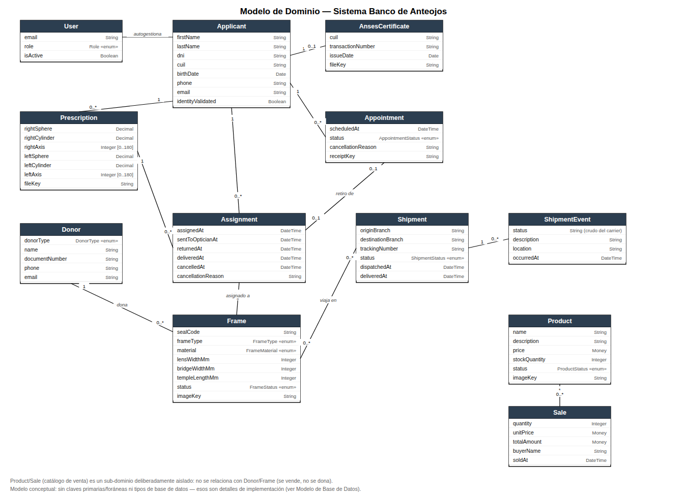

# Modelo de Dominio

## Sistema Banco de Anteojos — Fundación Hacer Futuro

> Diagrama de clases **conceptual**: los conceptos del dominio del negocio, sus atributos y sus
> asociaciones, tal como los describe el SRS — sin claves primarias/foráneas, tipos de columna ni
> ningún otro detalle de implementación (eso corresponde al Modelo de Base de Datos). Es el
> artefacto de análisis que precede al diseño; la Vista Lógica del Documento de Arquitectura
> retoma estos mismos conceptos ya en el contexto de la solución de software.

## 1. Diagrama

Las 13 clases del dominio y sus 13 asociaciones, todas en un único diagrama (ninguna relación
queda relegada a una nota de texto).

## 2. Enumeraciones

| Enumeración | Valores | Usada en |
|---|---|---|
| `Role` | `ADMIN`, `OPERATOR`, `APPLICANT` | `User.role` |
| `DonorType` | `INDIVIDUAL`, `ORGANIZATION` | `Donor.donorType` |
| `FrameType` | `FULL_RIM`, `SEMI_RIMLESS`, `RIMLESS` | `Frame.frameType` |
| `FrameMaterial` | `ACETATE`, `METAL`, `TITANIUM`, `PLASTIC`, `OTHER` | `Frame.material` |
| `FrameStatus` | `AVAILABLE`, `ASSIGNED`, `AT_OPTICIAN`, `READY`, `DELIVERED`, `DISCARDED` | `Frame.status` |
| `AppointmentStatus` | `PENDING_PAYMENT`, `PENDING_REVIEW`, `SCHEDULED`, `COMPLETED`, `MISSED`, `CANCELLED` | `Appointment.status` |
| `ShipmentStatus` | `PENDING`, `CANCELLED`, `REGISTERED`, `INFO_RECEIVED`, `IN_TRANSIT`, `AVAILABLE_FOR_PICKUP`, `OUT_FOR_DELIVERY`, `DELIVERED`, `DELIVERY_FAILURE`, `EXCEPTION`, `EXPIRED`, `NOT_FOUND` | `Shipment.status` |
| `ProductStatus` | `ACTIVE`, `DISCONTINUED` | `Product.status` |

`ShipmentEvent.status` es la única excepción: es texto libre, no una enumeración cerrada, porque
transporta el valor crudo que informa 17TRACK (un carrier externo puede agregar estados sin previo
aviso).

## 3. Asociaciones

| Asociación | Multiplicidad | Rol / significado |
|---|---|---|
| User — Applicant | 0..1 — 1 | Un beneficiario puede autogestionarse con un login propio |
| Applicant — Prescription | 1 — 0..* | Un solicitante puede tener varias recetas a lo largo del tiempo |
| Applicant — AnsesCertificate | 1 — 0..1 | Un único certificado vigente por solicitante |
| Applicant — Appointment | 1 — 0..* | Historial de turnos del beneficiario |
| Applicant — Assignment | 1 — 0..* | Historial de marcos asignados al beneficiario |
| Prescription — Assignment | 1 — 0..* | La receta con la que se hizo el match |
| Donor — Frame | 1 — 0..* | Los marcos que donó ese donante |
| Frame — Assignment | 1 — 0..1 | Un marco tiene a lo sumo una asignación activa a la vez |
| Appointment — Assignment | 0..1 — 0..1 | Turno de retiro de un par puntual (opcional; `null` = atención general) |
| Frame — Shipment | 0..* — 0..* | Un envío agrupa varios marcos; un marco puede viajar más de una vez entre sucursales |
| Shipment — ShipmentEvent | 1 — 0..* | Historial de eventos del carrier para ese envío |
| Product — Sale | 1 — 0..* | Historial de ventas de ese producto |
| Sale — Comprador | 0..* — 1 *(conceptual)* | El comprador navega el catálogo y decide la compra; el Operador es quien la registra |

## 4. Conceptos deliberadamente sin relación

- **Product/Sale** (catálogo de venta) no se relaciona con `Donor` ni `Frame`: son anteojos de sol
  para financiar la fundación, no marcos donados para beneficiarios — mezclar ambos inventarios
  sería un acoplamiento accidental.
- **Comprador** se dibuja con línea punteada porque es una asociación conceptual, no una FK
  persistida: el comprador no tiene cuenta ni login (consulta el catálogo público, RF-28), y el
  sistema no guarda su identidad más allá del nombre suelto en `Sale.buyerName`. Quien efectivamente
  registra la venta es un Operador — sin login especial para "vendedor", igual que el resto de las
  operaciones de mostrador — por eso tampoco aparece una asociación formal Operador–Sale: el
  sistema no lleva ese registro.
- **Assignment** no tiene un atributo de "estado": cada hito del circuito (asignado, enviado a la
  óptica, retornado, entregado, cancelado) es un atributo de fecha propio, y esa secuencia de
  fechas **es** la trazabilidad (RF-16). El estado "actual" de un marco vive en `Frame.status`, no
  se duplica acá.

## 5. Relación con otros artefactos

- Los mismos conceptos, ya como clases de software organizadas en capas (`*ServiceHandler`,
  `*Repository`, DTOs), están en la Vista de Desarrollo del Documento de Arquitectura.
- La materialización de estas mismas entidades como tablas relacionales (con PK, FK, tipos de
  columna e índices) está en el Modelo de Base de Datos.
- El comportamiento de cada concepto frente a un actor está especificado en el Modelo de Casos de
  Uso y en los Casos de Uso Reales.
