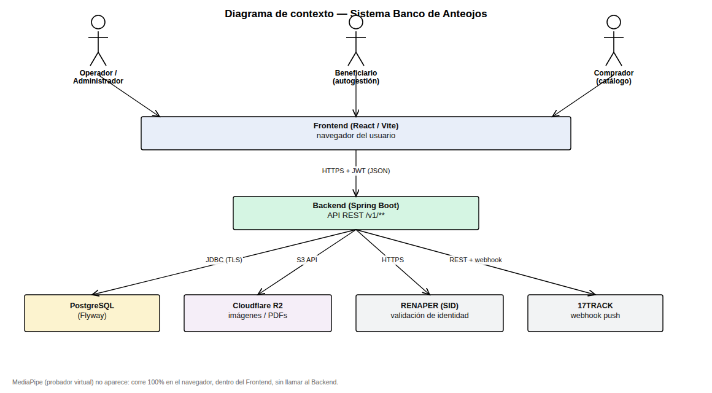

# Especificación de Requisitos de Software (SRS)

## Sistema Banco de Anteojos — Fundación Hacer Futuro

**Basado en IEEE Std 830-1998** (estructura clásica de SRS, con elementos de IEEE 29148 para
requisitos de interfaz).

| | |
|---|---|
| Proyecto | Proyecto Final UTN-FRT 2026 · ID T045 |
| Organización | Fundación Hacer Futuro — Chacabuco 27, San Miguel de Tucumán |
| Versión del documento | 1.0 |
| Estado | Alcance completo del sistema (incluye módulos ya implementados y pendientes) |
| Fuente de requisitos | Declaración de Alcance v4 / Matriz de Trazabilidad v3, consolidados en `docs/REQUIREMENTS.md` |

---

## Índice

1. [Introducción](#1-introducción)
2. [Descripción general](#2-descripción-general)
3. [Requisitos específicos](#3-requisitos-específicos)
4. [Apéndices](#4-apéndices)

---

## 1. Introducción

### 1.1 Propósito

Este documento especifica los requisitos funcionales y no funcionales del sistema **Banco de
Anteojos**, desarrollado para la Fundación Hacer Futuro. Su propósito es servir como contrato
técnico entre el equipo de desarrollo y la cátedra/fundación: define **qué** debe hacer el sistema,
sin prescribir **cómo** implementarlo (el cómo se documenta en el Documento de Arquitectura de
Software).

Está dirigido a: el equipo de desarrollo (como referencia de alcance), la cátedra (como entregable
de evaluación) y la fundación (como validación de que el sistema cubre su operatoria real).

### 1.2 Alcance del sistema

El sistema digitaliza la operatoria del Banco de Anteojos, hoy gestionada en papel. Cubre el ciclo
completo:

1. Recepción de donaciones de marcos y registro de donantes.
2. Registro y validación de elegibilidad de beneficiarios (solicitantes).
3. Inventario de marcos con clasificación por atributos.
4. Match entre receta médica y marco disponible, asignación y trazabilidad end-to-end hasta la
   entrega.
5. Gestión de turnos de atención y notificaciones asociadas.
6. Logística de envíos entre sucursales, integrada con el operador de encomiendas Vía Cargo a
   través de 17TRACK.
7. Probador virtual de marcos sobre foto estática.
8. Panel de indicadores de impacto social.
9. Catálogo de venta de anteojos de sol, como fuente adicional de financiamiento.

**Fuera de alcance:** procesamiento de pagos online (el bono contribución se valida offline por un
operador a partir de un comprobante), realidad aumentada 3D en tiempo real, aplicación móvil nativa,
integración directa con Vía Cargo (se realiza vía 17TRACK), y cualquier trámite administrativo
externo (el convenio de confronte de datos con RENAPER vía TAD es un trámite de la fundación, no una
funcionalidad del sistema).

### 1.3 Definiciones, siglas y abreviaturas

| Término | Significado |
|---|---|
| RF / RNF | Requisito Funcional / Requisito No Funcional |
| Beneficiario / Solicitante (`Applicant`) | Persona sin cobertura médica que solicita anteojos a la fundación |
| Donante (`Donor`) | Persona o entidad que dona marcos usados |
| Marco (`Frame`) | Armazón de anteojos donado, sujeto a un ciclo de vida propio en el inventario |
| Asignación (`Assignment`) | Vínculo entre un beneficiario, su receta y un marco, con trazabilidad hasta la entrega |
| SID | Sistema de Identificación Digital de RENAPER (validación de identidad por DNI) |
| ANSES — Certificación Negativa | Constancia de que la persona no percibe prestación de ANSES, requisito de elegibilidad |
| TAD | Trámites a Distancia (plataforma del Estado Nacional) |
| 17TRACK | Servicio de terceros que unifica el tracking de encomiendas de múltiples transportistas, incluido Vía Cargo |
| Bono contribución | Aporte voluntario que el beneficiario transfiere para confirmar su turno de autogestión |
| ADMIN / OPERATOR / APPLICANT | Roles del sistema (ver sección 2.3) |
| R2 | Cloudflare R2, almacenamiento de objetos S3-compatible usado para imágenes y PDFs |
| RENAPER | Registro Nacional de las Personas |

### 1.4 Referencias

- Declaración de Alcance v4 (documento de cátedra — fuente textual de los criterios de aceptación).
- Matriz de Trazabilidad v3 (documento de cátedra).
- `docs/REQUIREMENTS.md` — consolidado de RF-01 a RF-30 y RNF-01 a RNF-11 usado como base de este SRS.
- IEEE Std 830-1998, *Recommended Practice for Software Requirements Specifications*.
- Ley 25.326 de Protección de Datos Personales (República Argentina).
- Documentación pública de 17TRACK API y MediaPipe Face Mesh.

### 1.5 Visión general del documento

La sección 2 describe el sistema en términos generales: perspectiva, funciones, usuarios,
restricciones y supuestos. La sección 3 contiene la especificación detallada: interfaces externas,
requisitos funcionales agrupados por módulo (con entradas, proceso, salidas y prioridad) y
requisitos no funcionales. Los apéndices incluyen glosario extendido, matriz de trazabilidad y
matriz de roles y permisos.

---

## 2. Descripción general

### 2.1 Perspectiva del producto

El sistema es una aplicación web nueva (no reemplaza ningún sistema previo, ya que la operatoria es
en papel). Se compone de:

- **Frontend**: SPA en React, consumida desde navegador por el personal de la fundación (ADMIN /
  OPERATOR) y, para el portal de autogestión, por los propios beneficiarios (APPLICANT).
- **Backend**: API REST en Spring Boot, stateless, autenticada con JWT.
- **Base de datos**: PostgreSQL, única fuente de verdad transaccional.
- **Servicios de terceros** con los que el backend se integra: RENAPER (SID), verificación local del
  PDF de ANSES (no es un servicio de terceros, es procesamiento propio), 17TRACK (logística),
  Cloudflare R2 (almacenamiento de imágenes/PDFs).
- **Cliente embebido en el navegador**: MediaPipe Face Mesh para el probador virtual, ejecutado
  100% en el dispositivo del usuario.

Diagrama de contexto:

### 2.2 Funciones del producto

Agrupadas por módulo (correspondencia 1 a 1 con los dominios del backend):

| Módulo | Función principal |
|---|---|
| Solicitantes y Validación | Alta, validación de identidad y de elegibilidad ANSES, receta médica, consulta/edición |
| Donaciones | Alta de donantes, recepción y clasificación de marcos donados |
| Inventario, Asignación y Trazabilidad | Inventario en tiempo real, match receta↔marco, asignación, trazabilidad end-to-end |
| Probador Virtual | Detección facial y superposición 2D del marco sobre foto estática |
| Turnos y Notificaciones | Alta, reprogramación, cancelación y notificación de turnos; autogestión del beneficiario |
| Logística e Integración 17TRACK | Registro y seguimiento de envíos entre sucursales |
| Panel de Impacto | Indicadores agregados de impacto social |
| Catálogo de Venta | Catálogo, venta y gestión de stock de anteojos de sol |

### 2.3 Características de los usuarios

| Rol | Descripción | Nivel técnico esperado |
|---|---|---|
| **ADMIN** | Administra usuarios, configuración y catálogo de venta. Acceso completo al sistema. | Personal de la fundación, no técnico, capacitación ~30 min (RNF-05) |
| **OPERATOR** | Uso diario: registra solicitantes/donaciones, valida elegibilidad, asigna marcos, gestiona turnos y envíos. | Personal de la fundación, no técnico |
| **APPLICANT** (beneficiario) | Se autogestiona: pide turno, sube comprobante del bono contribución, consulta el estado de su marco, usa el probador virtual. | Público general, sin capacitación previa |
| Comprador del catálogo | Navega el catálogo de anteojos de sol. No requiere cuenta para ver el catálogo; la venta la registra un OPERATOR/ADMIN. | Público general |

### 2.4 Restricciones

- El backend debe seguir arquitectura en 4 capas con aislamiento estricto entre dominios (ver
  Documento de Arquitectura, sección Vistas — Vista de Desarrollo).
- El schema de base de datos se gestiona exclusivamente por migraciones Flyway (append-only); no se
  permite DDL generado por Hibernate.
- No se persisten binarios en PostgreSQL: toda imagen/PDF va a Cloudflare R2 y solo su URL se guarda
  en base de datos (RNF-07).
- El probador virtual no puede depender de un servidor de procesamiento externo (RNF-04): debe
  funcionar con superposición 2D sobre foto estática, compatible con dispositivos de gama baja.
- El plan gratuito de 17TRACK limita a 100 envíos/mes; el sistema no debe asumir un volumen mayor
  sin migrar de plan.
- Idioma del código: inglés. Idioma de la interfaz y de los mensajes al usuario final: español
  (ver CLAUDE.md del proyecto).

### 2.5 Supuestos y dependencias

- Se asume que la fundación gestiona por fuera del sistema el convenio de confronte de datos con
  RENAPER (trámite TAD, PT-1.2.7 de la EDT); el sistema solo consume el servicio una vez
  habilitado.
- Se asume disponibilidad de conectividad a internet en el punto de atención para consultar
  RENAPER y 17TRACK; ante indisponibilidad de RENAPER, el sistema depende de que el operador
  ejecute la validación presencial documentada como alternativa (RF-06).
- Se asume que el monto del bono contribución y la validez del comprobante los verifica un humano
  (operador), no el sistema — el sistema solo garantiza que no se confirme un turno sin comprobante
  cargado.
- Depende de que Cloudflare R2 y 17TRACK estén operativos para sus respectivas funciones; ambos son
  servicios externos fuera del control del equipo de desarrollo.

---

## 3. Requisitos específicos

### 3.1 Requisitos de interfaces externas

#### 3.1.1 Interfaces de usuario

- Aplicación web responsive, operable desde navegadores de escritorio y dispositivos móviles
  modernos (RNF-11).
- Formularios con validación en el borde (cliente) y mensajes de error en español, sin exponer
  detalles internos (stack traces, nombres de tablas).
- Navegación diferenciada por rol: menú y rutas visibles según ADMIN / OPERATOR / APPLICANT.
- Convención de fecha única `DD/MM/YYYY (ART)` en toda la interfaz.

#### 3.1.2 Interfaces de hardware

- Cámara del dispositivo del usuario para captura de foto (alta de marcos, probador virtual),
  acceso mediado por API estándar del navegador (`getUserMedia`); sin hardware propietario.
- Sin requerimiento de hardware específico del lado servidor más allá de lo provisto por el hosting
  (Render).

#### 3.1.3 Interfaces de software (servicios de terceros)

| Servicio | Propósito | Protocolo | Notas |
|---|---|---|---|
| **RENAPER — SID** | Validar identidad del solicitante a partir del DNI (RF-02) | API vía convenio de confronte de datos (TAD) | Cliente aislado `RenaperClient`; fallback presencial si no disponible (RF-06) |
| **ANSES (verificación local)** | Extraer CUIL y fecha de emisión del código de barras del PDF de Certificación Negativa (RF-04, RF-05) | Procesamiento local del PDF, no hay API pública | No es un cliente de terceros; vive en `business/applicants` |
| **17TRACK** | Registrar y seguir envíos entre sucursales por Vía Cargo (RF-23, RF-24) | REST `/register` + webhook push | Cliente aislado `TrackingClient`; tier gratuito, 100 envíos/mes |
| **Cloudflare R2** | Almacenar imágenes de marcos/catálogo y PDFs (recetas, ANSES, comprobantes) | API S3-compatible | Solo se persiste la URL en PostgreSQL (RNF-07) |
| **MediaPipe Face Mesh** | Detección de rostro en el navegador para el probador virtual (RF-17) | Librería cliente (WASM/JS), sin llamada a servidor | Ejecuta 100% en el dispositivo del usuario |

#### 3.1.4 Interfaces de comunicación

- Toda comunicación frontend↔backend por HTTPS, API REST versionada (`/v1/...`), JSON en
  `camelCase`.
- Autenticación stateless por header `Authorization: Bearer <JWT>`.
- Webhook entrante de 17TRACK sobre HTTPS (`POST /v1/shipments/webhook`), sin sesión de usuario
  asociada.

### 3.2 Requisitos funcionales

Cada requisito funcional se especifica con: descripción, entradas, proceso, salidas y prioridad
(**Alta** = crítico para el flujo core del banco de anteojos; **Media** = valor agregado;
**Baja** = mejora/complementario).

#### Módulo 1 — Solicitantes y Validación

**RF-01 — Registrar solicitante**
- *Descripción*: el sistema permite registrar un beneficiario con sus datos personales y DNI.
- *Entradas*: nombre, apellido, DNI, fecha de nacimiento, teléfono, email.
- *Proceso*: valida formato de DNI y unicidad; crea el registro con `identityValidated = false`.
- *Salidas*: solicitante creado, con ID único.
- *Prioridad*: Alta.

**RF-02 — Validación de identidad vía RENAPER**
- *Descripción*: el sistema integra el SID de RENAPER para validar la identidad a partir del DNI.
- *Entradas*: DNI del solicitante.
- *Proceso*: consulta al SID; si coincide, marca `identityValidated = true`.
- *Salidas*: resultado de validación (validado / no validado / servicio no disponible).
- *Prioridad*: Alta.

**RF-03 — Carga de PDF de Certificación Negativa de ANSES**
- *Descripción*: el sistema permite adjuntar el PDF de ANSES del solicitante.
- *Entradas*: archivo PDF.
- *Proceso*: sube el PDF a Cloudflare R2 y asocia la URL al solicitante.
- *Salidas*: certificado ANSES registrado, pendiente de verificación.
- *Prioridad*: Alta.

**RF-04 — Verificación de CUIL por código de barras**
- *Descripción*: el sistema lee el código de barras del PDF de ANSES, extrae el CUIL codificado y
  verifica que coincide con el solicitante.
- *Entradas*: PDF cargado en RF-03.
- *Proceso*: decodifica el código de barras (formato `CUIL-NroTransacción`); compara el CUIL contra
  el registrado o lo asocia si es la primera verificación.
- *Salidas*: coincidencia confirmada o rechazo con motivo.
- *Prioridad*: Alta.

**RF-05 — Verificación de vigencia del certificado ANSES**
- *Descripción*: extrae la fecha de emisión del PDF y rechaza automáticamente documentos con más de
  30 días de antigüedad; la validación final queda a criterio del operador.
- *Entradas*: PDF cargado en RF-03.
- *Proceso*: calcula antigüedad respecto a la fecha actual; marca como vencido si supera 30 días.
- *Salidas*: estado de vigencia (vigente/vencido) — no bloqueante, informativo para el operador.
- *Prioridad*: Alta.

**RF-06 — Validación presencial alternativa**
- *Descripción*: ante indisponibilidad del SID de RENAPER, habilita la validación presencial del
  DNI documentada por el operador como alternativa.
- *Entradas*: confirmación manual del operador (DNI físico verificado).
- *Proceso*: registra la validación como manual, con el operador responsable.
- *Salidas*: `identityValidated = true` por vía alternativa, trazado como tal.
- *Prioridad*: Media.

**RF-07 — Registrar receta médica**
- *Descripción*: el sistema permite registrar la receta (graduación) del beneficiario.
- *Entradas*: valores de graduación (por ojo), archivo de la receta (opcional).
- *Proceso*: asocia la receta al solicitante; puede haber más de una en el tiempo.
- *Salidas*: receta registrada, disponible para el algoritmo de match (RF-14).
- *Prioridad*: Alta.

**RF-08 — Consultar, editar y listar solicitantes**
- *Descripción*: permite listar, buscar, ver el detalle y editar los datos de un solicitante.
- *Entradas*: filtros de búsqueda (DNI, nombre) o ID de solicitante; datos a editar.
- *Proceso*: consulta paginada; edición valida los mismos formatos que el alta (DNI no editable
  post-creación, por ser la identidad validada contra RENAPER).
- *Salidas*: listado, detalle o confirmación de edición.
- *Prioridad*: Alta.

#### Módulo 2 — Donaciones

**RF-09 — Registrar donante**
- *Descripción*: permite registrar un donante, persona física o entidad.
- *Entradas*: tipo de donante, datos de contacto.
- *Proceso*: valida datos mínimos según tipo; crea el registro.
- *Salidas*: donante creado con ID único.
- *Prioridad*: Alta.

**RF-10 — Registrar recepción de marcos donados**
- *Descripción*: registra la recepción de marcos donados, asignando a cada uno un identificador
  único (precinto).
- *Entradas*: donante, cantidad y datos de cada marco.
- *Proceso*: crea un `Frame` por unidad, vinculado al donante, en estado `AVAILABLE`.
- *Salidas*: marcos registrados en inventario.
- *Prioridad*: Alta.

**RF-11 — Clasificar marcos por atributos**
- *Descripción*: permite clasificar los marcos según tipo, material y medidas.
- *Entradas*: tipo de marco, material, medidas.
- *Proceso*: persiste los atributos como parte del `Frame`, usados luego por el algoritmo de match.
- *Salidas*: marco clasificado.
- *Prioridad*: Alta.

**RF-12 — Consultar y listar donaciones y donantes**
- *Descripción*: permite consultar el historial de donaciones por donante y listar donantes.
- *Entradas*: filtros de búsqueda.
- *Proceso*: consulta paginada.
- *Salidas*: listado de donantes / marcos donados por donante.
- *Prioridad*: Media.

#### Módulo 3 — Inventario, Asignación y Trazabilidad

**RF-13 — Inventario en tiempo real**
- *Descripción*: mantiene el control de inventario en tiempo real de los marcos disponibles.
- *Entradas*: altas/bajas/cambios de estado de marcos.
- *Proceso*: cada transición de estado (`AVAILABLE → ASSIGNED → AT_OPTICIAN → READY → DELIVERED`,
  o `DISCARDED`) se refleja de inmediato en la consulta de inventario.
- *Salidas*: vista de inventario actualizada, filtrable por estado/atributos.
- *Prioridad*: Alta.

**RF-14 — Algoritmo de match receta↔marco**
- *Descripción*: ejecuta un match entre la receta médica del beneficiario y los atributos de los
  marcos disponibles.
- *Entradas*: receta del beneficiario, inventario disponible.
- *Proceso*: filtra/ordena marcos candidatos según compatibilidad con la graduación y atributos
  requeridos.
- *Salidas*: lista de marcos candidatos para asignar.
- *Prioridad*: Alta.

**RF-15 — Asignar marco a beneficiario**
- *Descripción*: permite asignar un marco a un beneficiario y descuenta la unidad del inventario.
- *Entradas*: solicitante, receta, marco elegido.
- *Proceso*: crea una `Assignment`, cambia el marco a `ASSIGNED`.
- *Salidas*: asignación creada, marco removido del inventario disponible.
- *Prioridad*: Alta.

**RF-16 — Trazabilidad end-to-end**
- *Descripción*: mantiene la trazabilidad de cada par de anteojos desde la donación hasta la
  entrega.
- *Entradas*: eventos de ciclo de vida (envío a óptica, retorno, entrega, cancelación).
- *Proceso*: cada transición queda registrada con fecha y responsable, consultable desde la
  asignación.
- *Salidas*: historial completo consultable por asignación o por marco.
- *Prioridad*: Alta.

#### Módulo 4 — Probador Virtual

**RF-17 — Detección de rostro**
- *Descripción*: detecta el rostro sobre una foto estática del beneficiario usando MediaPipe Face
  Mesh.
- *Entradas*: foto estática (cámara o archivo).
- *Proceso*: procesamiento client-side con MediaPipe; si falla, degrada a estado "no disponible" sin
  romper el resto de la app.
- *Salidas*: puntos de referencia faciales (landmarks).
- *Prioridad*: Media.

**RF-18 — Superposición 2D del marco**
- *Descripción*: superpone en 2D (Canvas) el marco seleccionado sobre la foto del beneficiario.
- *Entradas*: landmarks de RF-17, imagen del marco.
- *Proceso*: posiciona y escala el marco según los landmarks; permite ajuste manual (rotación,
  altura).
- *Salidas*: previsualización renderizada en Canvas.
- *Prioridad*: Media.

**RF-19 — Selección de distintos marcos**
- *Descripción*: permite seleccionar distintos marcos disponibles para previsualizar cómo lucen.
- *Entradas*: selección del usuario sobre el catálogo/inventario de marcos.
- *Proceso*: recalcula la superposición (RF-18) para el marco elegido.
- *Salidas*: previsualización actualizada.
- *Prioridad*: Baja.

#### Módulo 5 — Turnos y Notificaciones

**RF-20 — Registrar turnos**
- *Descripción*: permite registrar turnos de atención para los beneficiarios.
- *Entradas*: solicitante, fecha/hora deseada.
- *Proceso*: valida disponibilidad; en el flujo de autogestión, el turno nace en estado
  `PENDING_PAYMENT` hasta que se cargue el comprobante del bono contribución.
- *Salidas*: turno creado.
- *Prioridad*: Alta.

**RF-21 — Gestionar turnos (reprogramación y cancelación)**
- *Descripción*: permite reprogramar y cancelar turnos.
- *Entradas*: turno existente, nueva fecha/hora o motivo de cancelación.
- *Proceso*: valida pertenencia del turno (el beneficiario solo puede gestionar los propios); cambia
  fecha o estado a `CANCELLED`.
- *Salidas*: turno actualizado.
- *Prioridad*: Alta.

**RF-22 — Notificaciones automáticas de turnos**
- *Descripción*: envía notificaciones automáticas asociadas a los turnos.
- *Entradas*: evento de turno (confirmación al pasar a `SCHEDULED`, recordatorio, cancelación).
- *Proceso*: dispara la notificación correspondiente; un fallo en el envío no debe interrumpir el
  flujo principal (envuelto en manejo de error, no crítico).
- *Salidas*: notificación entregada al beneficiario (canal a definir: email/SMS).
- *Prioridad*: Media.

#### Módulo 6 — Logística e Integración 17TRACK

**RF-23 — Registrar envío en 17TRACK**
- *Descripción*: registra los envíos en 17TRACK (`/register`) para seguimiento de Vía Cargo.
- *Entradas*: datos del envío (origen, destino, número de seguimiento de Vía Cargo).
- *Proceso*: llama al endpoint `/register` de 17TRACK vía `TrackingClient`; crea el `Shipment` en
  estado despachado.
- *Salidas*: envío registrado y en seguimiento.
- *Prioridad*: Media.

**RF-24 — Actualizaciones automáticas por webhook**
- *Descripción*: recibe actualizaciones automáticas del estado de los envíos mediante webhook push
  de 17TRACK.
- *Entradas*: payload del webhook (`POST /v1/shipments/webhook`).
- *Proceso*: valida el payload, actualiza el estado del `Shipment` y registra un `ShipmentEvent`.
- *Salidas*: estado del envío actualizado, evento trazado.
- *Prioridad*: Media.

**RF-25 — Consultar estado y trazabilidad de envíos**
- *Descripción*: permite consultar el estado y la trazabilidad de los envíos entre sucursales.
- *Entradas*: ID de envío o filtros.
- *Proceso*: consulta el envío y su historial de eventos.
- *Salidas*: estado actual + historial.
- *Prioridad*: Media.

#### Módulo 7 — Panel de Impacto

**RF-26 — Panel de indicadores de impacto social**
- *Descripción*: presenta indicadores como entregas realizadas y beneficiarios atendidos.
- *Entradas*: ninguna (agregación de datos existentes).
- *Proceso*: calcula agregados (conteos, sumas) sobre asignaciones, entregas y turnos.
- *Salidas*: panel con indicadores clave.
- *Prioridad*: Media.

**RF-27 — Métricas agregadas por período**
- *Descripción*: permite visualizar métricas agregadas filtradas por período.
- *Entradas*: rango de fechas.
- *Proceso*: recalcula los indicadores de RF-26 acotados al período.
- *Salidas*: métricas del período solicitado.
- *Prioridad*: Baja.

#### Módulo 8 — Catálogo de Venta

**RF-28 — Catálogo digital de anteojos de sol**
- *Descripción*: muestra un catálogo de anteojos de sol disponibles con su precio.
- *Entradas*: ninguna (consulta pública).
- *Proceso*: lista productos en estado activo, con imagen y precio.
- *Salidas*: catálogo visible.
- *Prioridad*: Media.

**RF-29 — Registrar venta con descuento de stock**
- *Descripción*: permite registrar una venta con descuento automático del stock disponible.
- *Entradas*: producto, cantidad.
- *Proceso*: valida stock suficiente; crea la `Sale` y descuenta unidades del `Product`.
- *Salidas*: venta registrada, stock actualizado.
- *Prioridad*: Media.

**RF-30 — Gestionar stock del catálogo**
- *Descripción*: permite cargar, actualizar y dar de baja productos del catálogo.
- *Entradas*: datos del producto (alta/edición) o baja lógica.
- *Proceso*: CRUD sobre `Product`, incluyendo discontinuación (baja lógica, no borrado físico).
- *Salidas*: catálogo actualizado.
- *Prioridad*: Media.

### 3.3 Requisitos no funcionales

**RNF-01 — Autenticación y autorización**
Autenticación mediante JWT stateless, con roles diferenciados ADMIN, OPERATOR y APPLICANT. Cada
endpoint valida el rol requerido; el rol APPLICANT solo accede a sus propios recursos (`/v1/me/**`),
nunca a los de otro beneficiario.
*Criterio de verificación*: un request sin token o con rol insuficiente responde 401/403.

**RNF-02 — Protección de datos personales**
Tratamiento de datos personales conforme a la Ley 25.326. Los datos sensibles (DNI, CUIL, datos de
salud implícitos en la receta) se acceden solo por roles autorizados y no se exponen en logs ni
mensajes de error.

**RNF-03 — Gestión de credenciales y secretos**
Contraseñas con hash BCrypt. Credenciales y secretos (JWT, R2, API key de 17TRACK) se cargan desde
configuración externa (`.env`), nunca versionados en el repositorio.

**RNF-04 — Compatibilidad del probador virtual con gama baja**
Superposición 2D sobre foto estática, sin dependencia de un servidor de procesamiento externo;
debe funcionar en dispositivos de gama baja.

**RNF-05 — Usabilidad para personal no técnico**
La interfaz debe ser operable por personal no técnico de la fundación tras una capacitación mínima
(~30 minutos): labels claros en español, estados de carga/error visibles, validación en el borde.

**RNF-06 — Despliegue en producción**
El sistema se despliega en Render (backend + PostgreSQL), a partir del mismo repositorio
(`backend/` y `frontend/` como Root Directory de cada servicio).

**RNF-07 — Almacenamiento de imágenes**
Las imágenes y PDFs se almacenan en Cloudflare R2; en PostgreSQL se persiste únicamente la URL,
nunca el binario.

**RNF-08 — Tiempos de respuesta**
Las operaciones frecuentes (listados, alta de solicitante, asignación) se mantienen dentro de
márgenes aceptables para uso interactivo (referencia orientativa: percibido como inmediato por un
operador, sin definir un SLA numérico estricto dado el volumen esperado de la fundación).

**RNF-09 — Auditoría de operaciones sensibles**
Las operaciones sensibles (validaciones de identidad, asignaciones, entregas, bajas) quedan
registradas para su trazabilidad, con fecha y responsable.

**RNF-10 — Arquitectura en capas del backend**
El backend sigue una arquitectura en capas con separación estricta de responsabilidades:
`presentation → orchestrator → business → persistence`, más un paquete aislado para clientes de
terceros. Documentado en `backend/CLAUDE.md` y en el Documento de Arquitectura (Vista de
Desarrollo).

**RNF-11 — Compatibilidad de navegadores**
El frontend es compatible con navegadores web modernos (últimas versiones de Chrome, Firefox,
Edge, Safari).

### 3.4 Reglas de negocio transversales

- **Validación de pertenencia primero**: todo caso de uso que opera sobre un recurso de un
  beneficiario (turno, asignación, marco) valida primero que ese recurso pertenece a quien lo
  solicita, antes de ejecutar cualquier otra lógica. Un fallo de pertenencia responde 403.
- **DNI inmutable**: el DNI del solicitante no se edita una vez creado, por ser la identidad contra
  la que se validó RENAPER.
- **CUIL derivado, no cargado**: el CUIL del solicitante no lo ingresa el operador; queda registrado
  automáticamente cuando una Certificación Negativa de ANSES válida lo confirma (RF-04).
- **Turno de autogestión condicionado al pago**: un turno creado por autogestión nace
  `PENDING_PAYMENT` y solo pasa a `SCHEDULED` (disparando la notificación de RF-22) cuando se sube
  el comprobante del bono contribución; el monto no lo valida el sistema, lo revisa un operador
  después.
- **Baja lógica, no borrado físico**: marcos descartados y productos discontinuados cambian de
  estado (`DISCARDED` / `DISCONTINUED`), nunca se eliminan de la base de datos, para preservar la
  trazabilidad histórica.

---

## 4. Apéndices

### Apéndice A — Glosario extendido

Ver sección 1.3. Se amplía con vocabulario de estados:

- **Estados de `Frame`**: `AVAILABLE`, `ASSIGNED`, `AT_OPTICIAN`, `READY`, `DELIVERED`, `DISCARDED`.
- **Estados de `Appointment`**: `PENDING_PAYMENT`, `SCHEDULED`, `COMPLETED`, `MISSED`, `CANCELLED`.
- **Estados de `Product`**: activo / `DISCONTINUED`.

### Apéndice B — Matriz de trazabilidad (resumen)

| Módulo | RF | Prioridad | Estado de implementación (al momento de este documento) |
|---|---|---|---|
| 1. Solicitantes y Validación | RF-01, RF-07, RF-08 | Alta | Implementado |
| 1. Solicitantes y Validación | RF-03, RF-04, RF-05 | Alta | Implementado |
| 1. Solicitantes y Validación | RF-02, RF-06 | Alta / Media | Pendiente (cliente RENAPER no implementado; fallback manual a confirmar) |
| 2. Donaciones | RF-09 a RF-12 | Alta / Media | Implementado |
| 3. Inventario, Asignación y Trazabilidad | RF-13 a RF-16 | Alta | Implementado |
| 4. Probador Virtual | RF-17 a RF-19 | Media / Baja | Implementado |
| 5. Turnos y Notificaciones | RF-20, RF-21 | Alta | Implementado |
| 5. Turnos y Notificaciones | RF-22 | Media | Implementado (a confirmar canal de notificación) |
| 6. Logística e Integración 17TRACK | RF-23 a RF-25 | Media | Implementado |
| 7. Panel de Impacto | RF-26, RF-27 | Media / Baja | Implementado |
| 8. Catálogo de Venta | RF-28 a RF-30 | Media | Implementado |

> Nota: este documento especifica el alcance completo comprometido (RF-01 a RF-30). El detalle de
> estado de implementación es informativo para el seguimiento del proyecto y no forma parte de la
> especificación en sí.

### Apéndice C — Matriz de roles y permisos (resumen)

| Recurso | ADMIN | OPERATOR | APPLICANT |
|---|---|---|---|
| Solicitantes (alta/edición/listado) | ✔ | ✔ | — |
| Validación de identidad y ANSES | ✔ | ✔ | — |
| Donantes y marcos donados | ✔ | ✔ | — |
| Inventario y asignación | ✔ | ✔ | Solo lectura de su propia asignación (`/v1/me/assignments`) |
| Turnos | ✔ | ✔ (gestión de todos) | Alta/consulta de los propios (`/v1/me/appointments`) |
| Envíos/logística | ✔ | ✔ | — |
| Indicadores de impacto | ✔ | ✔ | — |
| Catálogo — consulta | ✔ | ✔ | Público (sin autenticación) |
| Catálogo — alta/edición/venta | ✔ | ✔ | — |
| Usuarios y configuración | ✔ | — | — |
